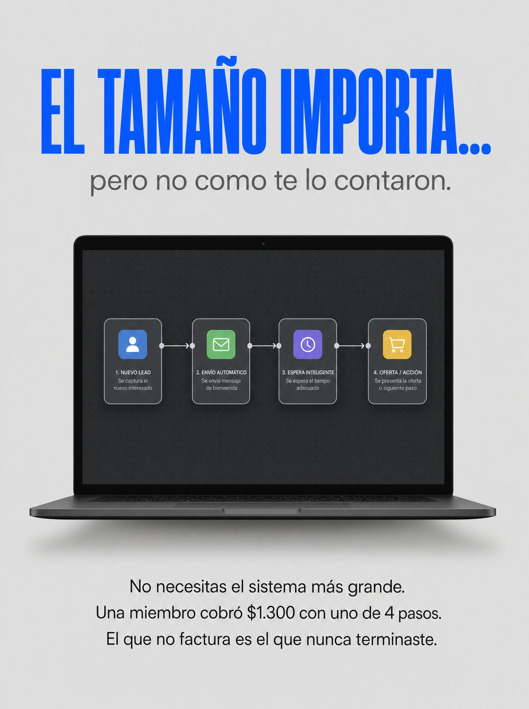

# 002 · Titular de doble sentido (The truth)

**Familia:** Tipografía dura · **Necesitas:** Nada. Si vendes un producto físico, una foto real de él · **Resultado en Meta:** $38 invertidos, 0 compras (cuenta de Imperio, ago 2026) (muestra chica)



## Qué es
Un titular gigante que parece hablar de otra cosa, una bajada chica que lo da vuelta y, al centro, el producto como foto de catálogo. Abajo, un párrafo de tres líneas resuelve la idea.

## Por qué funciona
El doble sentido frena el scroll y la bajada obliga a seguir leyendo para entender. El párrafo afirma algo concreto que rompe una creencia del cliente (en el ejemplo, que necesita el sistema más grande) y lo respalda con un caso con cifra.

## Cuándo usarlo
Público frío o tibio que arrastra una creencia equivocada sobre tu rubro (que necesita lo más grande, lo más caro o lo más complejo). Sirve para cualquier producto que la contradiga, y su objetivo es frenar el scroll y responder esa objeción.

## Así lo hicimos para Imperio
- **Texto en la imagen:** EL TAMAÑO IMPORTA... / pero no como te lo contaron. / [pantalla de laptop con un flujo de 4 nodos: 1. NUEVO LEAD, 2. ENVÍO AUTOMÁTICO, 3. ESPERA INTELIGENTE, 4. OFERTA / ACCIÓN, cada uno con una línea chica de explicación] / No necesitas el sistema más grande. / Una miembro cobró $1.300 con uno de 4 pasos. / El que no factura es el que nunca terminaste.
- **Texto principal:**
  > Todos creen que les falta el sistema más grande.
  >
  > Vilma cobró unos $1.300 con uno de 4 pasos, digitalizando inspecciones industriales. Joaquin cobró $800 por un tablero logístico.
  >
  > El que no factura no es el chico. Es el que nunca terminaste.
  >
  > Adentro somos +3.300 construyendo en español, con el paso a paso y 5 sesiones en vivo a la semana. $59 al mes 👇
- **Titular:** Imperio Agéntico · $59 al mes

## Receta para tu marca
- **Fondo:** gris claro liso, con mucho aire.
- **Titular:** [UNA FRASE HECHA DE TU RUBRO QUE SUENE A OTRA COSA]... en mayúsculas, sans gruesa y condensada, en un color fuerte de tu marca.
- **Bajada:** una línea chica en gris que la da vuelta: [PERO NO COMO TE LO CONTARON].
- **Centro:** [TU PRODUCTO] como foto de catálogo, flotando con sombra suave.
- **Párrafo:** tres líneas centradas abajo, en letra oscura chica: [LA CREENCIA QUE DESARMAS] / [UN CASO REAL CON CIFRA] / [LA VERDAD INCÓMODA].
- **Lo que no se toca:** fondo liso, un solo color fuerte y el titular con segunda lectura. Si el titular se entiende de una sola forma, el formato no funciona.

## Prompt con que se hizo el de Imperio (GPT Image 2.5)
```
[Nota: el de Imperio se generó con GPT Image 2 en 3:4. En GPT Image 2.5 pídelo en 4:5]
Vertical ad, flat light grey background. Upper area: 'EL TAMAÑO IMPORTA...' in electric blue bold condensed sans, large. Directly below in smaller grey sans: 'pero no como te lo contaron.' Center: a floating dark laptop screen showing a simple four-node automation flow diagram, shot product-style with a soft drop shadow on the grey. Bottom third: a centered three-line small dark paragraph reading 'No necesitas el sistema más grande. Una miembro cobró $1.300 con uno de 4 pasos. El que no factura es el que nunca terminaste.' Clean minimal product-ad layout, generous space. Correct Spanish accents. No inverted punctuation, no em dashes.
```

## Ojo
- Si el párrafo cita un caso con cifra, tiene que ser real y verificable.
- Marca la casilla de contenido generado por IA en el Administrador de anuncios.
