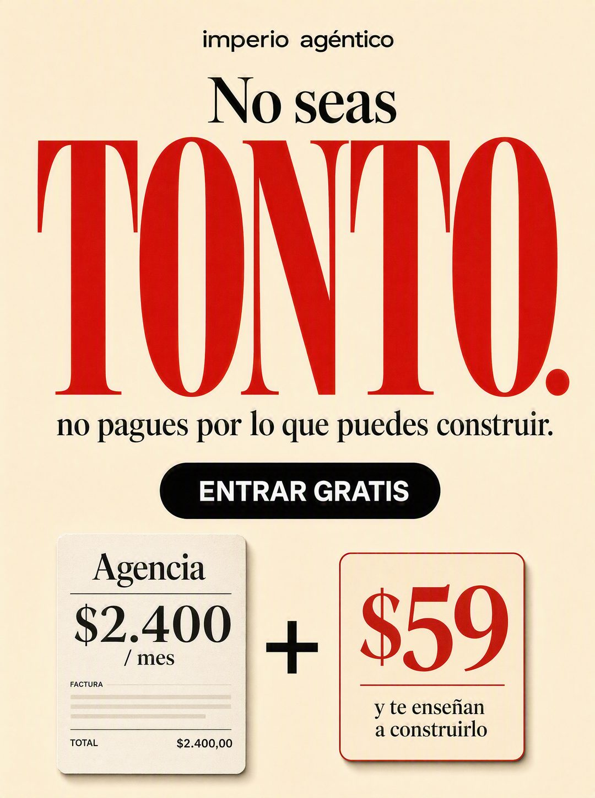

# 003 · Insulto cariñoso y comparación de precio (Don't be an idiot)

**Familia:** Tipografía dura · **Necesitas:** Nada. Solo el precio real de la alternativa que reemplazas · **Resultado en Meta:** Sin datos propios todavía



## Qué es
Un titular que le dice al cliente, con cariño, que está haciendo el tonto si sigue pagando de más, con la palabra del insulto en letra gigante. Abajo, una comparación visual entre la factura de la alternativa cara y tu precio.

## Por qué funciona
Ninguna marca le habla así a su cliente, y por eso frena el scroll. La comparación de abajo cierra el argumento sin leer una palabra más: el número grande de la alternativa al lado del tuyo responde la objeción de precio antes de que aparezca.

## Cuándo usarlo
Público frío o tibio que hoy paga una alternativa más cara (agencia, proveedor, servicio a medida). Sirve para negocios que reemplazan esa alternativa, y su objetivo es responder la objeción de precio y empujar la compra.

## Así lo hicimos para Imperio
- **Texto en la imagen:** imperio agéntico (letra chica, arriba) / No seas / TONTO. (rojo, gigante) / no pagues por lo que puedes construir. / ENTRAR GRATIS (botón negro) / Agencia / $2.400 / mes / FACTURA / TOTAL $2.400,00 (tarjeta de factura, a la izquierda) / + / $59 / y te enseñan a construirlo (tarjeta de la derecha)
- **Texto principal:**
  > Una agencia de automatización cobra entre $1.500 y $2.400 al mes por mantener lo que tú puedes construir.
  >
  > Lo sé porque adentro hay gente que YA se lo está cobrando a otros. José reemplazó una agencia completa y facturó $2.100.
  >
  > No pagues por lo que puedes aprender a construir. Entra por $59 al mes 👇

## Receta para tu marca
- **Marca:** [TU MARCA] en minúscula, chica, arriba al centro.
- **Titular:** 'No seas' en serif negra mediana y debajo [TONTO O TONTA]. en serif roja gigante, de borde a borde.
- **Bajada:** una línea en serif negra: [NO PAGUES POR LO QUE HOY PAGAS DE MÁS].
- **Botón:** píldora negra con [TU LLAMADO A LA ACCIÓN EXACTO].
- **Comparación:** dos tarjetas abajo: a la izquierda la factura de [LA ALTERNATIVA CARA] con [SU PRECIO REAL], a la derecha [TU PRECIO] en rojo con [LO QUE INCLUYE EN 4 PALABRAS], y entre ellas un signo que se lea como 'en vez de', no un más.
- **Lo que no se toca:** fondo crema, una sola palabra roja enorme y la comparación sin texto extra. Si el insulto se achica, se pierde el golpe.

## Prompt con que se hizo el de Imperio (GPT Image 2.5)
```
[Nota: el de Imperio se generó con GPT Image 2 en 3:4. En GPT Image 2.5 pídelo en 4:5]
Vertical ad, warm cream background. Top: small black lowercase wordmark [TU MARCA: logo y nombre]. Then 'No seas' in medium black serif. Then 'TONTO.' in enormous RED serif dominating the frame. Then in small black serif: 'no pagues por lo que puedes construir.' Below, a black pill button with white text 'ENTRAR GRATIS'. At the bottom, a visual price comparison: on the left a small invoice card reading 'Agencia $2.400 / mes', on the right a small card reading '$59' with a tiny label under it 'y te enseñan a construirlo', with a plus sign between them. Editorial, high contrast, punchy. Correct Spanish accents. No inverted punctuation, no em dashes.
```

## Ojo
- El botón tiene que decir exactamente tu oferta: si cobras, no escribas 'gratis' (en el ejemplo de Imperio se coló un 'ENTRAR GRATIS').
- El precio de la alternativa tiene que ser real en tu mercado, no uno inflado para que la comparación se vea mejor.
- Marca la casilla de contenido generado por IA en el Administrador de anuncios.
