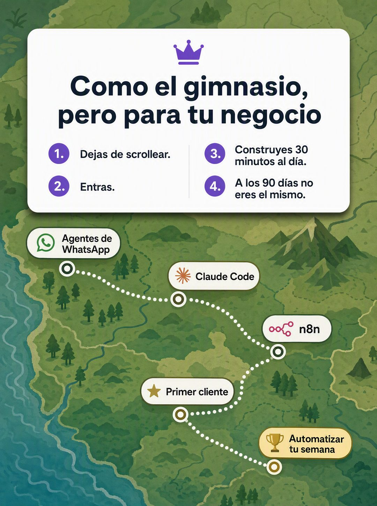

# 004 · Analogía en tarjeta sobre mapa (X for X)

**Familia:** Diagrama y dato · **Necesitas:** Tu logo · **Resultado en Meta:** $382 invertidos, 12 compras, $31,8 por compra (cuenta de Imperio, ago 2026)



## Qué es
Una tarjeta blanca con una analogía ('como X, pero para Y') y cuatro pasos numerados, flotando sobre un mapa ilustrado. Las paradas del mapa son lo que el cliente va a recorrer contigo.

## Por qué funciona
La analogía explica tu oferta en una línea con algo que el cliente ya entiende, sin jerga. El mapa vende el catálogo al mismo tiempo: cada parada es un tema o un resultado y la ruta da sensación de avance. Los pasos bajan la fricción de entrada (en el ejemplo, '30 minutos al día').

## Cuándo usarlo
Público frío que todavía no entiende qué vendes. Sirve para cursos, comunidades, programas o servicios con etapas, y su objetivo es explicar la oferta y bajar la fricción de entrada.

## Así lo hicimos para Imperio
- **Texto en la imagen:** [ícono de corona morada] / Como el gimnasio, pero para tu negocio / 1. Dejas de scrollear. / 2. Entras. / 3. Construyes 30 minutos al día. / 4. A los 90 días no eres el mismo. / Agentes de WhatsApp / Claude Code / n8n / Primer cliente / Automatizar tu semana (etiquetas con ícono sobre la ruta del mapa)
- **Texto principal:**
  > Nadie se pone en forma leyendo sobre pesas.
  >
  > Con la IA es igual: no te falta otro tutorial, te falta ir 30 minutos al día y que alguien te corrija.
  >
  > Eso son las 5 sesiones en vivo semanales de Imperio. Llegas trabado, sales andando.
  >
  > +3.300 personas ya están adentro. $59 al mes 👇
- **Titular:** Imperio Agéntico · $59 al mes

## Receta para tu marca
- **Fondo:** mapa ilustrado plano en [LOS COLORES DE TU MARCA O VERDES NEUTROS], con una ruta punteada que lo cruza.
- **Paradas:** cinco etiquetas tipo píldora sobre la ruta, de [LA PRIMERA ETAPA] a [EL RESULTADO FINAL], con íconos genéricos.
- **Tarjeta:** blanca, con esquinas redondeadas y sombra suave, en la mitad de arriba, con [TU LOGO] chico arriba.
- **Titular:** 'Como [ALGO QUE TU CLIENTE YA CONOCE], pero para [TU RUBRO]', en sans gruesa oscura.
- **Pasos:** cuatro, numerados en dos columnas y de una línea cada uno: de [EL PRIMER PASO MÁS FÁCIL] a [EL CAMBIO CON UN PLAZO CONCRETO].
- **Lo que no se toca:** la analogía en una sola línea y un primer paso ridículamente fácil. Si la tarjeta tapa el mapa entero, se pierde el catálogo.

## Prompt con que se hizo el de Imperio (GPT Image 2.5)
```
[Nota: el de Imperio se generó con GPT Image 2 en 3:4. En GPT Image 2.5 pídelo en 4:5]
Vertical ad. Background: a flat illustrated map in greens and olive tones, a stylized territory with a dotted route winding across it, and small white and gold pill-shaped map labels reading 'Agentes de WhatsApp', 'Claude Code', 'n8n', 'Primer cliente', 'Automatizar tu semana'. Overlaid on the upper half, a floating white rounded card with a soft shadow containing: [TU MARCA: logo y nombre], the bold dark headline 'Como el gimnasio, pero para tu negocio', and a numbered list in two columns reading exactly '1. Dejas de scrollear.' '2. Entras.' '3. Construyes 30 minutos al día.' '4. A los 90 días no eres el mismo.' Render the Spanish accents exactly as written: día, días. Modern education-app illustration style. No inverted punctuation, no em dashes.
```

## Ojo
- No pongas logos de herramientas o marcas de terceros en las paradas: usa íconos genéricos (en el ejemplo de Imperio se colaron los de WhatsApp, Claude y n8n).
- Marca la casilla de contenido generado por IA en el Administrador de anuncios.
