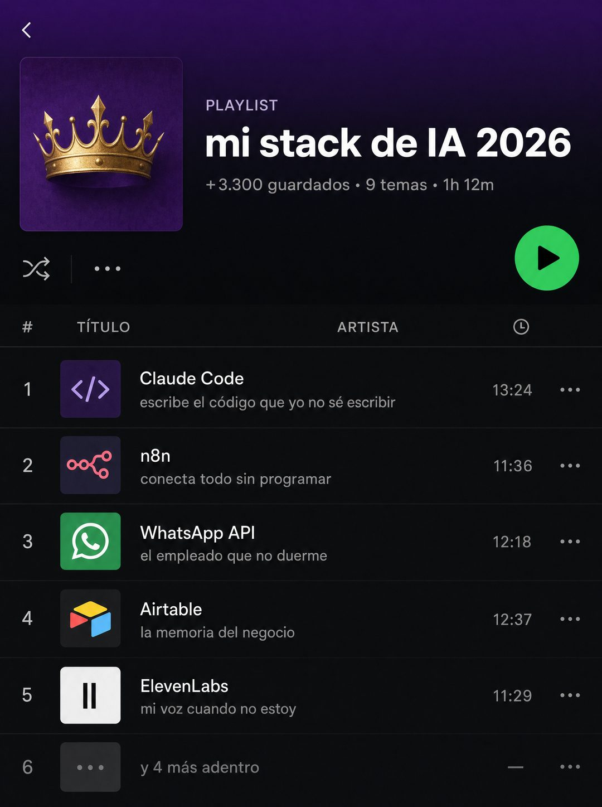

# 005 · Captura de playlist musical (Song playlist)

**Familia:** Interfaz creíble · **Necesitas:** Tu logo · **Resultado en Meta:** $401 invertidos, 4 compras, $100,3 por compra (cuenta de Imperio, ago 2026)



## Qué es
Una captura de una app de música donde la playlist es tu negocio: cada canción es un producto, una herramienta o un servicio, y la línea del artista dice lo que hace con gracia. La portada lleva tu logo.

## Por qué funciona
Se ve como captura de app y no como anuncio, así que el ojo la lee. El juego está en los subtítulos: cada línea vende un beneficio en tono de canción, y la última fila ('y 4 más adentro') deja la lista abierta para que quieran ver el resto.

## Cuándo usarlo
Público frío o tibio. Sirve para negocios con varios productos, servicios o herramientas (menú, catálogo, temario), y su objetivo es mostrar todo lo que incluye la oferta sin una lista aburrida.

## Así lo hicimos para Imperio
- **Texto en la imagen:** PLAYLIST / mi stack de IA 2026 / +3.300 guardados • 9 temas • 1h 12m / # TÍTULO ARTISTA / 1 Claude Code / escribe el código que yo no sé escribir / 13:24 / 2 n8n / conecta todo sin programar / 11:36 / 3 WhatsApp API / el empleado que no duerme / 12:18 / 4 Airtable / la memoria del negocio / 12:37 / 5 ElevenLabs / mi voz cuando no estoy / 11:29 / 6 y 4 más adentro (fila apagada)
- **Texto principal:**
  > Este es el stack completo con el que opero. No es teoría: son las 9 herramientas que uso todos los días.
  >
  > El paso a paso de cada una está adentro, en español, con los archivos listos para adaptar.
  >
  > +1.800 logros publicados por los miembros al corte de julio. Entra por $59 al mes 👇
- **Titular:** Imperio Agéntico · $59 al mes

## Receta para tu marca
- **Formato:** captura vertical de una app de música en modo oscuro, con un degradado de [EL COLOR PRINCIPAL DE TU MARCA] arriba que funde a negro.
- **Portada:** cuadrada, con [TU LOGO] sobre tu color; al lado, 'PLAYLIST', [EL TÍTULO DE TU LISTA] y una línea de datos con temas y duración.
- **Canciones:** cinco filas con miniatura, [TU PRODUCTO O SERVICIO] en blanco y debajo, en gris, [LO QUE HACE, DICHO COMO VERSO]. La sexta fila, apagada: [Y X MÁS ADENTRO].
- **Botones:** play verde redondo, aleatorio y tres puntos, como en una app real.
- **Lo que no se toca:** que parezca captura de app y no diseño, y que cada subtítulo tenga gracia. Si se convierte en lista de características, se cae.

## Prompt con que se hizo el de Imperio (GPT Image 2.5)
```
[Nota: el de Imperio se generó con GPT Image 2 en 3:4. En GPT Image 2.5 pídelo en 4:5]
Vertical. A faithful dark-mode music streaming app screenshot with a deep PURPLE gradient at the top fading into black. Top left: a square cover art in purple with [TU MARCA: logo y nombre]. Small label 'PLAYLIST', then the large white title 'mi stack de IA 2026', then a metadata line '+3.300 guardados · 9 temas · 1h 12m'. A green circular play button, shuffle icon and three dots. Below, a track table with column headers and rows, each with a small thumbnail, a white track title and a grey line underneath: 'Claude Code' with 'escribe el código que yo no sé escribir', 'n8n' with 'conecta todo sin programar', 'WhatsApp API' with 'el empleado que no duerme', 'Airtable' with 'la memoria del negocio', 'ElevenLabs' with 'mi voz cuando no estoy', and a final greyed row 'y 4 más adentro'. Crisp legible UI, no real brand logos. Correct Spanish accents. No inverted punctuation, no em dashes.
```

## Ojo
- No uses logos de marcas de terceros en las miniaturas ni el logo de una app de música real: usa íconos genéricos (en el ejemplo de Imperio se colaron logos reales).
- La línea de datos no puede inventar seguidores: pon una cifra real tuya o deja solo temas y duración.
- Marca la casilla de contenido generado por IA en el Administrador de anuncios.
