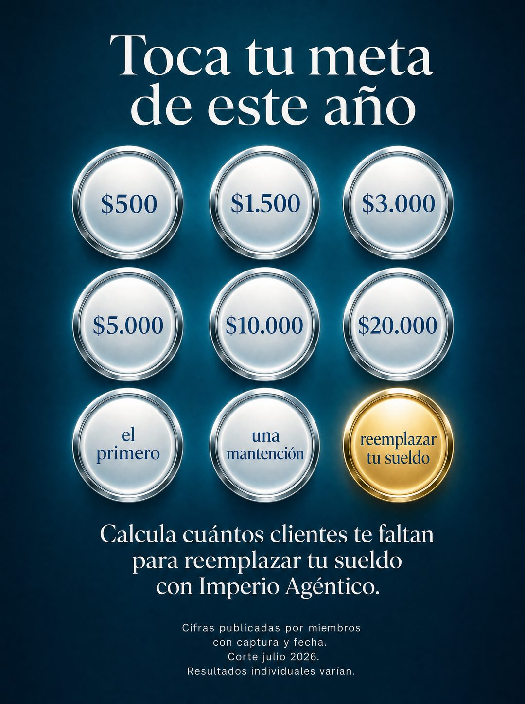

# 006 · Grid de metas para tocar (Tap your goals)

**Familia:** Diagrama y dato · **Necesitas:** Nada · **Resultado en Meta:** Sin datos propios todavía



## Qué es
Un grid de 3 x 3 botones metálicos con metas para elegir (montos, resultados o etapas), como si fuera una app. Uno brilla en dorado, y abajo van una línea que invita a calcular y una letra chica legal.

## Por qué funciona
El grid invita a tocar aunque no haga nada: el cliente elige su meta con la vista y ya se está imaginando el resultado. La letra chica legal le da aire de app seria y responde la sospecha de exageración antes de que aparezca.

## Cuándo usarlo
Público frío o tibio con una meta medible (bajar de peso, ahorrar, facturar, aprender). Sirve para negocios que acompañan hacia esa meta, y su objetivo es frenar el scroll y que el cliente se ponga en el resultado.

## Así lo hicimos para Imperio
- **Texto en la imagen:** Toca tu meta de este año / $500 / $1.500 / $3.000 / $5.000 / $10.000 / $20.000 / el primero / una mantención / reemplazar tu sueldo (botón dorado) / Calcula cuántos clientes te faltan para reemplazar tu sueldo con Imperio Agéntico. / Cifras publicadas por miembros con captura y fecha. Corte julio 2026. Resultados individuales varían. (letra chica, abajo)
- **Texto principal:**
  > La aritmética que casi nadie hace: 3 clientes de $1.500 son $4.500 al mes.
  >
  > Nadie parte en 3. Se parte en UNO, y el primero casi siempre es alguien que ya te conoce.
  >
  > Adentro está el método completo para ese primero, y +1.800 logros publicados con nombre y fecha para que veas que no lo digo por decir.
  >
  > $59 al mes 👇

## Receta para tu marca
- **Fondo:** degradado de [UN COLOR OSCURO DE TU MARCA] a casi negro.
- **Titular:** 'Toca tu meta de [PLAZO]' en serif blanca grande, arriba.
- **Grid:** 3 x 3 botones redondos con borde metálico brillante y texto en [TU COLOR]: seis [METAS CON NÚMERO] y tres [METAS EN PALABRAS], con [LA META QUE MÁS VENDES] en dorado.
- **Bajada:** dos o tres líneas en serif blanca: 'Calcula [LO QUE LE FALTA AL CLIENTE] para [SU META] con [TU MARCA].'
- **Letra chica:** cuatro líneas diminutas abajo: [DE DÓNDE SALEN LAS CIFRAS Y QUE LOS RESULTADOS VARÍAN].
- **Lo que no se toca:** el acabado metálico que pide ser tocado y la letra chica. Sin ella, parece una promesa de resultados.

## Prompt con que se hizo el de Imperio (GPT Image 2.5)
```
[Nota: el de Imperio se generó con GPT Image 2 en 3:4. En GPT Image 2.5 pídelo en 4:5]
Vertical ad, deep teal to dark gradient background. Top: 'Toca tu meta de este año' in large white serif. Center: a 3 by 3 grid of circular buttons with a glossy metallic silver rim and blue text inside, reading '$500', '$1.500', '$3.000', '$5.000', '$10.000', '$20.000', 'el primero', 'una mantención', 'reemplazar tu sueldo', with one circle filled gold. Below, two lines of white serif: 'Calcula cuántos clientes te faltan para reemplazar tu sueldo con Imperio Agéntico.' At the very bottom, a small four-line block of legal fine print in tiny type: 'Cifras publicadas por miembros con captura y fecha. Corte julio 2026. Resultados individuales varían.' Polished health-app aesthetic. Correct Spanish accents. No inverted punctuation, no em dashes.
```

## Ojo
- La letra chica tiene que ser verdad: si dice que las cifras salen de clientes reales, tienes que poder mostrarlas. No prometas resultados.
- Si sale texto roto, manos deformes o cifras mal escritas, se rehace.
- Marca la casilla de contenido generado por IA en el Administrador de anuncios.
