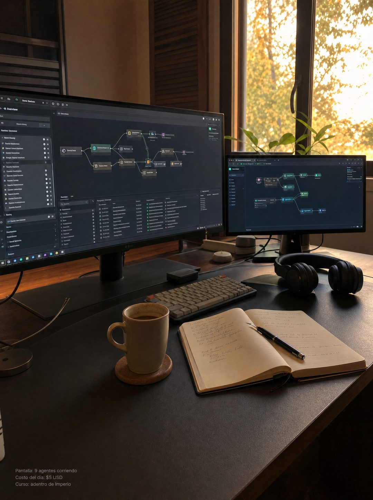

# 007 · Foto nativa del escritorio (Native)

**Familia:** Foto nativa · **Necesitas:** Nada. Si tienes una foto real de tu lugar de trabajo, mejor · **Resultado en Meta:** $2.561 invertidos, 63 compras, $40,7 por compra (cuenta de Imperio, ago-sep 2026)



## Qué es
Una foto que parece tomada con el teléfono al final del día: escritorio, pantallas encendidas, café y cuaderno. No tiene titular: la única venta son tres líneas de letra chica en una esquina.

## Por qué funciona
No parece anuncio, así que el ojo no lo salta. La letra chica funciona como el crédito de ropa en un post de moda: da un dato concreto sin gritarlo y deja que el texto principal haga la venta.

## Cuándo usarlo
Arriba del embudo, con público frío cansado de anuncios. Sirve para cualquier negocio con un lugar de trabajo reconocible: taller, consulta, cocina, escritorio.

## Así lo hicimos para Imperio
- **Texto en la imagen:** Pantalla: 9 agentes corriendo / Costo del día: $5 USD / Curso: adentro de Imperio (letra chica gris, abajo a la izquierda)
- **Texto principal:**
  > Son las 11 de la noche y estoy mirando los logros que publicaron hoy.
  >
  > Automatizaciones nuevas, primeros clientes cobrados, sistemas andando. Ninguno lo hice yo, y ese es exactamente el punto.
  >
  > +3.300 personas construyendo en español, +$220.000 USD en ventas que publicaron ellos mismos.
  >
  > Entra y mira el muro por dentro. $59 al mes 👇
- **Titular:** Imperio Agéntico · $59 al mes

## Receta para tu marca
- **Escena:** foto vertical tipo celular de [TU LUGAR DE TRABAJO] al final del día, luz natural, sin personas posando.
- **Protagonista:** [LA HERRAMIENTA O EL RESULTADO DE TU NEGOCIO] en uso, con cualquier pantalla desenfocada.
- **Texto:** solo tres líneas de letra chica gris en una esquina: [QUÉ SE VE] / [UN DATO CONCRETO CON CIFRA] / [DÓNDE SE APRENDE O SE COMPRA].
- **Colores:** los de la escena real; no agregues los colores de tu marca.
- **Lo que no se toca:** cero titular, cero logo, cero botón. Si le pones diseño encima, deja de ser nativo.

## Prompt con que se hizo el de Imperio (GPT Image 2.5)
```
[Nota: el de Imperio se generó con GPT Image 2 en 3:4. En GPT Image 2.5 pídelo en 4:5]
Vertical. An editorial lifestyle photograph, shot on a phone, no ad styling at all: a home office desk at the end of the day, warm late afternoon light through a window, two monitors glowing with node-based automation dashboards, a cooling cup of coffee, a notebook with handwriting, headphones. Natural, slightly imperfect, looks like a personal post not an advertisement. The ONLY text is tiny grey type in the bottom left corner, three short lines: 'Pantalla: 9 agentes corriendo', 'Costo del día: $5 USD', 'Curso: adentro de Imperio'. Photorealistic, no overlay graphics, no logos, no people. Correct Spanish accents. No inverted punctuation, no em dashes.
```

## Ojo
- El dato de la letra chica tiene que ser verdadero y verificable: aquí no hay titular que lo suavice.
- Marca la casilla de contenido generado por IA en el Administrador de anuncios.
