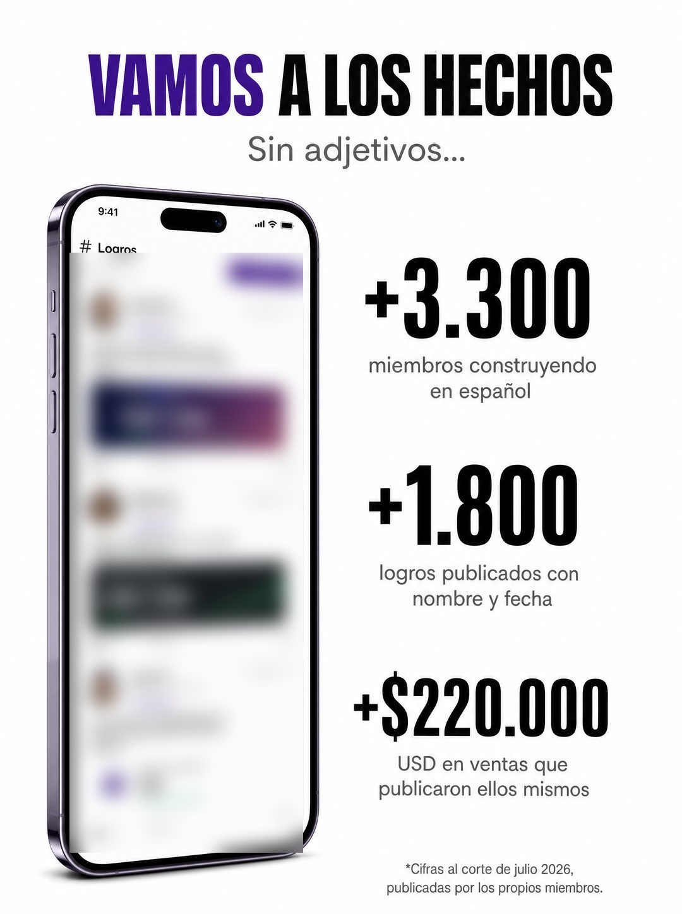

# 008 · Cifras gigantes con nota al pie (Let's talk numbers)

**Familia:** Diagrama y dato · **Necesitas:** Tus tres cifras reales y una captura que las respalde · **Resultado en Meta:** $0 invertidos, 0 compras (cuenta de Imperio, ago 2026) (muestra chica)



## Qué es
Dos columnas: a la izquierda la prueba (un teléfono con tu producto o tus resultados) y a la derecha tres cifras gigantes con dos líneas de contexto cada una. Abajo, una nota al pie dice de dónde sale cada dato.

## Por qué funciona
Las cifras grandes se leen antes que cualquier palabra y afirman algo concreto. Son autoridad propia, no prestada, y la nota al pie con fecha de corte y fuente es lo que convierte el marketing en evidencia.

## Cuándo usarlo
Público tibio o remarketing que ya te conoce y duda si funciona. Sirve para negocios con clientes, ventas o casos que se pueden contar, y su objetivo es mostrar prueba y empujar la compra.

## Así lo hicimos para Imperio
- **Texto en la imagen:** VAMOS A LOS HECHOS (VAMOS en morado) / Sin adjetivos... / [teléfono con un feed de 'Logros': tres posts de miembros con foto, nombre, ciudad, fecha y monto] / +3.300 / miembros construyendo en español / +1.800 / logros publicados con nombre y fecha / +$220.000 / USD en ventas que publicaron ellos mismos / *Cifras al corte de julio 2026, publicadas por los propios miembros. (letra chica, abajo a la derecha)
- **Texto principal:**
  > No te puedo prometer tu resultado. Te puedo mostrar los de ellos, con captura y fecha.
  >
  > +3.300 miembros. +1.800 logros publicados al corte de julio. +$220.000 USD en ventas documentadas por los propios miembros.
  >
  > Todo está adentro y lo puedes revisar tú mismo. $59 al mes 👇
- **Titular:** Imperio Agéntico · $59 al mes

## Receta para tu marca
- **Titular:** 'VAMOS A LOS HECHOS', con 'VAMOS' en el color de tu marca y el resto en negro, sans gruesa condensada. Debajo, en gris: 'Sin adjetivos...'.
- **Izquierda:** un teléfono con [UNA CAPTURA REAL DE TU PRODUCTO, TUS CLIENTES O TUS RESULTADOS], con nombres y datos de terceros desenfocados.
- **Derecha:** tres cifras apiladas en negro gigante, [CIFRA REAL 1], [CIFRA REAL 2] y [CIFRA REAL 3], cada una con dos líneas grises de contexto.
- **Nota al pie:** '*[FECHA DE CORTE Y FUENTE DE LAS CIFRAS]' en letra chica, abajo a la derecha.
- **Lo que no se toca:** fondo blanco, las cifras como protagonistas y la nota al pie. Sin la nota, las cifras son marketing.

## Prompt con que se hizo el de Imperio (GPT Image 2.5)
```
[Nota: el de Imperio se generó con GPT Image 2 en 3:4. En GPT Image 2.5 pídelo en 4:5]
Vertical ad, white background, two-column layout. Top centered: 'VAMOS' in deep purple bold sans immediately followed by 'A LOS HECHOS' in black bold sans, on one line. Below it in grey regular sans: 'Sin adjetivos...'. LEFT COLUMN: a vertical phone showing a feed of community achievement posts, photographed product-style. RIGHT COLUMN: three stacked stat blocks, each with an enormous black bold figure and two small grey lines under it: '+3.300' with 'miembros construyendo en español', '+1.800' with 'logros publicados con nombre y fecha', '+$220.000' with 'USD en ventas que publicaron ellos mismos'. Bottom right, tiny fine print: '*Cifras al corte de julio 2026, publicadas por los propios miembros.' Correct Spanish accents. No inverted punctuation, no em dashes.
```

## Ojo
- En este ejemplo desenfocamos la pantalla del celular: mostraba publicaciones de miembros generadas con IA, con nombre y monto. En tu versión, si muestras logros, que sean capturas reales y con permiso, o déjalos desenfocados.
- Nunca inventes testimonios, chats de clientes, reseñas ni capturas de resultados: si el formato muestra prueba social, usa material real o déjalo fuera.
- En el ejemplo de Imperio el teléfono muestra logros generados con caras, nombres y montos: en tu versión usa una captura real o desenfoca el contenido.
- Marca la casilla de contenido generado por IA en el Administrador de anuncios.
