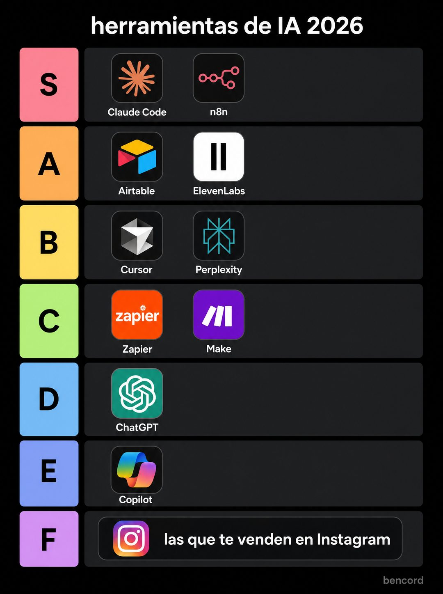

# 010 · Ranking por niveles (Tier list)

**Familia:** Diagrama y dato · **Necesitas:** Nada · **Resultado en Meta:** $585 invertidos, 34 compras, $17,2 por compra (cuenta de Imperio, ago 2026)



## Qué es
Una tabla de niveles de S a F, como las que hacen los fans, donde ordenas las opciones de tu rubro (productos, herramientas, métodos, lugares) según tu opinión. Cada fila tiene su etiqueta de color a la izquierda.

## Por qué funciona
Una tier list obliga a mirar dónde quedó cada cosa y a tomar partido. Funciona solo si incomoda: poner lo más popular abajo (en el ejemplo, ChatGPT en la D) genera comentarios y te muestra como alguien con criterio, no como un vendedor diplomático.

## Cuándo usarlo
Público frío de un rubro con muchas opciones y opiniones (herramientas, restaurantes, productos, métodos). Sirve para frenar el scroll, abrir conversación y mostrar criterio antes de vender.

## Así lo hicimos para Imperio
- **Texto en la imagen:** herramientas de IA 2026 / [fichas con logo y nombre en cada fila:] S: Claude Code, n8n / A: Airtable, ElevenLabs / B: Cursor, Perplexity / C: Zapier, Make / D: ChatGPT / E: Copilot / F: las que te venden en Instagram (ficha ancha con el logo de Instagram) / bencord (gris, abajo a la derecha)
- **Texto principal:**
  > Mi ranking después de 2 años metiéndoles mano a todas.
  >
  > Ojo con la fila F: son justo las que más se anuncian. Y sí, ChatGPT está en D, y adentro explico por qué.
  >
  > Cada herramienta de la S y la A tiene su curso completo en español. $59 al mes 👇
- **Titular:** Imperio Agéntico · $59 al mes

## Receta para tu marca
- **Fondo:** negro puro, con un título chico en blanco arriba: [QUÉ ESTÁS RANKEANDO Y EL AÑO].
- **Filas:** siete, de S a F, cada una con su cuadrado pastel a la izquierda (rosa, naranja, amarillo, verde, celeste, lavanda, lila) y una franja gris oscura.
- **Fichas:** [LAS OPCIONES DE TU RUBRO] como fichas redondeadas con el nombre debajo; arriba lo que recomiendas y abajo [LA OPCIÓN POPULAR QUE NO RECOMIENDAS].
- **Fila F:** una ficha ancha con [LA CRÍTICA O EL CHISTE DE TU RUBRO].
- **Firma:** [TU NOMBRE O TU MARCA] en gris chico abajo a la derecha, como firma de fan.
- **Lo que no se toca:** una opinión que incomode. Si todo queda en S y A, es tibia y no sirve.

## Prompt con que se hizo el de Imperio (GPT Image 2.5)
```
[Nota: el de Imperio se generó con GPT Image 2 en 3:4. En GPT Image 2.5 pídelo en 4:5]
Vertical tier list graphic on a pure black background. SEVEN horizontal rows, each with a small pastel colored square label on the far left containing a black letter: S in pink, A in orange, B in yellow, C in green, D in light blue, E in periwinkle, F in lilac. To the right of each label, a dark grey row strip holding rounded app tiles with small labels. Row S contains 'Claude Code' and 'n8n'. Row A contains 'Airtable' and 'ElevenLabs'. Row B contains 'Cursor' and 'Perplexity'. Row C contains 'Zapier' and 'Make'. Row D contains a single tile labeled 'ChatGPT'. Row E contains 'Copilot'. Row F contains one wide tile labeled 'las que te venden en Instagram'. Small white title above the rows: 'herramientas de IA 2026'. Bottom right corner, tiny grey credit: [TU MARCA: logo y nombre]. Authentic fan-made tier list look. No inverted punctuation, no em dashes.
```

## Ojo
- No uses logos de marcas de terceros sin permiso: escribe el nombre en la ficha o usa un ícono genérico.
- No pongas a un competidor directo con su nombre en las filas de abajo: rankea herramientas, métodos o categorías.
- Marca la casilla de contenido generado por IA en el Administrador de anuncios.
