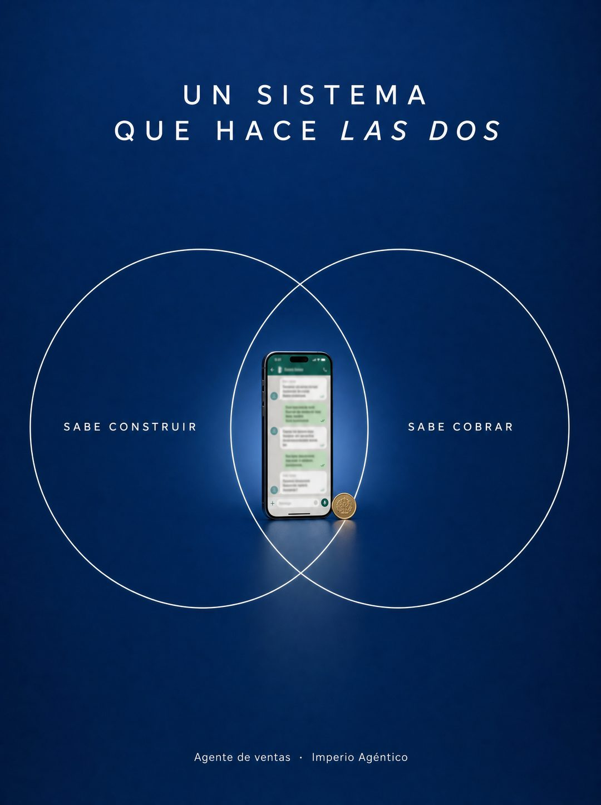

# 011 · Producto en la intersección (Venn diagram)

**Familia:** Diagrama y dato · **Necesitas:** Nada · **Resultado en Meta:** $82 invertidos, 0 compras (cuenta de Imperio, ago 2026) (muestra chica)



## Qué es
Dos círculos de línea fina, cada uno con una necesidad del cliente, y tu producto fotografiado justo donde se cruzan. Arriba, un titular en mayúsculas espaciadas dice que hace las dos cosas.

## Por qué funciona
El producto no dice que cubre las dos necesidades: lo demuestra con la posición. Se entiende en un segundo, sin párrafos, y el fondo limpio con mucho espacio vacío le da aire de marca premium.

## Cuándo usarlo
Público frío o tibio que cree que tiene que elegir entre dos cosas (rápido o bien hecho, rico o sano, construir o vender). Sirve para cualquier producto que resuelva las dos, y su objetivo es responder esa objeción en un vistazo.

## Así lo hicimos para Imperio
- **Texto en la imagen:** UN SISTEMA / QUE HACE LAS DOS (LAS DOS en cursiva) / SABE CONSTRUIR (círculo izquierdo) / SABE COBRAR (círculo derecho) / [teléfono con un chat desenfocado y una moneda dorada, en la intersección] / Agente de ventas · Imperio Agéntico (letra chica, abajo)
- **Texto principal:**
  > El 62% de mi comunidad llegó sabiendo construir y sin haber cobrado nunca.
  >
  > Esa es LA frase que más leo: sé hacer las automatizaciones, pero no sé venderlas.
  >
  > Adentro está el método del primer cliente, y los casos de los que ya lo cobraron. Alvaro cerró el suyo en 5 horas: $600.
  >
  > $59 al mes 👇
- **Titular:** Imperio Agéntico · $59 al mes

## Receta para tu marca
- **Fondo:** degradado profundo de [EL COLOR OSCURO DE TU MARCA], con mucho espacio vacío.
- **Titular:** dos líneas en mayúsculas blancas muy espaciadas: 'UN [TU PRODUCTO]' / 'QUE HACE LAS DOS', con 'LAS DOS' en cursiva.
- **Círculos:** dos, de línea blanca fina, con [NECESIDAD 1] y [NECESIDAD 2] en mayúsculas chicas.
- **Centro:** [TU PRODUCTO] fotografiado, chico y bien iluminado, exactamente en la intersección.
- **Pie:** '[QUÉ ES] · [TU MARCA]' en letra chica blanca.
- **Lo que no se toca:** el producto dentro del cruce y nada más en la imagen. Si agregas texto o íconos, se pierde la claridad.

## Prompt con que se hizo el de Imperio (GPT Image 2.5)
```
[Nota: el de Imperio se generó con GPT Image 2 en 3:4. En GPT Image 2.5 pídelo en 4:5]
Vertical, deep blue gradient background. Top centered in white letterspaced caps across two lines: 'UN SISTEMA' and 'QUE HACE LAS DOS' with 'LAS DOS' in italic. Center: two large overlapping circles drawn in thin white outline. Inside the left circle, small white caps 'SABE CONSTRUIR'. Inside the right circle, small white caps 'SABE COBRAR'. Positioned exactly inside the lens-shaped INTERSECTION, a photographed smartphone standing upright showing a green messaging conversation with unreadable blurred bubbles, small and product-lit, with a tiny gold coin beside it. At the bottom center, small white text: 'Agente de ventas · Imperio Agéntico'. Minimal, premium, lots of negative space. Correct Spanish accents. No inverted punctuation, no em dashes.
```

## Ojo
- Si el producto es una pantalla con conversaciones, desenfoca los mensajes: no muestres datos de clientes reales.
- Marca la casilla de contenido generado por IA en el Administrador de anuncios.
