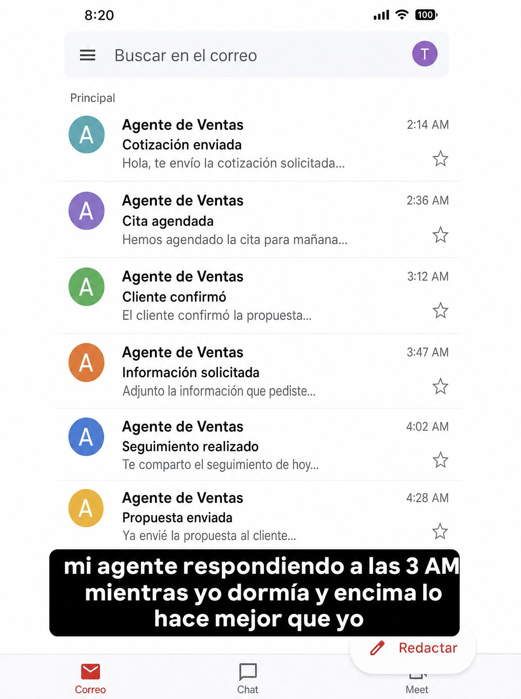

# 013 · Captura de correo con reacción (Email screenshot)

**Familia:** Interfaz creíble · **Necesitas:** Nada · **Resultado en Meta:** $285 invertidos, 15 compras, $19,0 por compra (cuenta de Imperio, ago 2026)



## Qué es
Una captura de bandeja de correo con un bloque de texto pegado encima, como cuando alguien repostea algo con su reacción. La bandeja muestra tu producto trabajando y el bloque dice lo que siente quien lo usa.

## Por qué funciona
No parece la marca hablando, parece alguien reaccionando a su propio teléfono: eso se lee como meme, y los memes se leen y se comparten. Las horas de madrugada en la bandeja prueban el punto sin explicarlo.

## Cuándo usarlo
Público frío o tibio. Sirve para software, servicios automatizados o cualquier negocio que trabaje mientras el cliente duerme, y su objetivo es mostrar el producto en uso.

## Así lo hicimos para Imperio
- **Texto en la imagen:** Buscar en el correo / Principal / [seis correos de 'Agente de Ventas' entre 2:14 AM y 4:28 AM: Cotización enviada, Cita agendada, Cliente confirmó, Información solicitada, Seguimiento realizado, Propuesta enviada] / mi agente respondiendo a las 3 AM mientras yo dormía y encima lo hace mejor que yo (bloque negro con letra blanca, sobre la captura) / Redactar / Correo / Chat / Meet
- **Texto principal:**
  > Este correo lo escribió un agente a las 3:47 AM. Cotizó, agendó y guardó el lead mientras yo dormía.
  >
  > Vincent construyó uno parecido para un negocio de celulares y lo cobró en $750.
  >
  > El curso de agentes está adentro, en español y sin escribir código. $59 al mes 👇
- **Titular:** Imperio Agéntico · $59 al mes

## Receta para tu marca
- **Fondo:** captura de una bandeja de correo genérica en modo claro, con seis filas de [EL REMITENTE QUE REPRESENTA A TU PRODUCTO] y asuntos cortos: [LO QUE HACE TU PRODUCTO, UNO POR FILA].
- **Prueba:** las horas de cada correo cuentan la historia: [HORAS QUE MUESTRAN QUE FUNCIONA SIN TI].
- **Reacción:** bloque negro redondeado con letra blanca gruesa encima de la captura: [TU REACCIÓN EN PRIMERA PERSONA Y EN MINÚSCULAS, COMO UN POST].
- **Colores:** los de la app de correo; tu marca no aparece.
- **Lo que no se toca:** el tono de reacción personal. Si el bloque suena a eslogan, deja de ser meme.

## Prompt con que se hizo el de Imperio (GPT Image 2.5)
```
[Nota: el de Imperio se generó con GPT Image 2 en 3:4. En GPT Image 2.5 pídelo en 4:5]
Vertical. A phone screenshot of an email inbox in light mode, showing six message rows all sent between 2 and 4 AM, each with an avatar, the sender name 'Agente de Ventas', short Spanish subject lines such as 'Cotización enviada', 'Cita agendada', 'Cliente confirmó', and timestamps '2:14 AM', '3:47 AM', '4:02 AM'. Layered ON TOP of the screenshot, pasted like a social caption, a BLACK rounded text block with WHITE sans text inside it reading exactly, once: 'mi agente respondiendo a las 3 AM mientras yo dormía y encima lo hace mejor que yo'. The caption block is solid black with white letters, clearly inverted against the light inbox behind it. Render the Spanish accents exactly as written: Cotización, confirmó, dormía. Authentic meme-repost look. No inverted punctuation, no em dashes.
```

## Ojo
- La bandeja es una demo de tu producto: no pongas nombres ni correos reales de clientes y no la presentes como testimonio.
- No copies el logo ni la interfaz exacta de un proveedor de correo: usa una bandeja genérica.
- Marca la casilla de contenido generado por IA en el Administrador de anuncios.
