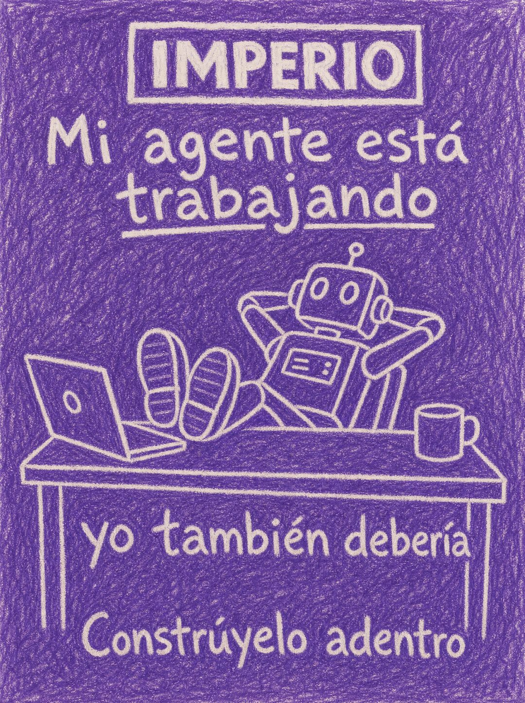

# 014 · Póster dibujado a crayón (Doodle)

**Familia:** Humor y meme · **Necesitas:** Tu logo, para redibujarlo a mano · **Resultado en Meta:** $40 invertidos, 2 compras, $19,9 por compra (cuenta de Imperio, ago 2026) (muestra chica)



## Qué es
Un póster entero dibujado a mano con crayón, logo incluido. El texto cuenta un chiste corto que el mismo dibujo confirma.

## Por qué funciona
En un feed lleno de diseño pulido, la textura de crayón salta a la vista. El garabato no es adorno sino el diseño completo, y eso hace que el chiste se sienta hecho por una persona y no por una agencia.

## Cuándo usarlo
Público frío. Sirve para marcas de tono cercano con un mensaje simple (descansar, delegar, darse un gusto), y su objetivo es frenar el scroll con humor.

## Así lo hicimos para Imperio
- **Texto en la imagen:** IMPERIO (dentro de un recuadro dibujado, arriba) / Mi agente está trabajando (trabajando subrayado) / [dibujo de un robot con los pies arriba del escritorio, junto a un laptop y una taza] / yo también debería / Constrúyelo adentro
- **Texto principal:**
  > El 90% abandona en el paso 3, justo antes de que la cosa funcione.
  >
  > Por eso adentro hay 5 sesiones en vivo a la semana: llegas con tu error, lo revisamos y sales con el sistema andando.
  >
  > +1.800 logros publicados dicen que funciona. $59 al mes 👇
- **Titular:** Imperio Agéntico · $59 al mes

## Receta para tu marca
- **Formato:** póster vertical dibujado entero a mano con crayón de [EL COLOR DE TU MARCA], con el rayado visible llenando el fondo.
- **Marca:** [TU LOGO] redibujado a mano dentro de un recuadro, arriba.
- **Texto:** letras blancas hechas a mano en tres bloques: [EL CHISTE EN UNA FRASE, CON UNA PALABRA SUBRAYADA] / [EL REMATE] / [TU LLAMADO A LA ACCIÓN CORTO].
- **Dibujo:** al centro, una escena simple en línea blanca que muestre el chiste: [TU PRODUCTO O TU PERSONAJE HACIENDO LO QUE DICE EL TEXTO].
- **Lo que no se toca:** todo a mano, logo incluido. Si mezclas tipografía digital o fotos, deja de ser garabato.

## Prompt con que se hizo el de Imperio (GPT Image 2.5)
```
[Nota: el de Imperio se generó con GPT Image 2 en 3:4. En GPT Image 2.5 pídelo en 4:5]
Vertical poster drawn ENTIRELY BY HAND with purple crayon on white paper, visible waxy crayon hatching texture filling the whole background in purple. Everything is hand drawn including the logo. At the top, a hand-drawn rectangular logo box with [TU MARCA: logo y nombre] lettered inside it in reserved white. Hand-lettered white text: 'Mi agente está trabajando' with the word 'trabajando' underlined. In the center, a naive hand-drawn robot sitting back with its feet up on a desk, drawn in white line on the purple crayon. Below, hand-lettered: 'yo también debería'. At the bottom, hand-lettered: 'Constrúyelo adentro'. Nothing digital, nothing polished, real crayon texture. Correct Spanish accents. No inverted punctuation, no em dashes.
```

## Ojo
- Si sale texto roto, manos deformes o cifras mal escritas, se rehace.
- Marca la casilla de contenido generado por IA en el Administrador de anuncios.
