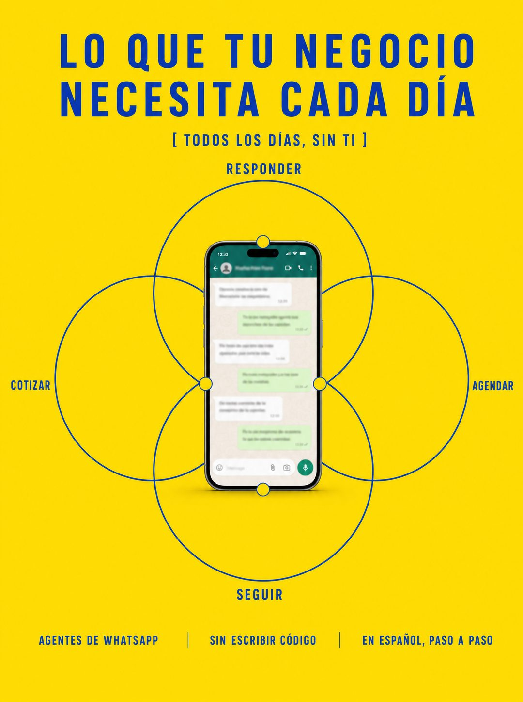

# 017 · Diagrama de tareas diarias (Daily use does X)

**Familia:** Diagrama y dato · **Necesitas:** Nada · **Resultado en Meta:** $23 invertidos, 0 compras (cuenta de Imperio, sep 2026) (muestra chica)



## Qué es
Cuatro círculos de línea fina que se cruzan como una flor, cada uno con una tarea que el cliente hace todos los días, y tu producto fotografiado justo al centro. Abajo, tres datos cortos en columnas.

## Por qué funciona
El producto al centro dice 'yo cubro todo esto' sin escribirlo. Las cuatro tareas son las que el cliente ya siente pesadas, así que se reconoce en el diagrama, y el color saturado lo saca del resto del feed.

## Cuándo usarlo
Público frío o tibio con una rutina repetitiva (atender, agendar, limpiar, cuidar). Sirve para negocios cuyo producto reemplaza varias tareas a la vez, y su objetivo es mostrar todo lo que cubre en un vistazo.

## Así lo hicimos para Imperio
- **Texto en la imagen:** LO QUE TU NEGOCIO / NECESITA CADA DÍA / [ TODOS LOS DÍAS, SIN TI ] (con los corchetes impresos) / RESPONDER / COTIZAR / AGENDAR / SEGUIR / [teléfono con un chat de WhatsApp desenfocado, al centro de los cuatro círculos] / AGENTES DE WHATSAPP / SIN ESCRIBIR CÓDIGO / EN ESPAÑOL, PASO A PASO (tres columnas, abajo)
- **Texto principal:**
  > Responder, cotizar, agendar, hacer seguimiento. Todo eso pasa igual el día que te enfermas.
  >
  > Un agente de WhatsApp hace las cuatro cosas y no se enferma. Se construye en una tarde y sin código.
  >
  > Es el caso que más se repite adentro con gimnasios, clínicas, veterinarias e inmobiliarias. $59 al mes 👇
- **Titular:** Imperio Agéntico · $59 al mes

## Receta para tu marca
- **Fondo:** un color plano y saturado de [TU MARCA O UN AMARILLO FUERTE].
- **Titular:** dos líneas en mayúsculas gruesas con espaciado: 'LO QUE TU [NEGOCIO O CLIENTE]' / 'NECESITA CADA DÍA', y debajo, entre corchetes impresos, [TU PROMESA EN 4 PALABRAS].
- **Diagrama:** cuatro círculos de línea fina en [TU COLOR DE CONTRASTE], con [TAREA 1], [TAREA 2], [TAREA 3] y [TAREA 4] en los bordes de afuera.
- **Centro:** [TU PRODUCTO] fotografiado de pie justo en el medio, con cualquier pantalla desenfocada.
- **Pie:** tres columnas de letra chica en mayúsculas: [QUÉ ES] / [LA FRICCIÓN QUE QUITAS] / [CÓMO SE ENTREGA].
- **Lo que no se toca:** dos colores nada más y el producto exactamente al centro. Si el producto queda fuera del cruce, se pierde el mensaje.

## Prompt con que se hizo el de Imperio (GPT Image 2.5)
```
[Nota: el de Imperio se generó con GPT Image 2 en 3:4. En GPT Image 2.5 pídelo en 4:5]
Vertical ad, saturated yellow background. Top centered in blue bold letterspaced sans across two lines: 'LO QUE TU NEGOCIO' 'NECESITA CADA DÍA'. Below it in small blue caps inside square brackets: '[ TODOS LOS DÍAS, SIN TI ]'. Center: four thin blue outlined circles overlapping in a flower arrangement, with small blue caps labels at the outer edges reading 'RESPONDER' at the top, 'COTIZAR' on the left, 'AGENDAR' on the right and 'SEGUIR' at the bottom. Positioned exactly in the middle of the overlapping circles, a photographed smartphone standing upright showing a chat with BLURRED unreadable message bubbles, with small yellow marker dots around it. At the bottom, three columns of tiny blue caps text: 'AGENTES DE WHATSAPP', 'SIN ESCRIBIR CÓDIGO', 'EN ESPAÑOL, PASO A PASO'. Swiss editorial infographic. Correct Spanish accents. No inverted punctuation, no em dashes.
```

## Ojo
- Las cuatro tareas tienen que ser cosas que tu producto hace de verdad: no agregues una que no cumple.
- Marca la casilla de contenido generado por IA en el Administrador de anuncios.
