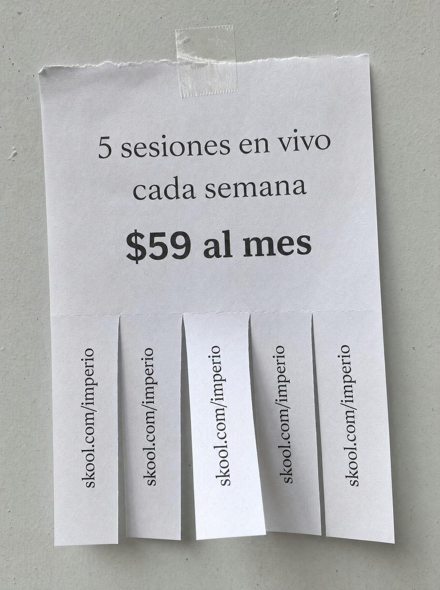

# 018 · Flyer con tiras arrancables (Free ticket)

**Familia:** Oferta y precio · **Necesitas:** Nada · **Resultado en Meta:** $346 invertidos, 10 compras, $34,6 por compra (cuenta de Imperio, sep 2026)



## Qué es
La foto de un flyer de papel pegado con cinta en una pared, con la oferta arriba y abajo tiras recortadas con tu contacto para arrancar, como los avisos de barrio.

## Por qué funciona
Es un objeto real, no un diseño, así que no parece anuncio. Las tiras dicen 'esto se acaba' y 'llévate el dato' sin escribirlo, y la oferta va en tres líneas sin adornos: qué recibes y cuánto cuesta.

## Cuándo usarlo
Público frío o tibio, sobre todo en negocios locales o de servicio (clases, talleres, comunidades, consultas). Sirve para presentar la oferta y el precio sin adornos y empujar la compra.

## Así lo hicimos para Imperio
- **Texto en la imagen:** 5 sesiones en vivo / cada semana / $59 al mes / skool.com/imperio (en cada una de las cinco tiras)
- **Texto principal:**
  > 5 sesiones en vivo cada semana. No son webinars grabados: llegas con tu problema real y sales con el sistema andando.
  >
  > Más +35 cursos en español y +1.800 logros publicados por los miembros para copiar ideas.
  >
  > $59 al mes, y si no es para ti tienes 7 días de garantía 👇
- **Titular:** Imperio Agéntico · $59 al mes

## Receta para tu marca
- **Escena:** foto frontal con luz de día de un flyer blanco pegado con cinta en [UNA PARED O UN DIARIO MURAL], con el borde de arriba rasgado.
- **Oferta:** tres líneas centradas en serif: [QUÉ RECIBES] / [CADA CUÁNTO] / [TU PRECIO EXACTO] en negrita.
- **Tiras:** cinco tiras verticales recortadas abajo, cada una con [TU DOMINIO O TU WHATSAPP] en texto girado, y una levantada hacia la cámara.
- **Colores:** papel blanco y tinta negra; tu marca no va.
- **Lo que no se toca:** que se vea como papel real, con sombra y cinta. Si parece plantilla digital, se pierde el formato.

## Prompt con que se hizo el de Imperio (GPT Image 2.5)
```
[Nota: el de Imperio se generó con GPT Image 2 en 3:4. En GPT Image 2.5 pídelo en 4:5]
Vertical photograph of a printed paper flyer taped to a pale grey wall, shot straight on in daylight. The upper part of the flyer is plain white paper with a torn top edge, printed with centered elegant serif lines reading '5 sesiones en vivo', 'cada semana', and below in bold '$59 al mes'. The lower part of the sheet is cut into five narrow vertical strips that hang down like a pull-tab notice, each strip printed with small rotated text reading 'skool.com/imperio', and the third strip is curled forward so its text faces the camera. Slight paper curl, soft shadow on the wall, a small piece of tape at the top. Documentary photograph of a real community notice board. No inverted punctuation, no em dashes.
```

## Ojo
- El precio y lo que incluye tienen que ser exactos: no escribas 'gratis' ni un descuento que no existe.
- Marca la casilla de contenido generado por IA en el Administrador de anuncios.
