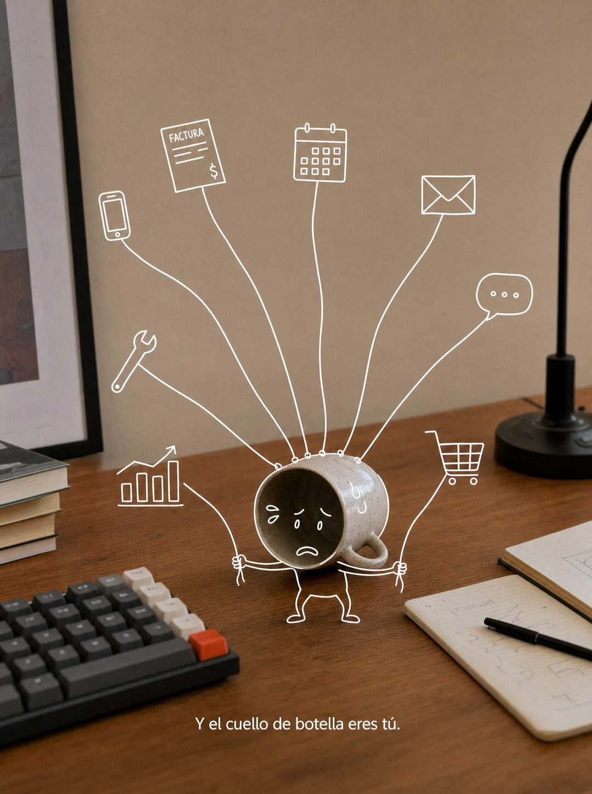

# 019 · Foto real con dibujo encima (Cartoon)

**Familia:** Humor y meme · **Necesitas:** Nada. Si tienes una foto real de tu producto, mejor · **Resultado en Meta:** $46 invertidos, 1 compra, $45,7 por compra (cuenta de Imperio, sep 2026) (muestra chica)



## Qué es
Una foto real de tu producto o de tu lugar de trabajo con un personaje dibujado encima en línea blanca fina: un objeto de la foto hace de cabeza o de cuerpo. El dibujo cuenta el problema del cliente.

## Por qué funciona
La mezcla de foto real y garabato no se parece a ningún anuncio, así que el ojo se detiene a entenderla. En el ejemplo, la taza agobiada que sostiene ocho cuerdas atadas a tareas es el dueño del que depende todo, y la frase de abajo lo dice en voz alta.

## Cuándo usarlo
Público frío. Sirve para nombrar un dolor con humor en cualquier negocio con un objeto reconocible (taza, herramienta, envase, producto), y su objetivo es frenar el scroll.

## Así lo hicimos para Imperio
- **Texto en la imagen:** FACTURA (dentro del ícono dibujado de una factura) / Y el cuello de botella eres tú. (letra blanca chica, abajo)
- **Texto principal:**
  > Si mañana te enfermas una semana, tu negocio factura o se detiene?
  >
  > Esa pregunta es todo el diagnóstico. La palabra que más leo en mi comunidad es DEPENDER.
  >
  > Glenda lo resolvió y lo escribió así: mi hostal funciona solo. Matias reemplazó a un administrativo completo en la empresa de su familia.
  >
  > $59 al mes 👇
- **Titular:** Imperio Agéntico · $59 al mes

## Receta para tu marca
- **Escena:** foto real y cálida de [TU PRODUCTO O UN OBJETO DE TU LUGAR DE TRABAJO] sobre una mesa, con fondo limpio.
- **Personaje:** dibujado encima con línea blanca fina: el objeto real hace de [CABEZA O CUERPO] y el dibujo le agrega brazos, piernas y una cara con [LA EMOCIÓN DE TU CLIENTE].
- **Acción:** el dibujo muestra [EL PROBLEMA DE TU CLIENTE] con íconos simples alrededor (en el ejemplo, ocho cuerdas atadas a tareas).
- **Texto:** una sola línea chica en blanco, abajo: [EL DIAGNÓSTICO EN UNA FRASE].
- **Lo que no se toca:** la foto tiene que ser foto y el dibujo, trazo fino blanco. Si todo es ilustración, se pierde el truco.

## Prompt con que se hizo el de Imperio (GPT Image 2.5)
```
[Nota: el de Imperio se generó con GPT Image 2 en 3:4. En GPT Image 2.5 pídelo en 4:5]
Vertical. A REAL photograph of a wooden desk against a warm beige wall, with a mechanical keyboard and a ceramic coffee mug tipped on its side. Drawn ON TOP of the photo in thin clean WHITE line art, a simple cartoon character: the tipped mug becomes the character's head, and the drawing adds a small body, two arms and legs, with eight thin drawn strings running from its hands to tiny drawn icons scattered around the photo (a phone, an invoice, a calendar, an envelope, a chat bubble, a cart, a chart, a wrench). The character looks overwhelmed. Photo real, line art clearly a hand-drawn digital overlay. At the bottom, small white text: 'Y el cuello de botella eres tú.' Correct Spanish accents. No inverted punctuation, no em dashes.
```

## Ojo
- El dibujo tiene que apoyarse en un objeto real de la foto: si el personaje flota sin tocar nada, se pierde el chiste.
- Marca la casilla de contenido generado por IA en el Administrador de anuncios.
