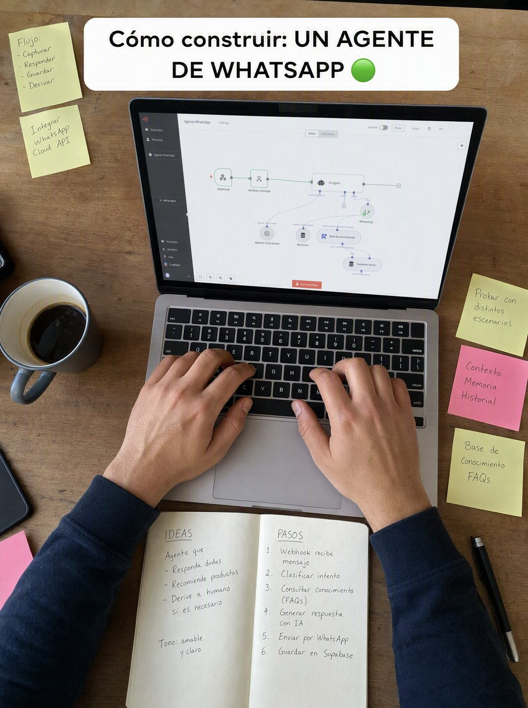

# 020 · Receta en foto cenital (Recipes)

**Familia:** Diagrama y dato · **Necesitas:** Nada. Si tienes una foto cenital real de tu proceso, mejor · **Resultado en Meta:** $564 invertidos, 11 compras, $51,3 por compra (cuenta de Imperio, sep 2026)



## Qué es
Una foto cenital de manos haciendo tu producto a mitad del proceso, con un caption tipo TikTok arriba que anuncia qué se está haciendo ('Cómo construir: UN AGENTE DE WHATSAPP'). Es contenido de receta, no publicidad de receta.

## Por qué funciona
El proceso en marcha da curiosidad y se lee como contenido que enseña, no como anuncio. Las manos reales y las notas alrededor prueban que hay trabajo detrás, y el caption promete el paso a paso.

## Cuándo usarlo
Público frío. Sirve para negocios donde el proceso se puede mostrar (cocina, oficios, diseño, software, belleza), y su objetivo es frenar el scroll enseñando algo.

## Así lo hicimos para Imperio
- **Texto en la imagen:** Cómo construir: UN AGENTE DE WHATSAPP 🟢 (caption blanco redondeado, arriba) / [post-its escritos a mano: Flujo: Capturar, Responder, Guardar, Derivar / Integrar WhatsApp Cloud API / Probar con distintos escenarios / Contexto Memoria Historial / Base de conocimiento FAQs] / [cuaderno abierto: IDEAS, agente que responda dudas, recomiende productos y derive a humano si es necesario, Tono: amable y claro / PASOS del 1 al 6, de Webhook recibe mensaje a Guardar en Supabase] / [pantalla con un flujo de nodos llamado Agente WhatsApp]
- **Texto principal:**
  > Un agente de WhatsApp se construye en una tarde. Ingredientes: un número, una cuenta de n8n, tu lista de precios y un prompt bien escrito.
  >
  > La receta completa, paso a paso y en español, está adentro.
  >
  > Vincent cobró $750 por el suyo. $59 al mes 👇
- **Titular:** Imperio Agéntico · $59 al mes

## Receta para tu marca
- **Escena:** foto cenital, tomada desde arriba, de [TU MESA DE TRABAJO] a mitad del proceso, con luz natural.
- **Manos:** dos manos haciendo [EL PASO MÁS VISUAL DE TU PROCESO], sin caras.
- **Detalles:** alrededor, [TUS INGREDIENTES O HERRAMIENTAS] y notas a mano con los pasos.
- **Caption:** caja blanca redondeada arriba con letra negra: 'Cómo [TU VERBO]: [TU PRODUCTO EN MAYÚSCULAS] [UN EMOJI]'.
- **Lo que no se toca:** que se vea en proceso y sin montar. Si todo está ordenado y perfecto, parece foto de catálogo.

## Prompt con que se hizo el de Imperio (GPT Image 2.5)
```
[Nota: el de Imperio se generó con GPT Image 2 en 3:4. En GPT Image 2.5 pídelo en 4:5]
Vertical overhead top-down photograph of a real desk in the middle of work: two hands typing on a laptop keyboard, the laptop screen showing a half-built node-based automation flow, handwritten sticky notes and a notebook scattered around, a pen, a coffee cup, warm natural light. Shot from directly above like a recipe process video. At the top, a white rounded caption box with black text reading: 'Cómo construir: UN AGENTE DE WHATSAPP 🟢'. Authentic in-progress process shot, not staged, no design elements other than the caption. Correct Spanish accents. No inverted punctuation, no em dashes.
```

## Ojo
- Si sale texto roto, manos deformes o cifras mal escritas, se rehace.
- Marca la casilla de contenido generado por IA en el Administrador de anuncios.
