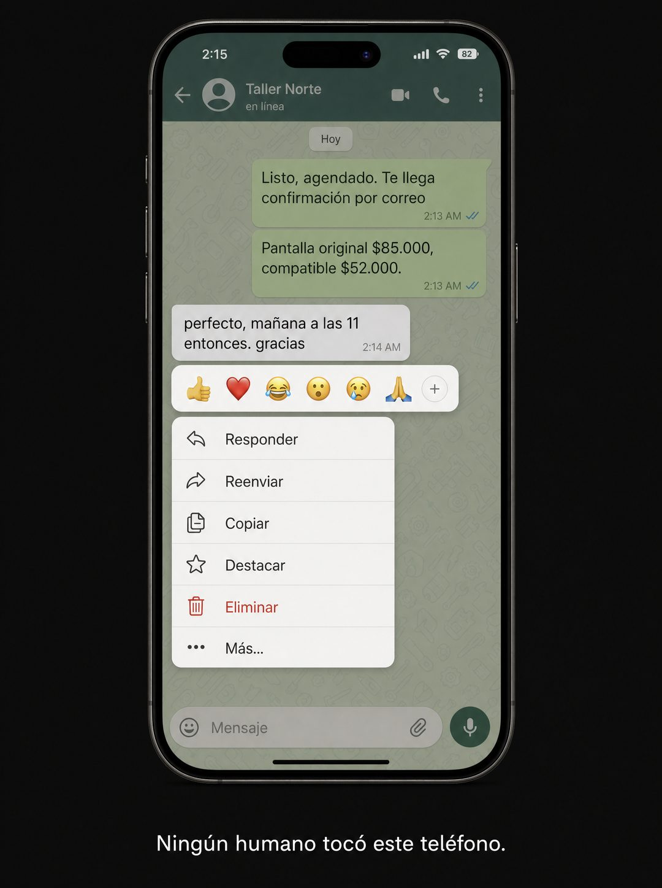

# 021 · Chat con menú contextual abierto (WhatsApp text)

**Familia:** Interfaz creíble · **Necesitas:** Nada · **Resultado en Meta:** $148 invertidos, 2 compras, $74,2 por compra (cuenta de Imperio, sep 2026)



## Qué es
Una captura de chat con el menú que aparece al mantener presionado un mensaje, abierto sobre la respuesta de un cliente. Debajo del teléfono, una sola línea explica qué estás viendo.

## Por qué funciona
El menú abierto es el detalle que hace creíble la captura: parece guardada en el momento, no armada. La hora de madrugada y la línea de abajo convierten un chat común en la prueba de que tu producto trabaja solo.

## Cuándo usarlo
Público tibio que duda si tu producto funciona de verdad. Sirve para software, atención automatizada o servicios con respuesta rápida, y su objetivo es mostrar el producto en uso.

## Así lo hicimos para Imperio
- **Texto en la imagen:** 2:15 / Taller Norte / en línea / Hoy / Listo, agendado. Te llega confirmación por correo (2:13 AM) / Pantalla original $85.000, compatible $52.000. (2:13 AM) / perfecto, mañana a las 11 entonces. gracias (2:14 AM) / [barra de reacciones con emojis] / Responder / Reenviar / Copiar / Destacar / Eliminar (en rojo) / Más... / Mensaje / Ningún humano tocó este teléfono. (letra blanca, debajo del teléfono)
- **Texto principal:**
  > Tu competencia contesta WhatsApp en 4 horas. Este agente contestó en 4 segundos, a las 2 de la mañana, y cerró la cita solo.
  >
  > No es magia. Es un flujo conectado a tu calendario y a tu lista de precios.
  >
  > El curso está adentro, sin escribir código. $59 al mes 👇
- **Titular:** Imperio Agéntico · $59 al mes

## Receta para tu marca
- **Formato:** teléfono con una app de mensajería genérica, sobre fondo oscuro liso.
- **Chat:** arriba, [LAS RESPUESTAS DE TU PRODUCTO O TU NEGOCIO] en burbujas verdes; abajo, el mensaje del cliente seleccionado, [UNA CONFIRMACIÓN CORTA EN MINÚSCULAS], con [UNA HORA QUE PRUEBE TU PUNTO].
- **Menú:** barra de reacciones con emojis y el menú abierto: Responder, Reenviar, Copiar, Destacar, Eliminar en rojo y Más...
- **Remate:** una línea blanca debajo del teléfono: [LA AFIRMACIÓN QUE EL CHAT PRUEBA].
- **Lo que no se toca:** el menú contextual abierto. Sin él, es un chat más.

## Prompt con que se hizo el de Imperio (GPT Image 2.5)
```
[Nota: el de Imperio se generó con GPT Image 2 en 3:4. En GPT Image 2.5 pídelo en 4:5]
Vertical phone screenshot of a green-tinted messaging app with the LONG-PRESS CONTEXT MENU OPEN over one message. At the top of the menu, a horizontal emoji reaction bar. The selected incoming grey message reads 'perfecto, mañana a las 11 entonces. gracias' with the timestamp '2:14 AM'. The open context menu lists 'Responder', 'Reenviar', 'Copiar', 'Destacar', 'Eliminar' in red, and 'Más...'. Behind the menu, outgoing green messages are partially visible reading 'Listo, agendado. Te llega confirmación por correo' and 'Pantalla original $85.000, compatible $52.000.' Below the phone on a plain dark background, one white line: 'Ningún humano tocó este teléfono.' Believable generic messenger UI, no real brand logos. No inverted question or exclamation marks anywhere. Correct Spanish accents. No em dashes.
```

## Ojo
- Mantén el chat como demo de tu producto: no lo presentes como conversación real de un cliente ni muestres nombres o números reales.
- La línea de abajo tiene que ser verdad: si una persona revisa las respuestas, no digas que nadie tocó el teléfono.
- Marca la casilla de contenido generado por IA en el Administrador de anuncios.
