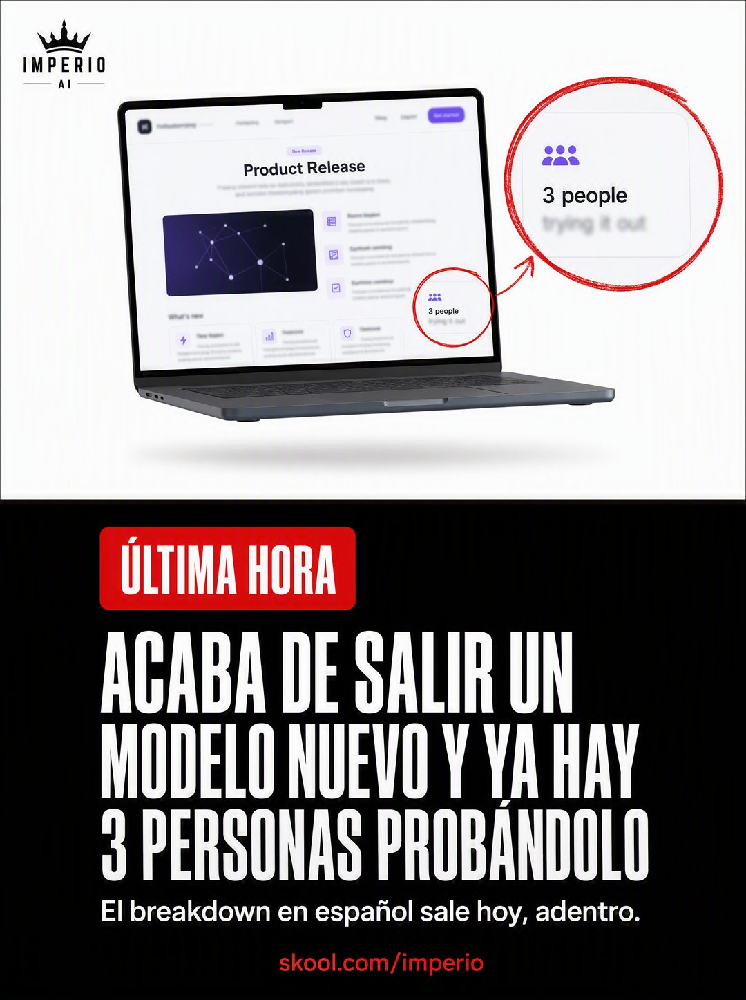

# 023 · Noticia de última hora (Breaking news)

**Familia:** Tipografía dura · **Necesitas:** Tu logo · **Resultado en Meta:** Sin datos propios todavía



## Qué es
Una pieza partida en dos: arriba, la captura de la novedad con un círculo rojo de marcador sobre el detalle que importa; abajo, un bloque negro con etiqueta de última hora y titular condensado.

## Por qué funciona
El círculo rojo es lenguaje de noticia y de meme a la vez: dice 'mira esto' antes de que leas. El titular se cuelga de algo que está pasando hoy, y eso le da urgencia sin inventarla.

## Cuándo usarlo
Público frío o tibio, solo cuando hay una novedad real en tu rubro (lanzamiento, cambio de reglas, temporada, producto nuevo). Sirve para cualquier negocio que reaccione rápido, y su objetivo es aprovechar la noticia y empujar la entrada.

## Así lo hicimos para Imperio
- **Texto en la imagen:** IMPERIO AI (logo con corona, arriba a la izquierda) / [laptop con una página de lanzamiento en inglés, 'Product Release', con el texto desenfocado] / 3 people / trying it out (marcado con un círculo rojo y ampliado en una burbuja) / ÚLTIMA HORA (etiqueta roja) / ACABA DE SALIR UN MODELO NUEVO Y YA HAY 3 PERSONAS PROBÁNDOLO / El breakdown en español sale hoy, adentro. / skool.com/imperio (en rojo, abajo)
- **Texto principal:**
  > Cada vez que sale un modelo nuevo pasa lo mismo: afuera es puro hilo de humo y adentro ya hay gente probándolo el mismo día.
  >
  > El breakdown en español sale adentro primero, con lo que sirve y lo que no.
  >
  > +3.300 personas para no enterarte último. $59 al mes 👇

## Receta para tu marca
- **Mitad de arriba:** fondo blanco con [LA CAPTURA DE LA NOVEDAD] en un laptop flotando, el texto desenfocado y un círculo rojo a mano alzada con burbuja de zoom sobre [EL DETALLE QUE IMPORTA].
- **Marca:** [TU LOGO] chico, arriba a la izquierda.
- **Mitad de abajo:** bloque negro con la etiqueta roja 'ÚLTIMA HORA' y un titular blanco condensado en tres líneas: [LA NOVEDAD Y LO QUE TÚ YA HICISTE CON ELLA].
- **Cierre:** una línea blanca más chica con [QUÉ RECIBE EL CLIENTE Y CUÁNDO] y [TU DOMINIO] en rojo al pie.
- **Lo que no se toca:** el círculo rojo y el bloque negro con la etiqueta. Si la noticia no es de hoy, el formato pierde la gracia.

## Prompt con que se hizo el de Imperio (GPT Image 2.5)
```
[Nota: el de Imperio se generó con GPT Image 2 en 3:4. En GPT Image 2.5 pídelo en 4:5]
Vertical ad split in two. TOP HALF on white: a floating laptop screen showing a generic AI product release web page with blurred unreadable body text, with a hand-drawn RED MARKER CIRCLE annotation around one area of the screen and a magnified zoom bubble beside it. Small brand mark in the top left corner. BOTTOM HALF a solid black block containing: a red badge with white caps 'ÚLTIMA HORA', then a white bold condensed headline across three lines 'ACABA DE SALIR UN MODELO NUEVO Y YA HAY 3 PERSONAS PROBÁNDOLO', then a smaller white line 'El breakdown en español sale hoy, adentro.' and at the bottom in small red text the URL 'skool.com/imperio'. No specific AI model name anywhere. Urgent news aesthetic. Correct Spanish accents. No inverted punctuation, no em dashes.
```

## Ojo
- La novedad y la cifra del titular tienen que ser verdad el día que publicas: no inventes urgencia.
- Si la captura es de la página de otra marca, desenfócala y no uses su logo.
- Marca la casilla de contenido generado por IA en el Administrador de anuncios.
