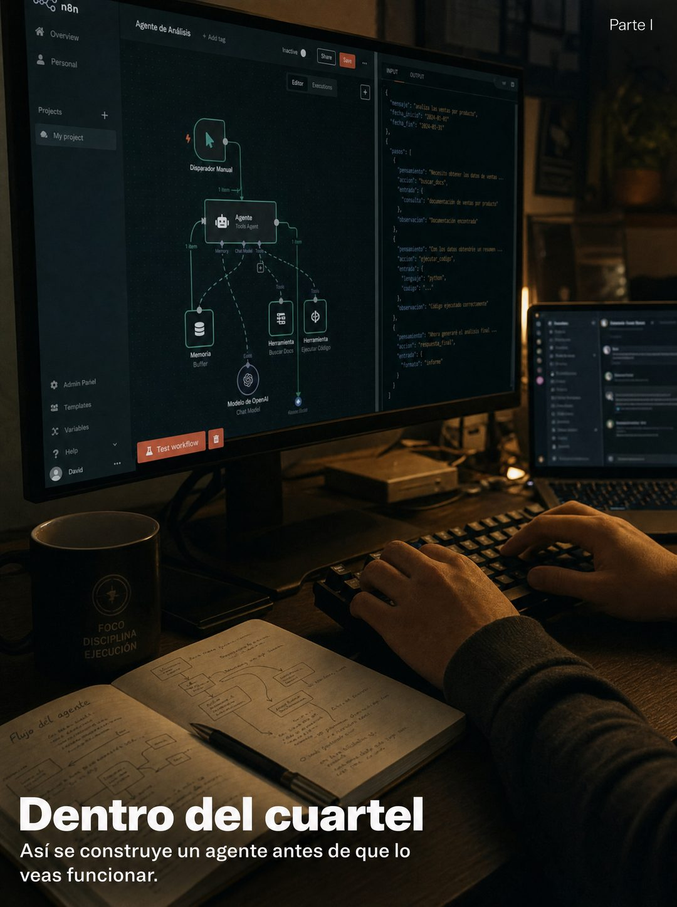

# 024 · Detrás de escena en serie (Sourcing)

**Familia:** Foto nativa · **Necesitas:** Nada. Si tienes una foto real de tu taller, mejor · **Resultado en Meta:** $88 invertidos, 6 compras, $14,6 por compra (cuenta de Imperio, sep 2026) (muestra chica)



## Qué es
Una foto documental de cómo se hace tu producto por dentro (el taller, la cocina, el escritorio de noche), con un texto discreto abajo y un 'Parte I' en la esquina que promete una serie.

## Por qué funciona
Mostrar el trabajo que el cliente no ve genera confianza, y la foto sin diseño no se lee como anuncio. El 'Parte I' abre un ciclo: la gente quiere ver lo que sigue.

## Cuándo usarlo
Público frío o tibio. Sirve para negocios con un proceso artesanal o técnico que vale la pena mostrar, y para campañas en serie que construyen confianza pieza a pieza.

## Así lo hicimos para Imperio
- **Texto en la imagen:** Parte I (arriba a la derecha) / [pantalla con un flujo de nodos 'Agente de Análisis' y código; taza con FOCO DISCIPLINA EJECUCIÓN; cuaderno con 'Flujo del agente'] / Dentro del cuartel (blanco, en negrita, abajo a la izquierda) / Así se construye un agente antes de que lo veas funcionar.
- **Texto principal:**
  > Así se ve construir un agente antes de que lo veas funcionar: dos pantallas, un cuaderno lleno de diagramas y varios intentos fallidos.
  >
  > Eso es lo que no te muestran los cursos de 5 minutos.
  >
  > Adentro está el proceso completo, con las sesiones en vivo para cuando te trabas. $59 al mes 👇
- **Titular:** Imperio Agéntico · $59 al mes

## Receta para tu marca
- **Escena:** foto real y con poca luz de [TU LUGAR DE TRABAJO] a mitad del trabajo, con manos trabajando y sin caras.
- **Detalles:** [TUS HERRAMIENTAS, MATERIALES O PANTALLAS] y algo de desorden real; cualquier pantalla con datos, desenfocada.
- **Texto:** abajo a la izquierda, en blanco: [DENTRO DE TU TALLER, TU COCINA O TU ESTUDIO] en negrita y debajo [QUÉ SE HACE ANTES DE QUE EL CLIENTE LO VEA].
- **Serie:** 'Parte I' chico en blanco, arriba a la derecha.
- **Lo que no se toca:** la luz real del lugar y el texto discreto. Si le pones logo o botón, deja de parecer detrás de escena.

## Prompt con que se hizo el de Imperio (GPT Image 2.5)
```
[Nota: el de Imperio se generó con GPT Image 2 en 3:4. En GPT Image 2.5 pídelo en 4:5]
Vertical documentary photograph, shot in low warm light late at night: a close view of a working desk with a large monitor showing a complex node-based automation canvas and lines of code, a second screen partially visible, a mechanical keyboard, an open notebook covered in diagrams, a mug. Hands resting on the keyboard, cropped, no face. Cinematic behind-the-scenes feel, real and unstaged. Overlaid discreetly in the lower left, white text: 'Dentro del cuartel' in bold and below it in smaller type 'Así se construye un agente antes de que lo veas funcionar.' In the top right corner, small white text 'Parte I'. Correct Spanish accents. No inverted punctuation, no em dashes.
```

## Ojo
- Si en una pantalla se lee el logo de una herramienta de terceros o datos de clientes, desenfócalo.
- Si prometes 'Parte I', ten lista la Parte II: la serie tiene que existir.
- Marca la casilla de contenido generado por IA en el Administrador de anuncios.
