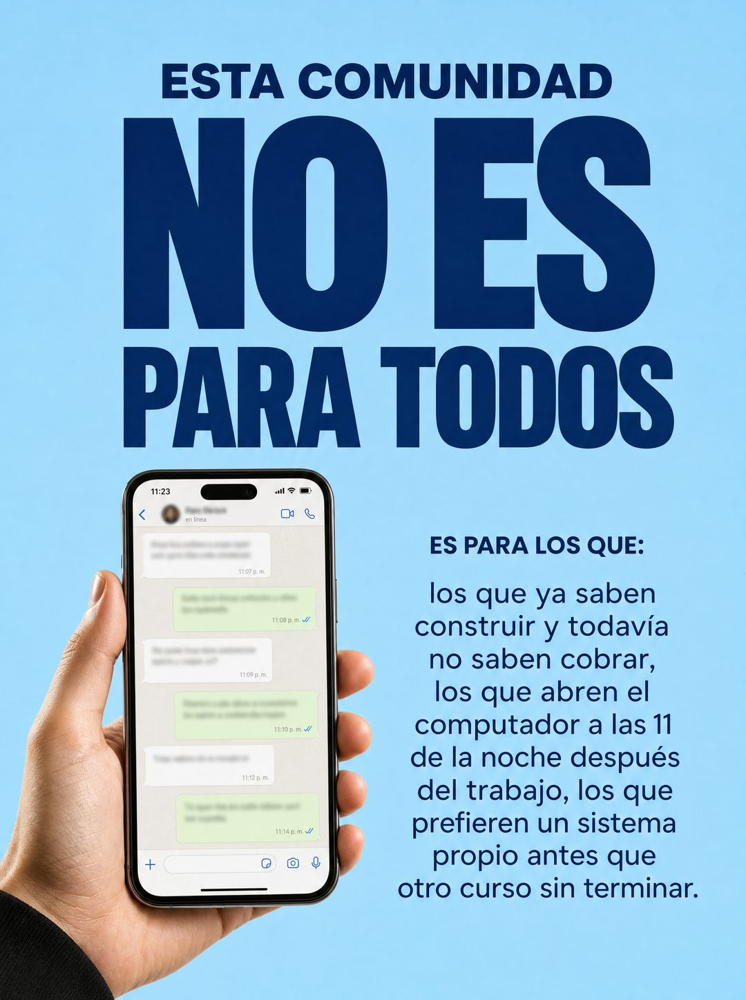

# 025 · No es para todos (Avoid this)

**Familia:** Tipografía dura · **Necesitas:** Nada · **Resultado en Meta:** Sin datos propios todavía



## Qué es
Un titular que descalifica ('no es para todos') y un párrafo que describe con detalle a quién sí, junto a una mano que sostiene el producto.

## Por qué funciona
Que una marca diga que no es para todos frena el scroll y despierta las ganas de pertenecer. El párrafo no es una lista con palomitas: son escenas concretas en las que el cliente correcto se reconoce, y eso filtra al que no va a comprar.

## Cuándo usarlo
Público frío o tibio, para ofertas que funcionan mejor con el cliente correcto (comunidades, programas, servicios premium). Su objetivo es filtrar a los curiosos y atraer al que sí va a comprar.

## Así lo hicimos para Imperio
- **Texto en la imagen:** ESTA COMUNIDAD / NO ES / PARA TODOS / [mano sosteniendo un teléfono con un chat desenfocado] / ES PARA LOS QUE: / los que ya saben construir y todavía no saben cobrar, los que abren el computador a las 11 de la noche después del trabajo, los que prefieren un sistema propio antes que otro curso sin terminar.
- **Texto principal:**
  > Prefiero que no entres a que entres esperando magia.
  >
  > Si buscas plata fácil en 7 días o que alguien lo haga por ti, esto no es para ti y te va a molestar.
  >
  > Si estás dispuesto a construir 30 minutos al día, adentro hay +3.300 personas haciendo exactamente eso. $59 al mes 👇

## Receta para tu marca
- **Fondo:** un color plano y claro de [TU MARCA].
- **Titular:** '[ESTE CURSO, ESTE SERVICIO O ESTA TIENDA]' en sans gruesa mediana y debajo 'NO ES PARA TODOS' mucho más grande, en el color oscuro de tu marca.
- **Izquierda:** una mano real sosteniendo [TU PRODUCTO], recortada sobre el fondo.
- **Derecha:** 'ES PARA:' en negrita chica y un párrafo corrido, sin viñetas ni palomitas: [TRES ESCENAS CONCRETAS DE TU CLIENTE IDEAL, SEPARADAS POR COMA].
- **Lo que no se toca:** el párrafo en prosa, con escenas específicas (horarios, situaciones, frustraciones). Si se convierte en lista de beneficios, pierde el tono.

## Prompt con que se hizo el de Imperio (GPT Image 2.5)
```
[Nota: el de Imperio se generó con GPT Image 2 en 3:4. En GPT Image 2.5 pídelo en 4:5]
Vertical ad, sky blue background. Top: 'ESTA COMUNIDAD' in medium navy bold sans, then 'NO ES PARA TODOS' in MUCH larger navy bold sans across two lines. Lower left: a photograph of a hand holding a smartphone upright showing a chat conversation with blurred bubbles, cut out cleanly over the blue. Lower right: 'ES PARA LOS QUE:' in small navy bold, followed by a centered navy paragraph in flowing prose, no bullets and no checkmarks, reading: 'los que ya saben construir y todavía no saben cobrar, los que abren el computador a las 11 de la noche después del trabajo, los que prefieren un sistema propio antes que otro curso sin terminar.' Calm premium supplement-ad layout. Correct Spanish accents. No inverted punctuation, no em dashes.
```

## Ojo
- Si sale texto roto, manos deformes o cifras mal escritas, se rehace.
- Marca la casilla de contenido generado por IA en el Administrador de anuncios.
