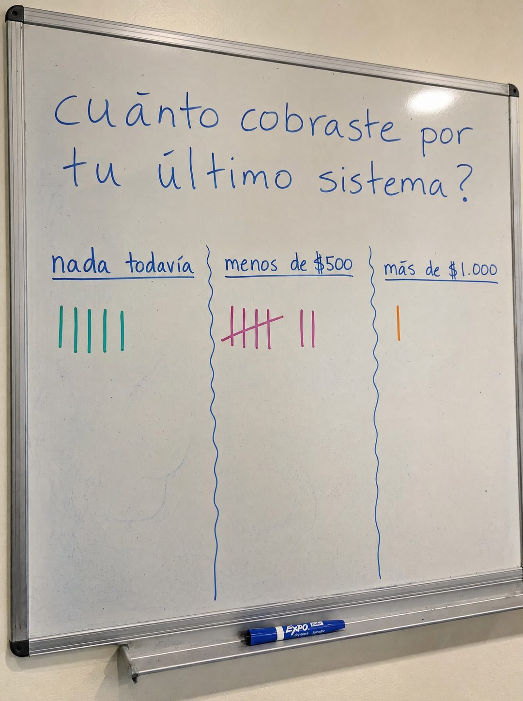

# 026 · Encuesta en pizarra con votos (Whiteboard)

**Familia:** Objeto físico con texto · **Necesitas:** Nada · **Resultado en Meta:** Sin datos propios todavía



## Qué es
La foto de una pizarra real con una pregunta escrita a mano, tres opciones en columnas y votos marcados con palitos de colores, como una encuesta de oficina.

## Por qué funciona
Es un objeto real con letra de persona, no un gráfico, así que no se lee como anuncio. La pregunta interpela directo al cliente y los votos ya marcados lo empujan a responder en su cabeza dónde está él.

## Cuándo usarlo
Público frío. Sirve para cualquier negocio que pueda hacer una pregunta incómoda sobre la situación del cliente (cuánto gasta, cuánto cobra, cada cuánto hace algo), y su objetivo es frenar el scroll y abrir conversación.

## Así lo hicimos para Imperio
- **Texto en la imagen:** cuánto cobraste por tu último sistema? / nada todavía / menos de $500 / más de $1.000 / [palitos de conteo de colores bajo cada opción: cinco, siete y uno] / EXPO (en el plumón de la bandeja)
- **Texto principal:**
  > La mediana por proyecto adentro es $1.000, con mantenciones de $75 a $150 al mes.
  >
  > El precio no lo pone el mercado. Lo pones tú cuando sabes lo que vale lo que construiste.
  >
  > Maximiliano cobró $200 solo por el diagnóstico. Vilma cerró unos $1.300. Adentro está cómo se cotiza.
  >
  > $59 al mes 👇

## Receta para tu marca
- **Escena:** foto levemente en ángulo de una pizarra blanca real con marco metálico, reflejo de luz y un plumón en la bandeja.
- **Pregunta:** escrita a mano en azul, en minúscula y en dos líneas: [UNA PREGUNTA INCÓMODA PARA TU CLIENTE]?, solo con el signo de cierre.
- **Opciones:** tres columnas separadas por líneas onduladas, cada una subrayada: [OPCIÓN BAJA] / [OPCIÓN MEDIA] / [OPCIÓN ALTA].
- **Votos:** palitos de conteo de distintos colores bajo cada opción, con más votos donde está el cliente que tu producto ayuda.
- **Lo que no se toca:** la letra imperfecta y la pizarra real. Si se ve como gráfico digital, deja de ser encuesta.

## Prompt con que se hizo el de Imperio (GPT Image 2.5)
```
[Nota: el de Imperio se generó con GPT Image 2 en 3:4. En GPT Image 2.5 pídelo en 4:5]
Vertical photograph of a REAL whiteboard with a metal frame and visible light glare, shot slightly angled. Handwritten in blue marker across two lines at the top, the sentence beginning directly with a lowercase c and NO punctuation mark before it: 'cuánto cobraste por tu último sistema?'. Below, three columns separated by hand-drawn wavy vertical lines, each headed with an underlined handwritten label: 'nada todavía', 'menos de $500', 'más de $1.000'. Under each label, TALLY MARKS counting votes in different marker colours: four strokes under the first, a group of five crossed plus two under the second, one under the third. A marker resting on the tray. Authentic imperfect handwriting. Critical: the question uses ONLY a closing question mark at the end, never an opening inverted one. No em dashes.
```

## Ojo
- Si sale texto roto, manos deformes o cifras mal escritas, se rehace.
- Los palitos son decorado: si citas el resultado de la encuesta en el texto del anuncio, tiene que ser una encuesta que hiciste de verdad.
- Marca la casilla de contenido generado por IA en el Administrador de anuncios.
