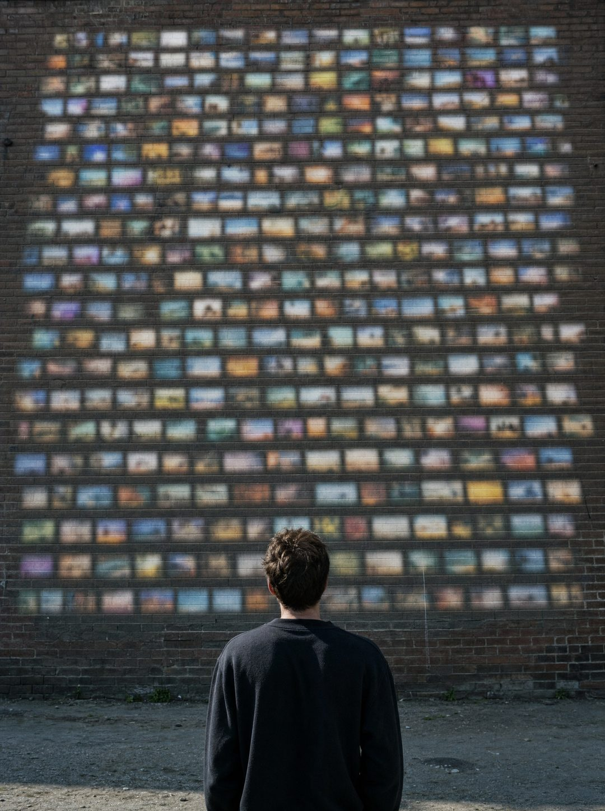

# 027 · Persona de espaldas frente al muro (Greenscreen)

**Familia:** Prueba social real · **Necesitas:** Muchas capturas reales de logros, reseñas o pedidos de clientes · **Resultado en Meta:** $105 invertidos, 5 compras, $21,1 por compra (cuenta de Imperio, sep 2026)



## Qué es
Una foto exterior de una persona de espaldas, chica en el cuadro, mirando un muro de ladrillo enorme donde se proyectan cientos de capturas fuera de foco: tus logros, reseñas o clientes. No lleva texto.

## Por qué funciona
La escala hace el trabajo: una persona chica frente a cientos de pruebas comunica volumen sin decir una cifra. Al estar de espaldas no posa ni actúa, y la foto parece del mundo real, no un diseño.

## Cuándo usarlo
Público tibio o remarketing, cuando ya tienes mucha prueba acumulada (reseñas, casos, pedidos, alumnos). Sirve para mostrar prueba y respaldar la cifra que va en el texto principal del anuncio.

## Así lo hicimos para Imperio
- **Texto en la imagen:** Ninguno
- **Texto principal:**
  > +1.800 logros publicados al corte de julio. Ninguno es mío.
  >
  > Cada uno lleva nombre, fecha y captura de quien lo construyó. Un panadero que trabaja en barcos, una señora de 49 que nunca tocó código, un médico que hizo su web sin programar.
  >
  > Entra y revisa el muro tú mismo. $59 al mes 👇
- **Titular:** Imperio Agéntico · $59 al mes

## Receta para tu marca
- **Escena:** foto exterior con luz de día de [UNA PERSONA DE ESPALDAS, PUEDES SER TÚ] con ropa casual, de pie frente a una pared de ladrillo enorme.
- **Muro:** proyectada sobre toda la pared, una grilla de cientos de [CAPTURAS REALES DE TUS LOGROS, RESEÑAS O PEDIDOS], fuera de foco.
- **Escala:** la persona ocupa poco del cuadro; el muro domina.
- **Texto:** ninguno en la imagen; la cifra va en el texto principal del anuncio.
- **Lo que no se toca:** la persona de espaldas y el muro gigante. Si la persona mira a cámara o posa, se pierde el efecto.

## Prompt con que se hizo el de Imperio (GPT Image 2.5)
```
[Nota: el de Imperio se generó con GPT Image 2 en 3:4. En GPT Image 2.5 pídelo en 4:5]
Vertical photograph taken outdoors in daylight: a man seen from BEHIND, standing casually in a dark sweatshirt, facing a huge brick wall. Projected across the entire wall, a giant grid of hundreds of small post cards, all clearly OUT OF FOCUS and unreadable, glowing faintly like a projection. The man is small in frame, the wall dominates. Natural light, documentary photograph, no text overlay, no readable content anywhere on the wall. Cinematic composition.
```

## Ojo
- Nunca inventes testimonios, chats de clientes, reseñas ni capturas de resultados: si el formato muestra prueba social, usa material real o déjalo fuera.
- Si quieres una versión legible, compón tus capturas reales encima después: no dejes que la IA invente su contenido.
- Marca la casilla de contenido generado por IA en el Administrador de anuncios.
