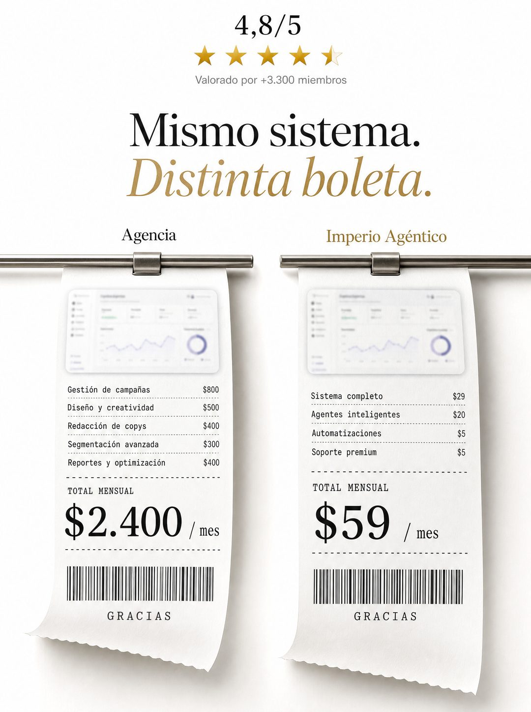

# 028 · Dos boletas lado a lado (Receipt)

**Familia:** Objeto físico con texto · **Necesitas:** Tu calificación real con su número de reseñas · **Resultado en Meta:** Sin datos propios todavía



## Qué es
Dos boletas de papel colgando de rieles: una con el precio de la alternativa cara y otra con el tuyo, cada una con el detalle de lo que cobra. Arriba, una calificación y un titular que dice que el resultado es el mismo.

## Por qué funciona
La boleta contiene la comparación completa, línea por línea, así que es imposible de malinterpretar. El papel real y los rieles lo alejan del gráfico de Canva, y la calificación de arriba responde la objeción de calidad antes de que aparezca.

## Cuándo usarlo
Público tibio o remarketing que está comparando precios. Sirve para negocios que son la alternativa más barata o más eficiente a algo caro y conocido, y su objetivo es responder la objeción de precio.

## Así lo hicimos para Imperio
- **Texto en la imagen:** 4,8/5 / [cuatro estrellas y media doradas] / Valorado por +3.300 miembros / Mismo sistema. / Distinta boleta. (dorado, en cursiva) / Agencia / [captura de panel desenfocada] / Gestión de campañas $800 / Diseño y creatividad $500 / Redacción de copys $400 / Segmentación avanzada $300 / Reportes y optimización $400 / TOTAL MENSUAL / $2.400 / mes / [código de barras] / GRACIAS / Imperio Agéntico / [captura de panel desenfocada] / Sistema completo $29 / Agentes inteligentes $20 / Automatizaciones $5 / Soporte premium $5 / TOTAL MENSUAL / $59 / mes / [código de barras] / GRACIAS
- **Texto principal:**
  > La diferencia no es solo el precio.
  >
  > Con una agencia dependes de ellos para siempre. Con Imperio aprendes a construirlo, y después se lo cobras tú a otros.
  >
  > José reemplazó una agencia completa y facturó $2.100 haciéndolo él. $59 al mes 👇

## Receta para tu marca
- **Arriba:** [TU CALIFICACIÓN REAL]/5 con estrellas doradas y en gris chico [CUÁNTAS RESEÑAS LA RESPALDAN].
- **Titular:** 'Mismo [RESULTADO].' en serif negra y debajo 'Distinta boleta.' en serif dorada y cursiva.
- **Boletas:** dos tiras de papel colgando de rieles metálicos, con su etiqueta arriba ([LA ALTERNATIVA CARA] y [TU MARCA]); cada una con [SU DETALLE DE COBRO LÍNEA POR LÍNEA], 'TOTAL MENSUAL', el total grande, código de barras y 'GRACIAS'.
- **Colores:** fondo blanco, papel con textura y dorado solo en el acento.
- **Lo que no se toca:** que las líneas sumen exacto el total y que la comparación sea justa. Si las cuentas no cuadran, la boleta pierde toda la credibilidad.

## Prompt con que se hizo el de Imperio (GPT Image 2.5)
```
[Nota: el de Imperio se generó con GPT Image 2 en 3:4. En GPT Image 2.5 pídelo en 4:5]
Vertical ad on a clean white background. Top centered: '4,8/5' with a row of four and a half gold stars, and under it small grey text 'Valorado por +3.300 miembros'. Then the headline: 'Mismo sistema.' in black serif and directly below 'Distinta boleta.' in gold italic serif. Center: TWO paper receipts hanging from thin metal rails, slightly curled. The left receipt shows a small blurred dashboard screenshot printed at its top, several small line items, and one large bold total '$2.400 / mes', with a barcode and 'GRACIAS' at the bottom. The right receipt shows the same kind of blurred screenshot, line items, and one large bold total '$59 / mes', with a barcode and 'GRACIAS'. Small labels above each rail: 'Agencia' and 'Imperio Agéntico'. Premium minimal e-commerce photography, detailed paper texture. Correct Spanish accents. No inverted punctuation, no em dashes.
```

## Ojo
- Nunca inventes testimonios, chats de clientes, reseñas ni capturas de resultados: si el formato muestra prueba social, usa material real o déjalo fuera.
- Las líneas de cada boleta tienen que sumar exacto el total, y el precio de la alternativa tiene que ser real en tu mercado.
- Marca la casilla de contenido generado por IA en el Administrador de anuncios.
