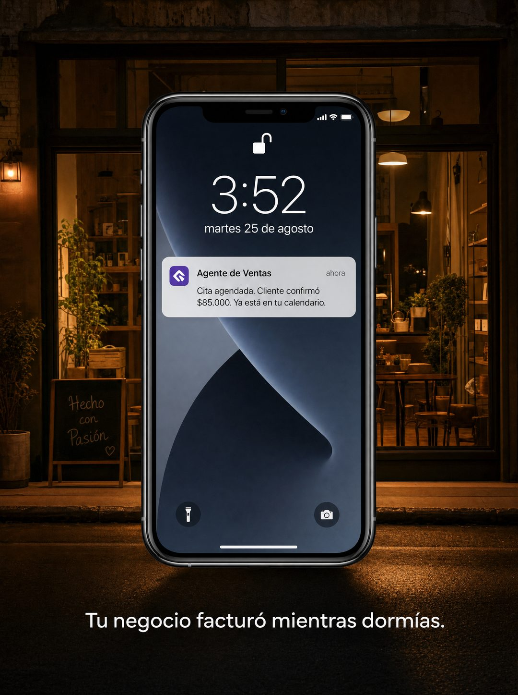

# 030 · Notificación en pantalla de bloqueo (Notification offer)

**Familia:** Interfaz creíble · **Necesitas:** Nada. Si tienes una foto real de tu negocio, mejor · **Resultado en Meta:** Sin datos propios todavía



## Qué es
Un teléfono con la pantalla de bloqueo encendida y una sola notificación que anuncia el resultado que vende tu producto. Detrás va una foto del lugar donde ese resultado ocurre: en el ejemplo de Imperio, un local de noche con las luces prendidas y nadie adentro.

## Por qué funciona
La notificación es una interfaz que todos revisan sin pensar, así que se lee antes de que el ojo la clasifique como anuncio. La hora de madrugada y el local vacío cuentan la historia completa: el resultado llegó sin que nadie estuviera trabajando. El aviso afirma algo concreto, con acción y monto, en vez de prometer en abstracto.

## Cuándo usarlo
Público frío y tibio, en cualquier negocio cuyo producto genera un aviso: reservas, ventas, citas, pedidos o pagos. Sirve para frenar el scroll y mostrar el beneficio final en una sola imagen.

## Así lo hicimos para Imperio
- **Texto en la imagen:** Pantalla del teléfono: 3:52 / martes 25 de agosto / Agente de Ventas / ahora / Cita agendada. Cliente confirmó $85.000. Ya está en tu calendario. / Tu negocio facturó mientras dormías. (línea blanca bajo el teléfono) / Hecho con Pasión (pizarra del local, al fondo a la izquierda)
- **Texto principal:**
  > Cita agendada a las 3:52 AM. Cliente confirmado. Nadie despierto.
  >
  > Eso es un agente conectado a WhatsApp y a tu calendario. Se construye en una tarde y no necesita que sepas programar.
  >
  > +3.300 personas ya lo están armando en español. $59 al mes 👇

## Receta para tu marca
- **Fondo:** foto vertical de [EL LUGAR DONDE OCURRE TU RESULTADO] a una hora en que nadie trabaja, cálida y real, sin personas.
- **Teléfono:** centrado, con la pantalla de bloqueo: hora grande [UNA HORA DE MADRUGADA], fecha en minúsculas y candado abierto.
- **Notificación:** una sola tarjeta con ícono cuadrado en [COLOR DE TU MARCA], título [NOMBRE DE TU PRODUCTO O AGENTE], la palabra ahora a la derecha y el cuerpo [EL AVISO QUE GENERA TU PRODUCTO, CON ACCIÓN Y MONTO].
- **Remate:** una línea blanca bajo el teléfono: [EL BENEFICIO EN UNA FRASE, EN PASADO].
- **Lo que no se toca:** una sola notificación, hora de madrugada y fondo sin gente. Si agregas más avisos o personas en la foto, se pierde la historia.

## Prompt con que se hizo el de Imperio (GPT Image 2.5)
```
[Nota: el de Imperio se generó con GPT Image 2 en 3:4. En GPT Image 2.5 pídelo en 4:5]
Vertical. The BACKGROUND is a photograph of a small business at night with the lights still on and nobody inside, seen through the window from the street, warm and inviting. Overlaid on top, centered, a modern smartphone mockup showing its lock screen: a large clock reading '3:52', the date 'martes 25 de agosto', an open padlock icon. On the lock screen, one notification card with a small purple app icon, the title 'Agente de Ventas', 'ahora' on the right, and the body text 'Cita agendada. Cliente confirmó $85.000. Ya está en tu calendario.' Below the phone, one clean white line: 'Tu negocio facturó mientras dormías.' Photoreal, crisp legible notification. Correct Spanish accents. No inverted punctuation, no em dashes.
```

## Ojo
- La notificación es una demostración de lo que hace tu producto, no el resultado de un cliente: no le pongas nombres reales ni montos que no puedas respaldar.
- Revisa que el día de la semana coincida con la fecha y que el aviso salga completo; si sale texto cortado o cifras mal escritas, se rehace.
- Marca la casilla de contenido generado por IA en el Administrador de anuncios.
