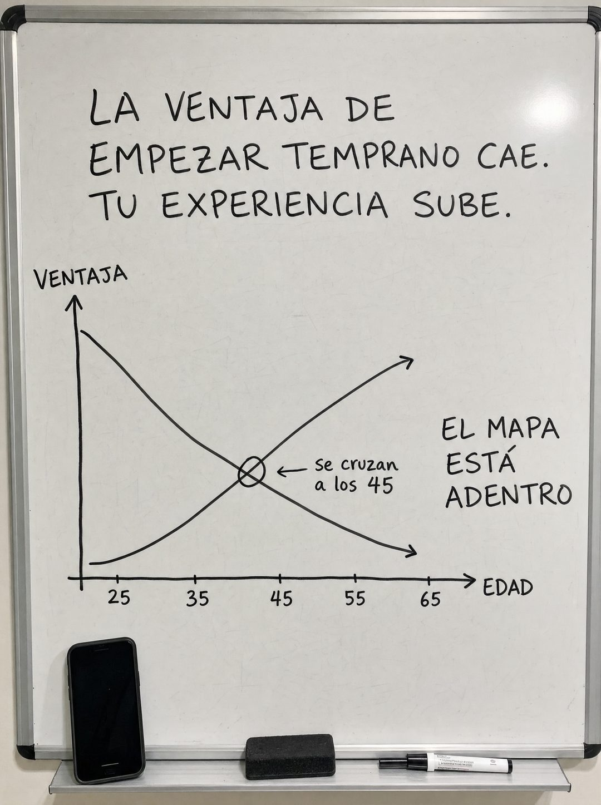

# 031 · Curva dibujada en pizarra (Demographic callout)

**Familia:** Diagrama y dato · **Necesitas:** Nada. Si vendes algo físico, una foto de tu producto · **Resultado en Meta:** $270 invertidos, 11 compras, $24,6 por compra (cuenta de Imperio, sep 2026)



## Qué es
Una pizarra blanca fotografiada con un dato y su gráfico dibujados a mano con plumón: titular arriba, ejes rotulados, una curva y una nota que señala el punto clave. En el ejemplo de Imperio son dos curvas que se cruzan (la ventaja de empezar temprano baja, la experiencia sube) y un teléfono real apoyado en la bandeja.

## Por qué funciona
Un gráfico hecho a mano se lee como algo que alguien te explicó en una reunión, no como algo que una agencia diseñó para venderte. La pizarra es un objeto real, y lo que parece capturado del mundo rinde más que lo que parece hecho en Canva. El objeto en la bandeja conecta la idea con la solución sin necesidad de botón.

## Cuándo usarlo
Público frío, en negocios que pueden explicar su propuesta con una tendencia o un cruce de dos variables: salud, finanzas, educación, servicios profesionales. Sirve para frenar el scroll y responder una objeción (en el ejemplo, sentirse tarde por la edad).

## Así lo hicimos para Imperio
- **Texto en la imagen:** LA VENTAJA DE / EMPEZAR TEMPRANO CAE. / TU EXPERIENCIA SUBE. / VENTAJA (eje vertical) / se cruzan / a los 45 (nota con flecha hacia el cruce de las curvas) / EL MAPA / ESTÁ / ADENTRO (a la derecha) / 25 35 45 55 65 / EDAD (eje horizontal)
- **Texto principal:**
  > El que lleva 20 años en un rubro y aprende IA le gana al de 22 que sabe IA y no conoce ningún negocio.
  >
  > Tú ya tienes la parte que no se aprende en YouTube: clientes, oficio y criterio. Falta la herramienta.
  >
  > Adentro hay gente de 49 que jamás tocó código y ya automatizó su semana. $59 al mes 👇
- **Titular:** Imperio Agéntico · $59 al mes

## Receta para tu marca
- **Escena:** foto vertical de una pizarra blanca con marco de aluminio, luz de oficina, borrador y plumón en la bandeja.
- **Titular:** arriba, a mano en mayúsculas y en dos o tres líneas: [LA TENDENCIA QUE TU CLIENTE NO CONOCE].
- **Gráfico:** ejes dibujados a mano con [VARIABLE VERTICAL] y [VARIABLE HORIZONTAL] con sus marcas, una o dos curvas y un círculo en el punto clave con la nota [EL DATO EN CUATRO PALABRAS].
- **Cierre:** a la derecha, a mano: [DÓNDE ESTÁ LA SOLUCIÓN]; en la bandeja, [TU PRODUCTO O UN TELÉFONO CON TU APP].
- **Colores:** solo plumón negro sobre blanco; el color de tu marca aparece únicamente en el objeto de la bandeja.
- **Lo que no se toca:** todo escrito a mano y con trazo imperfecto. Si el gráfico sale limpio como de computador, deja de ser una pizarra.

## Prompt con que se hizo el de Imperio (GPT Image 2.5)
```
[Nota: el de Imperio se generó con GPT Image 2 en 3:4. En GPT Image 2.5 pídelo en 4:5]
Vertical photograph of a white whiteboard, everything HAND DRAWN in black marker. At the top, handwritten in capitals across three lines: 'LA VENTAJA DE EMPEZAR TEMPRANO CAE. TU EXPERIENCIA SUBE.' Below, a hand-drawn chart with a wobbly hand-drawn Y axis labelled 'VENTAJA' and X axis labelled 'EDAD' with the marks 25, 35, 45, 55, 65 written by hand, and TWO hand-drawn curves crossing each other, one descending and one ascending, with a small circle drawn around the crossing point and the handwritten note 'se cruzan a los 45' beside it. On the right, handwritten: 'EL MAPA ESTÁ ADENTRO'. A real smartphone rests on the whiteboard tray below. Authentic marker texture and imperfect handwriting. Correct Spanish accents. No inverted punctuation, no em dashes.
```

## Ojo
- Si la curva muestra un dato duro (un porcentaje, una edad), tiene que salir de una fuente que puedas citar; si es una idea tuya, preséntala como opinión.
- El círculo tiene que caer justo sobre la cifra que dice la nota: en el ejemplo de Imperio el cruce quedó cerca del 42 y la nota dice 45.
- Marca la casilla de contenido generado por IA en el Administrador de anuncios.
