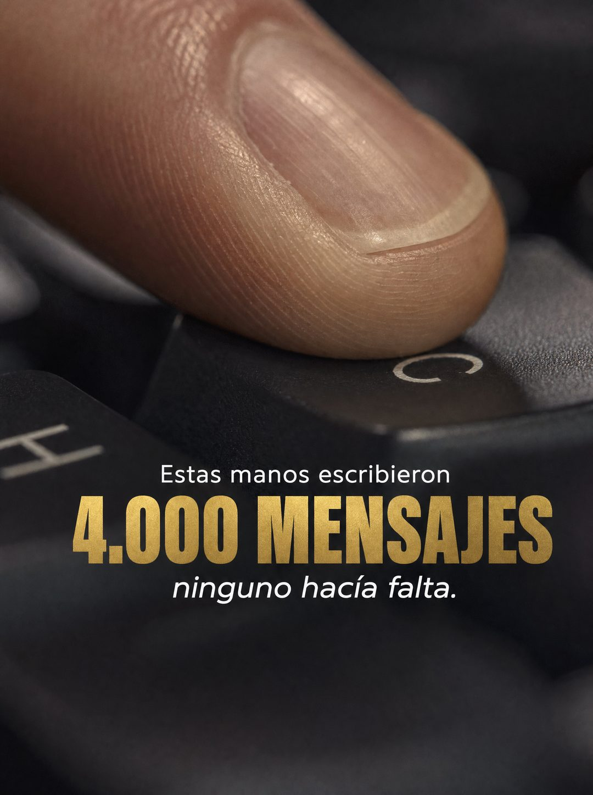

# 032 · Cifra sobre textura en macro (Text on skin)

**Familia:** Diagrama y dato · **Necesitas:** Nada · **Resultado en Meta:** $37 invertidos, 6 compras, $6,2 por compra (cuenta de Imperio, sep 2026) (muestra chica)



## Qué es
Un macro extremo de una textura que llena todo el encuadre, con tres líneas centradas: una frase corta, una cifra gigante en otro color y un remate en itálica. En el ejemplo de Imperio es la yema de un dedo sobre una tecla y la cantidad de mensajes que se escriben a mano.

## Por qué funciona
Una textura en primer plano es rara en el feed y frena el pulgar antes de que se lea nada. Toda la carga va en una sola cifra de color distinto, y el remate en itálica le da la vuelta: la cifra no presume, se convierte en un costo que el lector reconoce.

## Cuándo usarlo
Público frío, en negocios que pueden resumir el dolor de su cliente en una cantidad: mensajes, horas, cuentas, kilos, visitas. Sirve para frenar el scroll y ponerle número al problema antes de hablar del producto.

## Así lo hicimos para Imperio
- **Texto en la imagen:** Estas manos escribieron / 4.000 MENSAJES (dorado, grande) / ninguno hacía falta. (itálica) / [letras C y H en las teclas]
- **Texto principal:**
  > Cotizar, responder, agendar, recordar. Miles de mensajes al año que no necesitaban tu cabeza.
  >
  > Eso es exactamente lo que un agente hace mejor que tú, todos los días y sin quejarse.
  >
  > +3.300 personas construyendo los suyos en español. $59 al mes 👇
- **Titular:** Imperio Agéntico · $59 al mes

## Receta para tu marca
- **Escena:** macro extremo vertical de [UNA TEXTURA LIGADA A TU RUBRO: PIEL, MASA, TELA, MADERA, TECLADO], luz cálida lateral y poca profundidad de campo.
- **Encuadre:** si aparece el cuerpo, que sea un solo detalle (una yema, un nudillo), nunca la mano completa.
- **Texto:** centrado en tres partes: [FRASE CORTA EN BLANCO] / [CIFRA Y SUSTANTIVO EN MAYÚSCULAS, MUY GRANDE] / [REMATE EN ITÁLICA QUE LE DA LA VUELTA].
- **Colores:** la cifra en [UN COLOR DE TU MARCA QUE CONTRASTE CON LA TEXTURA], el resto en blanco.
- **Lo que no se toca:** una sola cifra y un solo color distinto. Si agregas un segundo dato o un logo grande, la textura deja de mandar.

## Prompt con que se hizo el de Imperio (GPT Image 2.5)
```
[Nota: el de Imperio se generó con GPT Image 2 en 3:4. En GPT Image 2.5 pídelo en 4:5]
Vertical extreme macro photograph, very tight crop on a SINGLE human index finger resting on one key of a dark mechanical keyboard. Only the fingertip and one or two keys are in frame, so no full hand is visible and no anatomy can look wrong. Skin texture, fingerprint ridges and the key surface are sharply detailed, shallow depth of field, moody warm directional light. Anatomically correct single finger, natural nail, realistic proportions. Centered text overlay in three parts: 'Estas manos escribieron' in small white sans, then '4.000 MENSAJES' in large GOLD bold sans, then 'ninguno hacía falta.' in small white italic. Render the accent exactly: hacía. Cinematic macro photography. No inverted punctuation, no em dashes.
```

## Ojo
- Si sale texto roto, manos deformes o cifras mal escritas, se rehace.
- La cifra tiene que ser una estimación que puedas defender para tu cliente típico, no un número inflado para impresionar.
- Marca la casilla de contenido generado por IA en el Administrador de anuncios.
