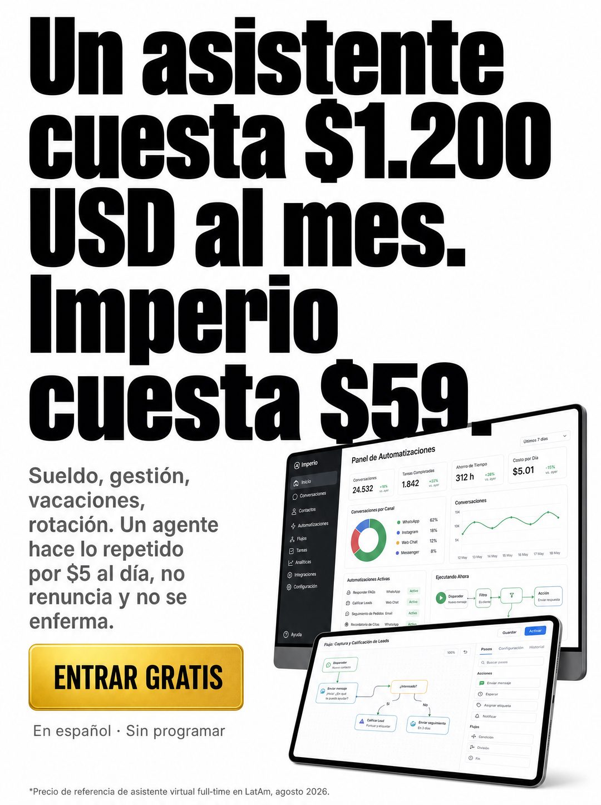

# 033 · Titular de costo comparado (Stat headline)

**Familia:** Tipografía dura · **Necesitas:** Nada. Si tienes fotos de tu producto, mejor · **Resultado en Meta:** Sin datos propios todavía



## Qué es
Un titular gigante en negro sobre blanco que pone tu precio al lado de un costo que tu cliente ya acepta pagar, con un párrafo corto, un botón y un asterisco al pie que dice de dónde sale la cifra. En el ejemplo de Imperio, el sueldo de un asistente contra la mensualidad, con pantallas del sistema a la derecha.

## Por qué funciona
La comparación hace la cuenta por el lector: tu precio deja de evaluarse solo y se mide contra un gasto que ya conoce. Es tipografía dura que afirma algo concreto, y el asterisco con fuente y fecha evita que suene demasiado bueno para ser cierto.

## Cuándo usarlo
Público tibio o frío que ya conoce el problema y duda por precio. Sirve para responder la objeción de precio en negocios que reemplazan un gasto mayor: personal, agencia, software, consultas.

## Así lo hicimos para Imperio
- **Texto en la imagen:** Un asistente / cuesta $1.200 / USD al mes. / Imperio / cuesta $59. / Sueldo, gestión, vacaciones, rotación. Un agente hace lo repetido por $5 al día, no renuncia y no se enferma. / ENTRAR GRATIS (botón dorado) / En español · Sin programar / [monitor y tableta con un panel de automatizaciones de Imperio: métricas, gráficos y un flujo de leads] / *Precio de referencia de asistente virtual full-time en LatAm, agosto 2026. (letra chica, al pie)
- **Texto principal:**
  > Sueldo, gestión, vacaciones, rotación. Un asistente sale caro y además se va.
  >
  > Yo tengo 9 agentes corriendo por $5 USD al día. No renuncian y no se enferman.
  >
  > Adentro aprendes a construirlos, en español y sin programar. $59 al mes 👇

## Receta para tu marca
- **Titular:** ocupa los dos tercios de arriba, sans negra muy gruesa en cuatro o cinco líneas: [EL COSTO QUE TU CLIENTE YA ACEPTA, CON CIFRA]. [TU MARCA] cuesta [TU PRECIO].
- **Texto:** abajo a la izquierda, un párrafo gris de cuatro líneas con [LO QUE INCLUYE EL COSTO ALTO] y [LO QUE HACE TU PRODUCTO POR MENOS].
- **Botón:** bajo el párrafo, [TU LLAMADO A LA ACCIÓN] en [COLOR DE TU MARCA], y una línea chica con [DOS VENTAJAS CORTAS].
- **Producto:** abajo a la derecha, [FOTOS O PANTALLAS DE TU PRODUCTO].
- **Pie:** asterisco en letra chica con [FUENTE Y FECHA DEL COSTO DE REFERENCIA].
- **Lo que no se toca:** fondo blanco, titular gigante y el asterisco. Sin asterisco, la comparación parece inventada.

## Prompt con que se hizo el de Imperio (GPT Image 2.5)
```
[Nota: el de Imperio se generó con GPT Image 2 en 3:4. En GPT Image 2.5 pídelo en 4:5]
Vertical ad on white. The top two thirds are filled by an enormous black bold sans headline across four lines, written exactly and in this order: 'Un asistente cuesta $1.200 USD al mes. Imperio cuesta $59.' Render every digit exactly, do not alter the figures. Lower left: a small four-line grey paragraph: 'Sueldo, gestión, vacaciones, rotación. Un agente hace lo repetido por $5 al día, no renuncia y no se enferma.' Below it a bright gold button with black caps 'ENTRAR GRATIS'. Under the button, small grey text: 'En español · Sin programar'. Lower right: two floating screens showing automation dashboards, product-lit. At the very bottom in tiny grey type: '*Precio de referencia de asistente virtual full-time en LatAm, agosto 2026.' Direct-response newspaper energy. Correct Spanish accents. No inverted punctuation, no em dashes.
```

## Ojo
- El costo de comparación tiene que ser real y llevar su fuente y fecha en el asterisco, y el botón no puede decir GRATIS si tu oferta no tiene una entrada gratis de verdad.
- En el ejemplo de Imperio se colaron signos de apertura en el texto: pide en el prompt que no aparezcan.
- Marca la casilla de contenido generado por IA en el Administrador de anuncios.
