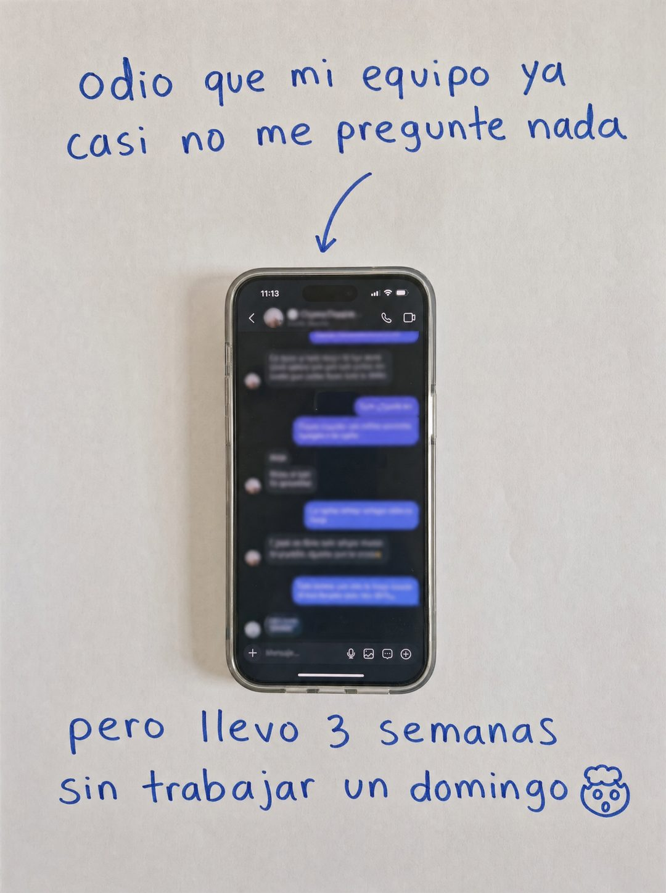

# 035 · Queja con remate manuscrito (Side effect)

**Familia:** Objeto físico con texto · **Necesitas:** Nada. Si vendes algo físico, una foto de tu producto · **Resultado en Meta:** $24 invertidos, 0 compras (cuenta de Imperio, sep 2026) (muestra chica)



## Qué es
Una hoja blanca con dos frases escritas a mano en plumón azul: arriba una queja que en realidad es un elogio, abajo el beneficio que la explica, y en medio el producto real fotografiado con una flecha que lo señala. En el ejemplo de Imperio, la queja es que el equipo ya casi no pregunta nada y el remate son tres semanas sin trabajar un domingo.

## Por qué funciona
La queja es el gancho: nadie espera que un anuncio empiece reclamando contra su propio producto. El remate convierte el reclamo en un beneficio concreto, y el papel manuscrito se ve como una nota personal, no como diseño de agencia. El producto en el centro hace de bisagra entre las dos frases.

## Cuándo usarlo
Público frío y tibio, en productos con un efecto secundario positivo fácil de contar: más tiempo libre, menos mensajes, mejor sueño, menos gasto. Sirve para frenar el scroll con humor y mostrar el resultado sin presumirlo.

## Así lo hicimos para Imperio
- **Texto en la imagen:** odio que mi equipo ya / casi no me pregunte nada / [flecha dibujada a mano hacia el teléfono] / [teléfono con un chat desenfocado, hora 11:13] / pero llevo 3 semanas / sin trabajar un domingo 🤯 (el emoji dibujado a mano)
- **Texto principal:**
  > El efecto secundario de automatizar bien es raro al principio: sobra tiempo y no sabes qué hacer con él.
  >
  > Glenda lo escribió así en la comunidad: mi hostal funciona solo.
  >
  > +3.300 personas construyendo lo mismo, en español. $59 al mes 👇
- **Titular:** Imperio Agéntico · $59 al mes

## Receta para tu marca
- **Escena:** foto cenital de una hoja blanca con textura suave y luz natural pareja.
- **Arriba:** a mano en plumón azul, minúsculas grandes y casuales: odio que [UN EFECTO DE TU PRODUCTO DICHO COMO QUEJA].
- **Centro:** una flecha curva dibujada a mano que apunta a [TU PRODUCTO REAL O UN TELÉFONO CON TU APP], fotografiado y recortado sobre el papel.
- **Abajo:** con el mismo plumón: pero [EL BENEFICIO CONCRETO CON CIFRA O PLAZO], cerrado con un emoji dibujado a mano.
- **Colores:** papel blanco y tinta azul; tu marca aparece solo en el producto.
- **Lo que no se toca:** la queja va primero y el beneficio después. Si se invierte el orden o el texto sale tipográfico, deja de parecer una nota personal.

## Prompt con que se hizo el de Imperio (GPT Image 2.5)
```
[Nota: el de Imperio se generó con GPT Image 2 en 3:4. En GPT Image 2.5 pídelo en 4:5]
Vertical photograph of a plain sheet of white paper with subtle texture. Handwritten in blue marker in large casual lowercase at the top: 'odio que mi equipo ya casi no me pregunte nada'. A curved hand-drawn arrow points downward to the center, where a REAL smartphone is photographed and cut out, standing upright, its screen showing a chat conversation with blurred unreadable bubbles. Below the phone, handwritten in the same blue marker: 'pero llevo 3 semanas sin trabajar un domingo 🤯'. Authentic personal note aesthetic, real handwriting, nothing polished or digital. Correct Spanish accents. No inverted punctuation, no em dashes.
```

## Ojo
- La frase es la voz de tu cliente ideal, no una cita: no le pongas nombre ni la presentes como testimonio salvo que alguien real la haya dicho.
- Si el teléfono muestra un chat, que salga desenfocado y sin datos de clientes.
- Marca la casilla de contenido generado por IA en el Administrador de anuncios.
