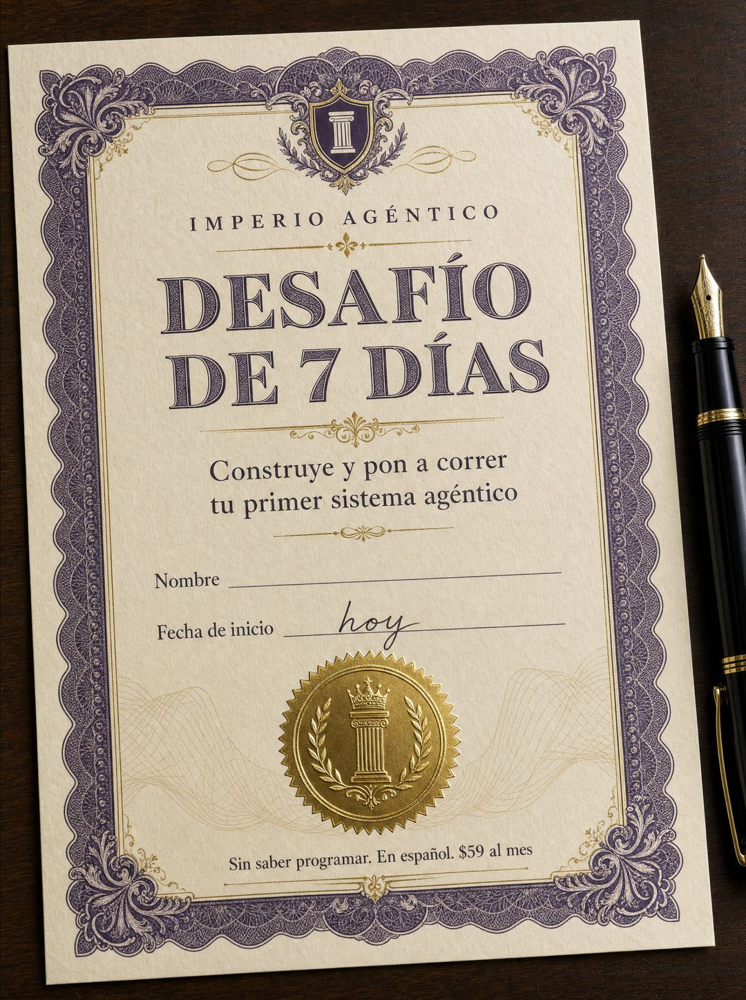

# 036 · Certificado del desafío en blanco

**Familia:** Objeto físico con texto · **Necesitas:** Nada. Si tienes logo, puede ir en el sello · **Resultado en Meta:** $137 invertidos, 0 compras (cuenta de Imperio, sep 2026)



## Qué es
Un certificado impreso en papel grueso, con borde grabado y sello dorado, que bautiza tu transformación como un desafío con plazo y deja el nombre en blanco para quien lo mira. En el ejemplo de Imperio es el Desafío de 7 días, con la fecha de inicio escrita a mano: hoy.

## Por qué funciona
Convierte la promesa en un producto con nombre y plazo, en vez de describir lo que incluye la oferta. El campo vacío pide ser llenado: el lector se imagina su nombre en la línea. Es un objeto real y no diseño gráfico, y el certificado en blanco fue de los conceptos arriesgados que pasaron sin correcciones.

## Cuándo usarlo
Público frío y tibio, en negocios que pueden empaquetar su resultado como un reto con plazo: cursos, entrenamiento, nutrición, coaching, programas. Sirve para empujar la compra con un primer paso que empieza hoy.

## Así lo hicimos para Imperio
- **Texto en la imagen:** IMPERIO AGÉNTICO / DESAFÍO / DE 7 DÍAS / Construye y pon a correr / tu primer sistema agéntico / Nombre (línea en blanco) / Fecha de inicio / hoy (a mano, en tinta, sobre la línea) / Sin saber programar. En español. $59 al mes (letra chica, abajo)
- **Texto principal:**
  > 7 días para poner a correr tu primer sistema. No para verlo, para tenerlo funcionando.
  >
  > Adentro está el paso a paso, los archivos listos y 5 sesiones en vivo por semana para cuando te trabes.
  >
  > +1.800 personas ya publicaron el suyo con captura y fecha. Empieza hoy por $59 al mes 👇
- **Titular:** Imperio Agéntico · $59 al mes

## Receta para tu marca
- **Escena:** foto de un certificado en papel crema grueso sobre un escritorio de madera oscura, con una pluma al lado y luz cálida.
- **Diseño:** borde grabado en [COLOR OSCURO DE TU MARCA], detalles dorados y un sello en relieve con [TU LOGO O UN EMBLEMA SIMPLE].
- **Texto:** [TU MARCA] en versalitas / [NOMBRE DEL DESAFÍO CON PLAZO] en serif grande / [LO QUE SE LOGRA, EN UNA LÍNEA].
- **Campos:** dos líneas: Nombre en blanco y Fecha de inicio con la palabra hoy escrita a mano en tinta.
- **Pie:** una línea chica con [DOS VENTAJAS Y TU PRECIO].
- **Lo que no se toca:** el nombre queda en blanco. Si lo llenas, deja de ser una invitación y pasa a ser el diploma de otro.

## Prompt con que se hizo el de Imperio (GPT Image 2.5)
```
[Nota: el de Imperio se generó con GPT Image 2 en 3:4. En GPT Image 2.5 pídelo en 4:5]
Vertical photograph of an ornate printed certificate on heavy cream paper with a deep purple engraved border, gold foil seal and guilloche patterns, lying on a dark wood desk with a fountain pen beside it. Printed in elegant engraved type: small caps at top 'IMPERIO AGÉNTICO', then large display serif 'DESAFÍO DE 7 DÍAS', then smaller serif 'Construye y pon a correr tu primer sistema agéntico'. Below, two ruled blank lines labelled 'Nombre' and 'Fecha de inicio', the second filled by hand in ink reading 'hoy'. At the bottom, small type: 'Sin saber programar. En español. $59 al mes'. Render every Spanish accent and the letter eñe exactly as written: AGÉNTICO, DESAFÍO, DÍAS, agéntico, español. Premium and tactile like a real diploma. No inverted punctuation, no em dashes.
```

## Ojo
- El plazo del desafío tiene que ser real: si en ese tiempo tu cliente no puede lograr lo que dice el certificado, cambia el plazo o el logro.
- Si sale texto roto, manos deformes o cifras mal escritas, se rehace.
- Marca la casilla de contenido generado por IA en el Administrador de anuncios.
