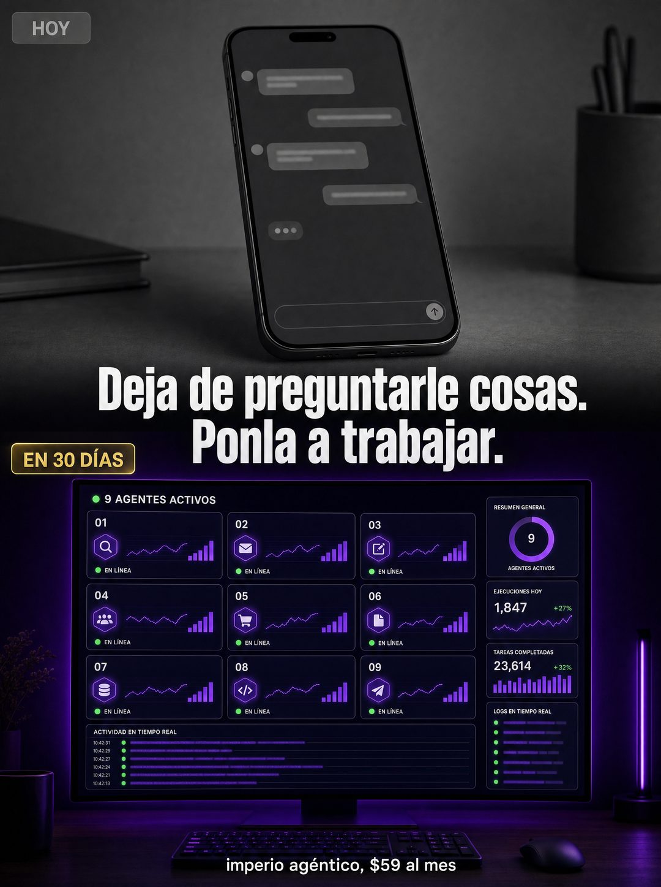

# 037 · Antes y después en pantalla dividida

**Familia:** Interfaz creíble · **Necesitas:** Nada. Si tienes capturas de tu producto, mejor · **Resultado en Meta:** $68 invertidos, 0 compras (cuenta de Imperio, sep 2026) (muestra chica)



## Qué es
Una imagen partida en dos por una línea dura: arriba, en gris, cómo se hace hoy; abajo, en color, cómo se ve después, con una etiqueta de plazo y el titular cruzando el corte. En el ejemplo de Imperio, un chat de IA esperando preguntas contra un panel con nueve agentes trabajando.

## Por qué funciona
El contraste de color hace el argumento antes de leer: lo gris se ve detenido y lo de color se ve vivo. No compite con otros productos, compite con la forma en que tu cliente resuelve hoy el problema, y eso lo obliga a ubicarse en la mitad de arriba. La etiqueta de plazo convierte la imagen en una promesa concreta.

## Cuándo usarlo
Público frío y tibio que ya usa una versión básica de la solución (una app, una planilla, un método casero). Sirve para frenar el scroll y mostrar el salto de categoría con un plazo.

## Así lo hicimos para Imperio
- **Texto en la imagen:** HOY (etiqueta gris, arriba a la izquierda) / [teléfono en gris con un chat de IA de burbujas vacías] / Deja de preguntarle cosas. / Ponla a trabajar. / EN 30 DÍAS (etiqueta dorada) / [monitor con un panel morado: 9 AGENTES ACTIVOS, nueve tarjetas numeradas del 01 al 09 con EN LÍNEA, contadores de ejecuciones y tareas, actividad y logs en tiempo real] / imperio agéntico, $59 al mes
- **Texto principal:**
  > El 95% usa la IA como buscador con mejores modales. Le pregunta cosas y copia la respuesta.
  >
  > El otro 5% la tiene ejecutando procesos mientras duerme. La diferencia no es el modelo. Es el arnés que le construyes alrededor.
  >
  > Eso es exactamente lo que se aprende adentro, en español. $59 al mes 👇
- **Titular:** Imperio Agéntico · $59 al mes

## Receta para tu marca
- **Formato:** vertical partido en dos mitades por una línea dura.
- **Arriba:** desaturado y gris, [CÓMO SE HACE HOY, SIN TU PRODUCTO], con una etiqueta gris HOY en la esquina.
- **Abajo:** oscuro y con [COLOR DE TU MARCA] encendido, [EL MISMO TRABAJO HECHO CON TU PRODUCTO], con una etiqueta dorada [TU PLAZO REAL].
- **Titular:** blanco y grueso, cruzando el corte en dos líneas: [LO QUE TU CLIENTE DEBE DEJAR DE HACER]. / [LO QUE DEBE EMPEZAR A HACER].
- **Pie:** una línea chica blanca con [TU MARCA Y TU PRECIO].
- **Lo que no se toca:** el contraste entre la mitad gris y la de color. Si las dos mitades tienen el mismo brillo, la comparación se pierde.

## Prompt con que se hizo el de Imperio (GPT Image 2.5)
```
[Nota: el de Imperio se generó con GPT Image 2 en 3:4. En GPT Image 2.5 pídelo en 4:5]
Vertical ad split horizontally into two halves with a hard dividing line. TOP HALF, desaturated grey: a phone showing a plain AI chat interface with a few short blurred unreadable question bubbles, looking idle, with a small grey label in the corner reading 'HOY'. BOTTOM HALF, vivid dark with purple accents: a wide desktop dashboard showing nine active automation agents running, live status dots, small charts and logs, glowing, with a small gold label in the corner reading 'EN 30 DÍAS'. Across the dividing line, a bold white headline in two lines: 'Deja de preguntarle cosas.' and 'Ponla a trabajar.' At the bottom, small white text: 'imperio agéntico, $59 al mes'. Render the accents exactly: DÍAS, agéntico. No readable text inside the chat bubbles. High contrast between halves. No inverted punctuation, no em dashes.
```

## Ojo
- El plazo de la etiqueta es una promesa: pon uno que tu cliente promedio de verdad alcance.
- Las cifras de los paneles son decorado: si se pueden leer, que sean tuyas y reales, o pide que salgan desenfocadas.
- Marca la casilla de contenido generado por IA en el Administrador de anuncios.
