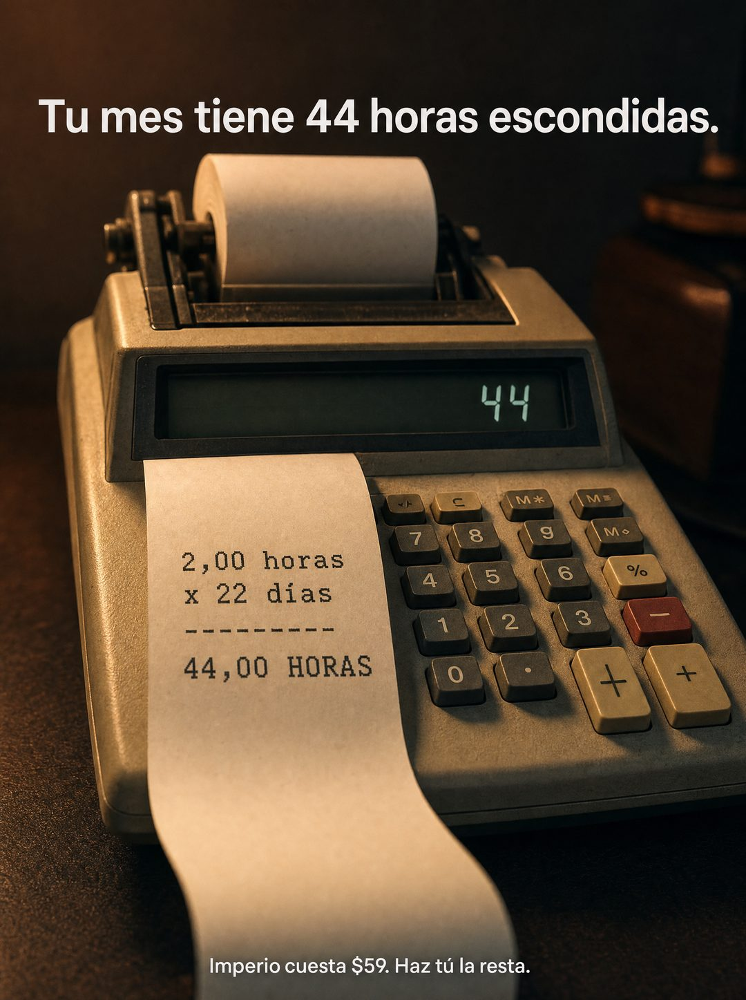

# 038 · Calculadora de cinta con la cuenta

**Familia:** Objeto físico con texto · **Necesitas:** Nada · **Resultado en Meta:** $114 invertidos, 0 compras (cuenta de Imperio, sep 2026)



## Qué es
Una calculadora antigua con cinta de papel que imprime la cuenta de lo que tu cliente pierde sin darse cuenta, con el total en la pantalla. Arriba va la conclusión y abajo tu precio, para que el lector haga la resta.

## Por qué funciona
La aritmética la termina el lector, y lo que uno calcula solo pesa más que lo que le dicen. La calculadora de cinta es un objeto real con textura, no un gráfico, y la cuenta impresa se lee como un dato, no como una promesa.

## Cuándo usarlo
Público tibio que ya conoce el problema y duda por precio. Sirve en negocios que ahorran tiempo o dinero medible (servicios, software, automatización, mantenimiento) para responder la objeción de precio.

## Así lo hicimos para Imperio
- **Texto en la imagen:** Tu mes tiene 44 horas escondidas. / 44 (pantalla de la calculadora) / 2,00 horas / x 22 días / [línea de guiones] / 44,00 HORAS (cinta de papel) / [teclado de la calculadora] / Imperio cuesta $59. Haz tú la resta.
- **Texto principal:**
  > 2 horas al día en tareas que un agente hace solo. 44 horas al mes.
  >
  > Ponle el número que quieras a tu hora y haz la resta contra $59.
  >
  > Adentro aprendes a construir el agente que se las come. +3.300 personas ya están en eso 👇
- **Titular:** Imperio Agéntico · $59 al mes

## Receta para tu marca
- **Escena:** primer plano de una calculadora de escritorio antigua con rollo de papel, sobre una superficie oscura con una sola luz cálida y teclas con números y signos reales.
- **Cinta:** sale hacia la cámara con la cuenta en letra de máquina: [CANTIDAD POR DÍA] / x [DÍAS O VECES] / una línea de guiones / [TOTAL EN MAYÚSCULAS]; la pantalla muestra el mismo total.
- **Titular:** arriba, en sans blanca: [EL TOTAL QUE PIERDE TU CLIENTE, DICHO EN UNA FRASE].
- **Cierre:** abajo, más chico: [TU MARCA] cuesta [TU PRECIO]. Haz tú la resta.
- **Lo que no se toca:** la cuenta queda sin resolver contra tu precio. Si haces la resta por el lector, pierde la gracia.

## Prompt con que se hizo el de Imperio (GPT Image 2.5)
```
[Nota: el de Imperio se generó con GPT Image 2 en 3:4. En GPT Image 2.5 pídelo en 4:5]
Vertical photorealistic close-up of a vintage desk calculator with a paper tape roll, on a dark surface under a single warm light. The printed paper tape curls out toward the viewer showing, in monospace calculator type, the lines: '2,00 horas', 'x 22 días', '--------', '44,00 HORAS'. The calculator LCD displays '44'. Overlaid at the top in clean white sans: 'Tu mes tiene 44 horas escondidas.' At the bottom in smaller white sans: 'Imperio cuesta $59. Haz tú la resta.' Render the Spanish accents exactly as written: días, tú. Cinematic product photography, shallow depth of field. No inverted punctuation, no em dashes.
```

## Ojo
- La cuenta tiene que cerrar y ser creíble para tu cliente: una cantidad por día que reconozca, multiplicada por días reales.
- Si sale texto roto, manos deformes o cifras mal escritas, se rehace.
- Marca la casilla de contenido generado por IA en el Administrador de anuncios.
