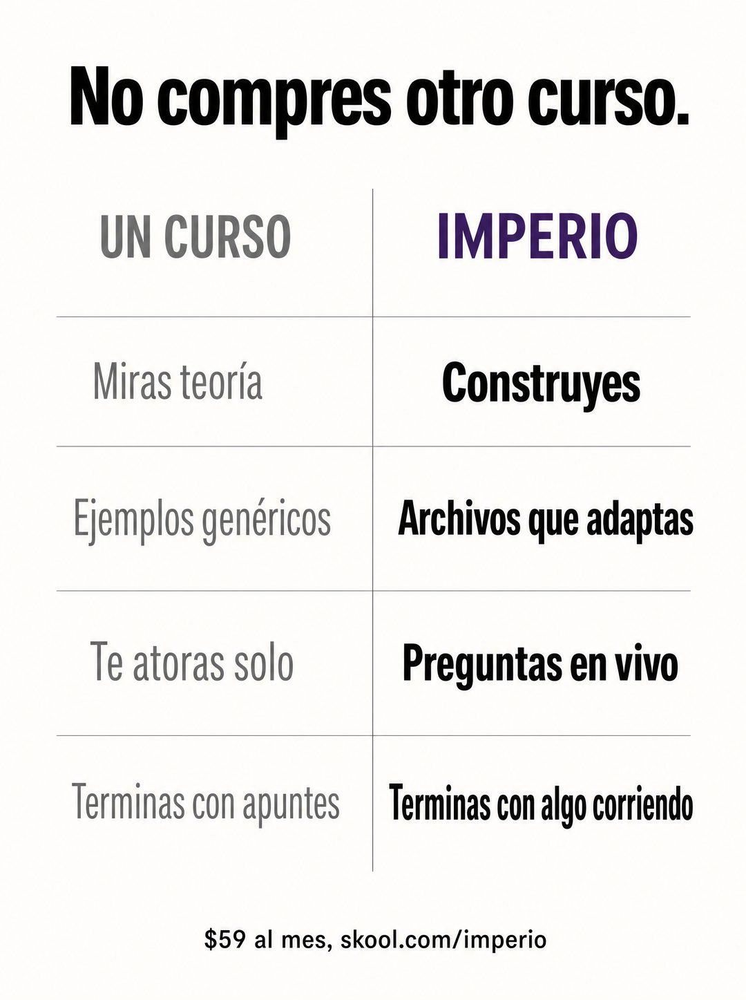

# 040 · Tabla comparativa contra la categoría

**Familia:** Tipografía dura · **Necesitas:** Nada · **Resultado en Meta:** $90 invertidos, 1 compra, $90,0 por compra (cuenta de Imperio, sep 2026) (muestra chica)



## Qué es
Una tabla de dos columnas sin imágenes: a la izquierda, en gris, lo que entrega la alternativa típica de tu rubro; a la derecha, en negro y con tu color, lo que entregas tú, fila por fila. Arriba va un titular que le dice al lector qué no hacer.

## Por qué funciona
Ataca a la categoría y no a un competidor con nombre, así que es dura y limpia a la vez. La tipografía sin imagen afirma algo en cada fila y no se esconde detrás de una foto bonita. El gris contra el negro hace que la columna ganadora se lea sola.

## Cuándo usarlo
Público tibio que está comparando opciones. Sirve para cualquier negocio con una alternativa obvia (el curso, la agencia, el gimnasio, hacerlo uno mismo) y para responder por qué elegirte si ya existen otras opciones.

## Así lo hicimos para Imperio
- **Texto en la imagen:** No compres otro curso. / UN CURSO (gris) | IMPERIO (morado) / Miras teoría | Construyes / Ejemplos genéricos | Archivos que adaptas / Te atoras solo | Preguntas en vivo / Terminas con apuntes | Terminas con algo corriendo / $59 al mes, skool.com/imperio (letra chica, abajo)
- **Texto principal:**
  > Un curso te deja con apuntes. Esto te deja con algo funcionando.
  >
  > Archivos que adaptas, sesiones en vivo para cuando te atoras, y +1.800 logros publicados por los miembros para copiar ideas.
  >
  > Ese es el trato. $59 al mes 👇
- **Titular:** Imperio Agéntico · $59 al mes

## Receta para tu marca
- **Formato:** fondo blanco roto, rigor tipográfico suizo, mucho aire y cero imágenes.
- **Titular:** arriba, negro y grueso: [LO QUE TU CLIENTE NO DEBERÍA VOLVER A COMPRAR].
- **Tabla:** dos columnas separadas por una línea fina; encabezados [LA ALTERNATIVA TÍPICA] en gris y [TU MARCA] en [COLOR DE TU MARCA].
- **Filas:** cuatro filas cortas, la izquierda en gris liviano y la derecha en negro grueso: [LO QUE FALLA EN LA ALTERNATIVA] frente a [LO QUE HACES TÚ].
- **Pie:** una línea chica con [TU PRECIO Y DÓNDE SE COMPRA].
- **Lo que no se toca:** comparar contra la categoría y no contra una marca con nombre. Cada fila tiene que ser verificable en tu oferta.

## Prompt con que se hizo el de Imperio (GPT Image 2.5)
```
[Nota: el de Imperio se generó con GPT Image 2 en 3:4. En GPT Image 2.5 pídelo en 4:5]
Vertical ad, stark editorial comparison table on off-white. Two columns with a thin vertical rule between them. Left column header in grey caps: 'UN CURSO'. Right column header in deep purple caps: 'IMPERIO'. Four rows separated by hairline rules, short Spanish text on each side, left in grey and right in black bold: 'Miras teoría' and 'Construyes'; 'Ejemplos genéricos' and 'Archivos que adaptas'; 'Te atoras solo' and 'Preguntas en vivo'; 'Terminas con apuntes' and 'Terminas con algo corriendo'. Above the table, a bold black headline: 'No compres otro curso.' At the bottom, small type: '$59 al mes, skool.com/imperio'. Render the Spanish accents exactly as written: teoría, genéricos. Swiss typographic rigor, no images, generous white space. No inverted punctuation, no em dashes.
```

## Ojo
- No nombres a un competidor ni uses su logo: la tabla compara contra la categoría.
- Cada fila de tu columna tiene que existir en tu oferta tal como está escrita.
- Marca la casilla de contenido generado por IA en el Administrador de anuncios.
