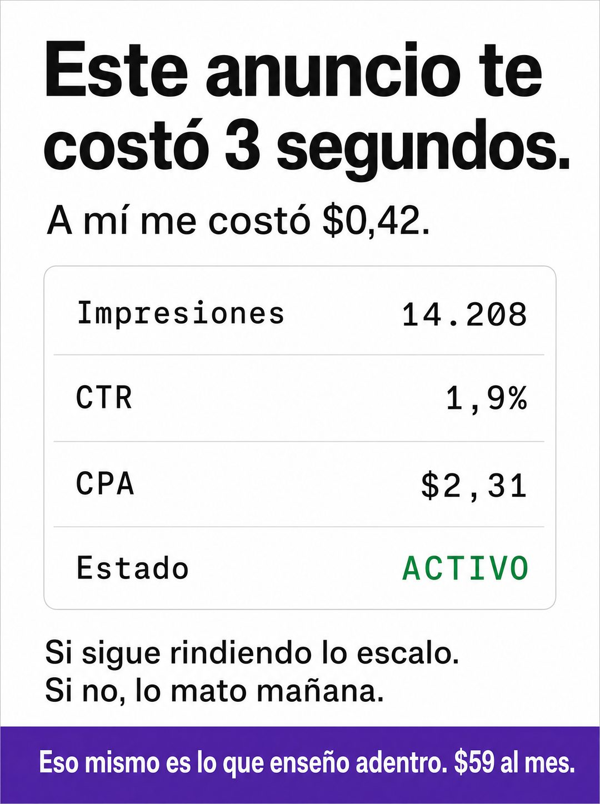

# 041 · Anuncio que muestra sus métricas

**Familia:** Tipografía dura · **Necesitas:** Tus cifras reales del anuncio: impresiones, CTR, CPA y costo · **Resultado en Meta:** Sin datos propios todavía



## Qué es
Una pieza de puro texto armada como un reporte de rendimiento: le dice al lector cuánto le costó a la marca que él viera el anuncio, muestra las métricas reales del día y anuncia qué se hará con el anuncio según rinda. Sirve a quien vende algo ligado a resultados medibles, porque el propio anuncio es la demostración.

## Por qué funciona
Rompe la cuarta pared: nadie espera que un anuncio hable de sí mismo y muestre su costo, y la curiosidad lo frena. La transparencia con números se vuelve el argumento, porque demuestra en vivo que sabes hacer lo que vendes. Fue de los conceptos más arriesgados y pasó sin correcciones.

## Cuándo usarlo
Público frío y tibio, en negocios que venden marketing, publicidad, análisis de datos o cualquier servicio donde los números son el producto. Sirve para mostrar prueba y autoridad propia.

## Así lo hicimos para Imperio
- **Texto en la imagen:** Este anuncio te / costó 3 segundos. / A mí me costó $0,42. / Impresiones 14.208 / CTR 1,9% / CPA $2,31 / Estado ACTIVO (en verde) / Si sigue rindiendo lo escalo. / Si no, lo mato mañana. / Eso mismo es lo que enseño adentro. $59 al mes. (franja morada, abajo)
- **Texto principal:**
  > Abro mis números con la pizarra y sin guardarme nada: lo que gasto al día, mi CPA, lo que escalo y lo que mato.
  >
  > Este anuncio es un ejemplo en vivo. Si rinde lo escalo, si no lo apago mañana.
  >
  > Ese sistema completo de creativos y testeo está adentro. $59 al mes 👇

## Receta para tu marca
- **Formato:** fondo blanco con estética de reporte, sin fotos.
- **Titular:** arriba, negro y grueso en dos líneas: Este anuncio te costó [SEGUNDOS] segundos. Debajo, más chico: A mí me costó [TU COSTO REAL].
- **Panel:** recuadro con cuatro filas en letra monoespaciada: Impresiones [CIFRA REAL] / CTR [CIFRA REAL] / CPA [CIFRA REAL] / Estado ACTIVO en verde.
- **Decisión:** dos líneas en negro: [QUÉ HARÁS SI RINDE]. / [QUÉ HARÁS SI NO].
- **Cierre:** franja de [COLOR DE TU MARCA] con texto blanco: [QUÉ ENSEÑAS O VENDES] y [TU PRECIO].
- **Lo que no se toca:** las cifras son las reales del anuncio, del día en que se publica. Con números inventados el formato se vuelve una mentira.

## Prompt con que se hizo el de Imperio (GPT Image 2.5)
```
[Nota: el de Imperio se generó con GPT Image 2 en 3:4. En GPT Image 2.5 pídelo en 4:5]
Vertical ad on plain white designed to look like an advertising performance report. At the top a bold black headline across two lines: 'Este anuncio te costó 3 segundos.' Below it a smaller line: 'A mí me costó $0,42.' Then a clean data panel with four labelled metric rows in monospace type: 'Impresiones 14.208', 'CTR 1,9%', 'CPA $2,31', 'Estado ACTIVO' with the word ACTIVO in green. Below the panel, in black sans across two lines: 'Si sigue rindiendo lo escalo.' and 'Si no, lo mato mañana.' At the bottom, a purple strip with white text: 'Eso mismo es lo que enseño adentro. $59 al mes.' Render the Spanish accents and the letter eñe exactly as written: costó, mí, mañana, enseño. Clean dashboard aesthetic meets print ad. No inverted punctuation, no em dashes.
```

## Ojo
- Imprime solo cifras reales y verificables del mismo anuncio: reemplázalas por las del día antes de publicar.
- Si sale texto roto, manos deformes o cifras mal escritas, se rehace.
- Marca la casilla de contenido generado por IA en el Administrador de anuncios.
