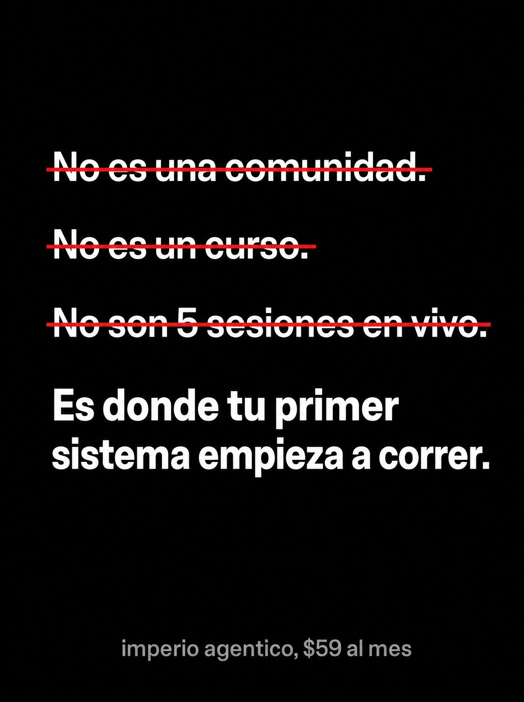

# 042 · Tachones sobre fondo negro

**Familia:** Tipografía dura · **Necesitas:** Nada · **Resultado en Meta:** $15 invertidos, 0 compras (cuenta de Imperio, sep 2026) (muestra chica)



## Qué es
Un póster de puro texto sobre negro: tres líneas que dicen lo que tu producto no es, tachadas en rojo, y una cuarta sin tachar que dice lo que sí es. Las tachadas son justo las características con que la categoría se suele vender.

## Por qué funciona
Es la lección de no vender características llevada al extremo: las tachas en pantalla y dejas solo el resultado. Una marca diciendo lo que no es despierta curiosidad, y la tipografía dura sobre negro afirma algo sin esconderse detrás de una foto. Los tachones sobre negro fueron de los conceptos raros que pasaron sin correcciones.

## Cuándo usarlo
Público frío y tibio, en negocios que se venden con listas de características parecidas a las de la competencia. Sirve para frenar el scroll y reposicionar la oferta en una sola frase.

## Así lo hicimos para Imperio
- **Texto en la imagen:** No es una comunidad. (tachado en rojo) / No es un curso. (tachado en rojo) / No son 5 sesiones en vivo. (tachado en rojo) / Es donde tu primer / sistema empieza a correr. / imperio agentico, $59 al mes (gris, letra chica, abajo)
- **Texto principal:**
  > Sé que suena raro venir a decirte lo que NO es.
  >
  > No compras acceso a un chat ni a otra carpeta de videos. Compras el lugar donde tu primer sistema empieza a correr, con gente al lado construyendo lo mismo.
  >
  > +$220.000 USD en ventas publicadas por los propios miembros. $59 al mes 👇
- **Titular:** Imperio Agéntico · $59 al mes

## Receta para tu marca
- **Formato:** fondo casi negro, mucho espacio vacío y cero imágenes.
- **Tachados:** tres líneas grandes en sans blanca, cada una con una raya roja limpia encima: No es [CARACTERÍSTICA 1]. / No es [CARACTERÍSTICA 2]. / No son [CARACTERÍSTICA 3 CON CIFRA].
- **Afirmación:** una cuarta línea sin tachar, más grande y en negrita: [EL RESULTADO QUE SÍ ENTREGAS].
- **Pie:** letra chica gris: [TU MARCA Y TU PRECIO].
- **Lo que no se toca:** tres tachadas y una limpia, con el rojo solo en las rayas. Si agregas color o imagen, pierde la dureza.

## Prompt con que se hizo el de Imperio (GPT Image 2.5)
```
[Nota: el de Imperio se generó con GPT Image 2 en 3:4. En GPT Image 2.5 pídelo en 4:5]
Vertical ad on solid near-black background. Four lines of large white sans text stacked vertically, the first three each STRUCK THROUGH with a clean red horizontal line: 'No es una comunidad.' struck through, 'No es un curso.' struck through, 'No son 5 sesiones en vivo.' struck through. Then a fourth line, not struck through, in bold white and slightly larger: 'Es donde tu primer sistema empieza a correr.' At the bottom, small grey text: 'imperio agentico, $59 al mes'. Brutally simple typographic poster, lots of negative space, no images. Spanish accents correct. No inverted punctuation, no em dashes.
```

## Ojo
- Lo que tachas tiene que seguir siendo verdad en tu oferta: tachas para cambiar el foco, no para negar lo que entregas.
- Revisa las tildes antes de publicar: en el ejemplo de Imperio salió agentico sin tilde.
- Marca la casilla de contenido generado por IA en el Administrador de anuncios.
