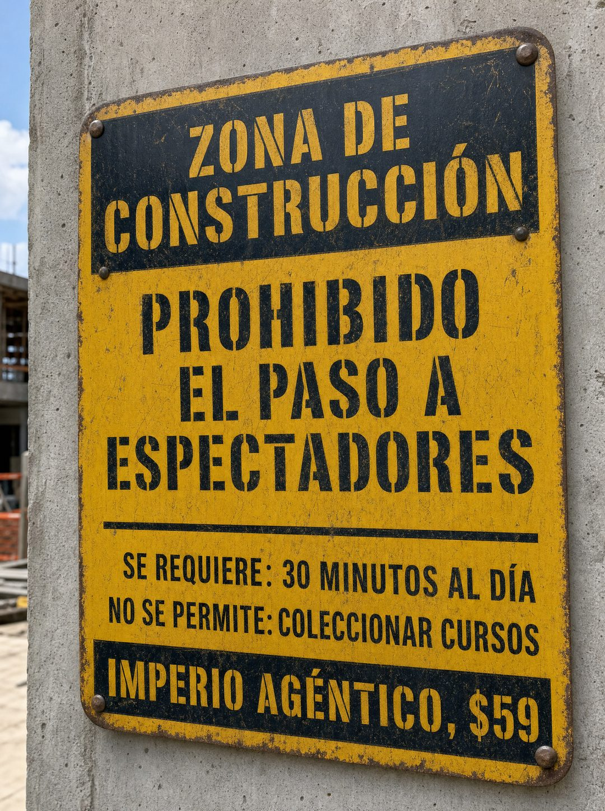

# 043 · Señal de obra que descalifica

**Familia:** Objeto físico con texto · **Necesitas:** Nada · **Resultado en Meta:** $17 invertidos, 0 compras (cuenta de Imperio, sep 2026) (muestra chica)



## Qué es
Una señal industrial de seguridad, de metal amarillo gastado y atornillada a un muro de obra, que usa el lenguaje de las advertencias para decir quién no debería comprar. En el ejemplo de Imperio prohíbe el paso a espectadores, pide 30 minutos al día y no permite coleccionar cursos.

## Por qué funciona
Descalificar con humor filtra y atrae a la vez: el que se siente constructor se queda. En un nicho serio y aspiracional, una señal de obra no se parece a nada del feed. Es un objeto real fotografiado, y la señal de obra fue de los conceptos raros que pasaron sin correcciones.

## Cuándo usarlo
Público frío, en negocios que necesitan compromiso del cliente para funcionar: entrenamiento, cursos, coaching, programas. Sirve para frenar el scroll y bajar la fricción de entrada con un requisito chico y claro.

## Así lo hicimos para Imperio
- **Texto en la imagen:** ZONA DE / CONSTRUCCIÓN / PROHIBIDO / EL PASO A / ESPECTADORES / SE REQUIERE: 30 MINUTOS AL DÍA / NO SE PERMITE: COLECCIONAR CURSOS / IMPERIO AGÉNTICO, $59
- **Texto principal:**
  > Esto no es para mirar. Es para construir 30 minutos al día.
  >
  > Si vienes a coleccionar cursos vas a perder tu plata y mi tiempo. Si vienes a poner algo a funcionar, adentro hay +3.300 personas haciéndolo.
  >
  > $59 al mes 👇
- **Titular:** Imperio Agéntico · $59 al mes

## Receta para tu marca
- **Escena:** foto vertical de una señal de metal amarillo gastado con remaches, atornillada a un muro de hormigón en una obra, luz de día y ángulo leve.
- **Banda superior:** franja negra con letras amarillas tipo esténcil: [TU ESPACIO, DICHO COMO ZONA DE ADVERTENCIA].
- **Advertencia:** letras negras grandes: PROHIBIDO EL PASO A [EL CLIENTE QUE NO QUIERES].
- **Reglas:** bajo una línea, dos renglones: SE REQUIERE: [EL COMPROMISO MÍNIMO REAL] / NO SE PERMITE: [EL HÁBITO QUE NO SIRVE].
- **Banda inferior:** franja negra con [TU MARCA Y TU PRECIO].
- **Lo que no se toca:** el lenguaje seco de señal real y el desgaste del metal. Si se ve limpia o con diseño de marca, parece un afiche.

## Prompt con que se hizo el de Imperio (GPT Image 2.5)
```
[Nota: el de Imperio se generó con GPT Image 2 en 3:4. En GPT Image 2.5 pídelo en 4:5]
Vertical photograph of an industrial safety warning sign made of weathered yellow metal with black text and rivets, bolted to a concrete wall at a construction site, shot slightly angled in daylight. The sign reads in stencil-style black caps: at the top inside a black band 'ZONA DE CONSTRUCCIÓN', then 'PROHIBIDO EL PASO A ESPECTADORES', then a divider, then smaller lines 'SE REQUIERE: 30 MINUTOS AL DÍA', 'NO SE PERMITE: COLECCIONAR CURSOS', and at the bottom in a black band 'IMPERIO AGÉNTICO, $59'. Render the accents exactly: CONSTRUCCIÓN, DÍA, AGÉNTICO. Authentic industrial signage, real metal texture, scratches and weathering. No inverted punctuation, no em dashes.
```

## Ojo
- Pide el compromiso más chico que de verdad funcione (30 minutos al día en vez de 3 horas a la semana): así bajas la fricción de entrada.
- Si sale texto roto, manos deformes o cifras mal escritas, se rehace.
- Marca la casilla de contenido generado por IA en el Administrador de anuncios.
