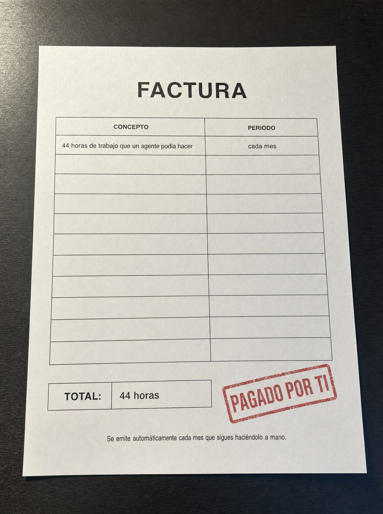

# 044 · Factura del costo de no actuar

**Familia:** Objeto físico con texto · **Necesitas:** Nada · **Resultado en Meta:** $197 invertidos, 4 compras, $49,4 por compra (cuenta de Imperio, sep 2026)



## Qué es
Una factura impresa y anónima, fotografiada sobre un escritorio, que cobra lo que tu cliente pierde por no resolver su problema, con un sello rojo de pagado. En el ejemplo de Imperio, el concepto son 44 horas de trabajo que un agente podía hacer, cobradas cada mes.

## Por qué funciona
Presenta el costo de no actuar como un cobro que el cliente ya está pagando, y eso pesa más que una promesa de ahorro. Una factura sellada es un objeto real que todos reconocen, no un gráfico. La línea al pie remata sin explicar: se emite cada mes que sigues igual.

## Cuándo usarlo
Público tibio y remarketing, en negocios que ahorran tiempo o dinero medible. Sirve para empujar la compra mostrando el costo de seguir igual.

## Así lo hicimos para Imperio
- **Texto en la imagen:** FACTURA / CONCEPTO | PERIODO / 44 horas de trabajo que un agente podía hacer | cada mes / [filas vacías] / TOTAL: 44 horas / PAGADO POR TI (sello rojo) / Se emite automáticamente cada mes que sigues haciéndolo a mano. (letra chica, al pie)
- **Texto principal:**
  > Esa factura la pagas todos los meses y nunca te llega en papel.
  >
  > 44 horas repitiendo lo mismo, mientras un agente lo hace por $5 al día sin quejarse.
  >
  > Adentro aprendes a construirlo, en español y sin programar. $59 al mes 👇
- **Titular:** Imperio Agéntico · $59 al mes

## Receta para tu marca
- **Escena:** foto cenital de una factura en papel blanco sobre un escritorio oscuro, con luz rasante suave.
- **Encabezado:** FACTURA, grande y centrado, sin logo, nombre de empresa, dirección ni datos tributarios.
- **Tabla:** una sola fila llena: CONCEPTO [LO QUE TU CLIENTE PAGA SIN DARSE CUENTA] y PERIODO [CADA CUÁNTO]; el resto de las filas vacías.
- **Total:** TOTAL: [EL COSTO EN TIEMPO U OPORTUNIDADES, SIN SIGNO DE DINERO] y al lado un sello rojo en diagonal: PAGADO POR TI.
- **Pie:** letra chica: Se emite [CADA CUÁNTO] que sigues [HACIÉNDOLO COMO SIEMPRE].
- **Lo que no se toca:** la factura es anónima y el sello es rojo. Si le pones tu logo, parece un cobro tuyo.

## Prompt con que se hizo el de Imperio (GPT Image 2.5)
```
[Nota: el de Imperio se generó con GPT Image 2 en 3:4. En GPT Image 2.5 pídelo en 4:5]
Vertical photorealistic image of a plain printed invoice on crisp white paper, lying flat on a dark desk, shot from above with soft raking light. NO company logo, NO company name, NO address, NO tax numbers anywhere. The document is deliberately anonymous. Large header centered: 'FACTURA'. A single ruled table with one filled row reading 'CONCEPTO: 44 horas de trabajo que un agente podía hacer' and 'PERIODO: cada mes', the rest of the rows empty. At the bottom, a totals block with one line reading 'TOTAL: 44 horas' and beside it a red rubber stamp printed diagonally reading 'PAGADO POR TI'. Small print at the foot: 'Se emite automáticamente cada mes que sigues haciéndolo a mano.' No currency symbols and no monetary amounts anywhere. Render the Spanish accents exactly as written: podía, automáticamente, haciéndolo. Realistic paper texture. No inverted punctuation, no em dashes.
```

## Ojo
- No pongas montos de dinero, números tributarios, direcciones ni logos en la factura: tiene que ser anónima para que nadie la confunda con un cobro real.
- Si sale texto roto, manos deformes o cifras mal escritas, se rehace.
- Marca la casilla de contenido generado por IA en el Administrador de anuncios.
