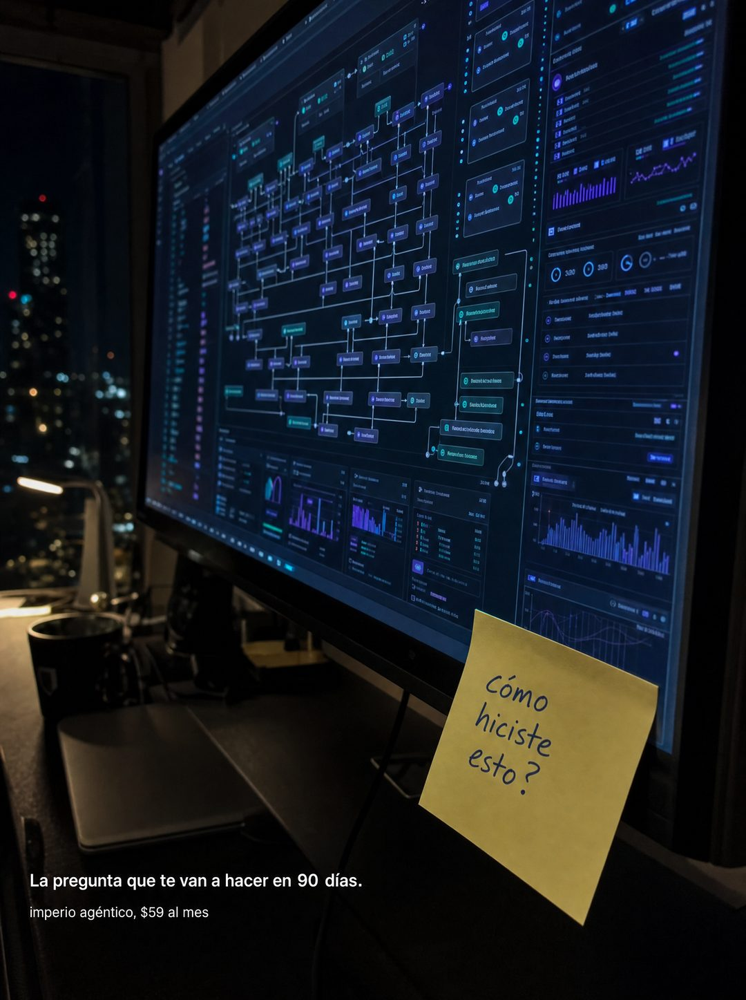

# 045 · Post-it con la pregunta de envidia (Make your friends jealous)

**Familia:** Objeto físico con texto · **Necesitas:** Nada. Si tienes una foto real de tu trabajo, mejor · **Resultado en Meta:** $299 invertidos, 4 compras, $74,7 por compra (cuenta de Imperio, sep 2026)



## Qué es
Una foto nocturna del resultado de tu producto ya funcionando (una pantalla, un plato, un espacio terminado) con un post-it pegado encima que trae escrita a mano la pregunta que otros le van a hacer a tu cliente. Abajo, en letra chica, el plazo en que eso va a pasar.

## Por qué funciona
Vende estatus, no ahorro: el lector se imagina siendo la persona a la que le preguntan cómo lo hizo. El post-it es un objeto real y manuscrito sobre una escena que no parece anuncio, y la pregunta sin respuesta deja la curiosidad abierta.

## Cuándo usarlo
Público frío y tibio, en negocios cuyo resultado se puede mostrar y presumir: diseño, remodelación, fitness, tecnología, cocina. Sirve para frenar el scroll y vender el resultado como algo que los demás van a notar.

## Así lo hicimos para Imperio
- **Texto en la imagen:** [monitor con un sistema de nodos funcionando, sin texto legible] / cómo / hiciste / esto? (post-it amarillo escrito a mano, pegado al borde del monitor) / La pregunta que te van a hacer en 90 días. / imperio agéntico, $59 al mes (letra chica, abajo a la izquierda)
- **Texto principal:**
  > Es la pregunta que te van a hacer cuando muestres el primero.
  >
  > Y la respuesta puede ser un servicio que cobras. La mediana por proyecto adentro es $1.000, con mantenciones de $75 a $150 al mes.
  >
  > Melina cerró un cliente de $3.500 MENSUALES. $59 al mes 👇
- **Titular:** Imperio Agéntico · $59 al mes

## Receta para tu marca
- **Escena:** foto vertical, de noche y con luz baja, de [EL RESULTADO DE TU PRODUCTO FUNCIONANDO], con mucho detalle y sin texto legible.
- **Post-it:** uno amarillo real, con la esquina levantada, pegado al borde de la escena, escrito a mano en tinta azul: [LA PREGUNTA QUE LE HARÁN A TU CLIENTE, EN MINÚSCULAS Y SOLO CON SIGNO DE CIERRE].
- **Texto:** abajo a la izquierda, letra blanca chica: La pregunta que te van a hacer en [TU PLAZO REAL].
- **Marca:** debajo, más chico aún: [TU MARCA Y TU PRECIO].
- **Lo que no se toca:** la pregunta va escrita a mano y sin respuesta. Si respondes en la imagen, se apaga la curiosidad.

## Prompt con que se hizo el de Imperio (GPT Image 2.5)
```
[Nota: el de Imperio se generó con GPT Image 2 en 3:4. En GPT Image 2.5 pídelo en 4:5]
Vertical photograph of a large monitor on a dark desk at night, its screen filled with a complex node-based automation system running, many connected nodes, live status indicators and small charts glowing in purple and teal, detailed but with no readable text. Stuck onto the bottom right corner of the physical screen bezel, a real yellow sticky note photographed with a slight curl, handwritten in blue ink: 'cómo hiciste esto?'. Overlaid in the lower left of the frame, small clean white text: 'La pregunta que te van a hacer en 90 días.' Below it, smaller: 'imperio agéntico, $59 al mes'. Render the Spanish accents exactly as written: cómo, días, agéntico. The handwritten question must have only a closing question mark, never an opening inverted one. Moody, cinematic, real desk photography. No em dashes.
```

## Ojo
- En el post-it solo va el signo de cierre: pide en el prompt que no aparezca el de apertura.
- El plazo tiene que ser uno que tu cliente promedio de verdad alcance.
- Marca la casilla de contenido generado por IA en el Administrador de anuncios.
