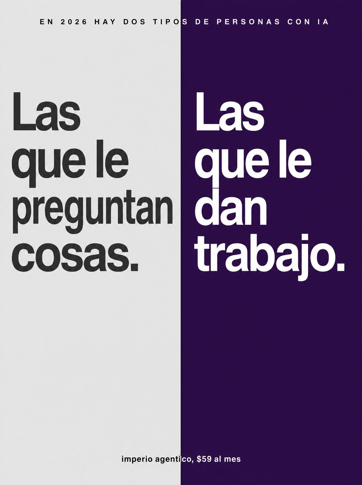

# 046 · Dos columnas, dos tipos de personas

**Familia:** Tipografía dura · **Necesitas:** Nada · **Resultado en Meta:** $2 invertidos, 0 compras (cuenta de Imperio, sep 2026) (muestra chica)



## Qué es
Un póster tipográfico partido en dos columnas de color: arriba una frase que divide a la gente en dos grupos, a la izquierda el grupo que el lector no quiere ser y a la derecha el que sí. Sin imágenes, solo dos frases grandes.

## Por qué funciona
Es identidad pura: obliga a elegir bando en dos segundos, y nadie elige la columna gris. La tipografía dura afirma algo sin explicar, y el color de marca queda pegado al lado ganador.

## Cuándo usarlo
Público frío, en cualquier negocio que pueda dividir a su mercado en dos maneras de hacer lo mismo. Sirve para frenar el scroll y poner tu marca del lado de la acción.

## Así lo hicimos para Imperio
- **Texto en la imagen:** EN 2026 HAY DOS TIPOS DE PERSONAS CON IA (mayúsculas chicas y espaciadas, arriba) / Las que le preguntan cosas. (columna gris, izquierda) / Las que le dan trabajo. (columna morada, derecha) / imperio agentico, $59 al mes (letra chica, abajo al centro)
- **Texto principal:**
  > Preguntarle cosas a la IA es gratis y no cambia nada.
  >
  > Darle trabajo es lo que separa a los que en 12 meses tienen un negocio distinto de los que van a tener las mismas conversaciones.
  >
  > +3.300 ya eligieron bando, en español. $59 al mes 👇
- **Titular:** Imperio Agéntico · $59 al mes

## Receta para tu marca
- **Formato:** dos columnas verticales iguales separadas por una línea fina, sin imágenes y con mucho aire.
- **Arriba:** cruzando las dos columnas, mayúsculas chicas y espaciadas: [EN TU AÑO O TU RUBRO] HAY DOS TIPOS DE [TU CLIENTE].
- **Izquierda:** fondo gris claro y texto gris oscuro muy grande: [LOS QUE HACEN LO DE SIEMPRE].
- **Derecha:** fondo de [COLOR DE TU MARCA] y texto blanco muy grande: [LOS QUE HACEN LO QUE TÚ ENSEÑAS O VENDES].
- **Pie:** letra chica centrada: [TU MARCA Y TU PRECIO].
- **Lo que no se toca:** las dos frases con la misma estructura y el mismo largo. El contraste lo hacen el color y una sola idea distinta.

## Prompt con que se hizo el de Imperio (GPT Image 2.5)
```
[Nota: el de Imperio se generó con GPT Image 2 en 3:4. En GPT Image 2.5 pídelo en 4:5]
Vertical typographic poster, split into two vertical columns by a single hairline rule down the middle. Left column on light grey background, right column on deep purple background. At the top spanning both columns, in small black caps: 'EN 2026 HAY DOS TIPOS DE PERSONAS CON IA'. In the left column, large grey-black sans text reading 'Las que le preguntan cosas.' In the right column, large white sans text reading 'Las que le dan trabajo.' At the very bottom spanning both columns, small text: 'imperio agentico, $59 al mes'. Brutal, confident, no images, generous negative space, Swiss typography. Spanish accents correct. No inverted punctuation, no em dashes.
```

## Ojo
- Las dos frases tienen que describir conductas, no insultar: el lector debe poder verse en la columna gris sin sentirse atacado.
- Revisa las tildes antes de publicar: en el ejemplo de Imperio salió agentico sin tilde.
- Marca la casilla de contenido generado por IA en el Administrador de anuncios.
