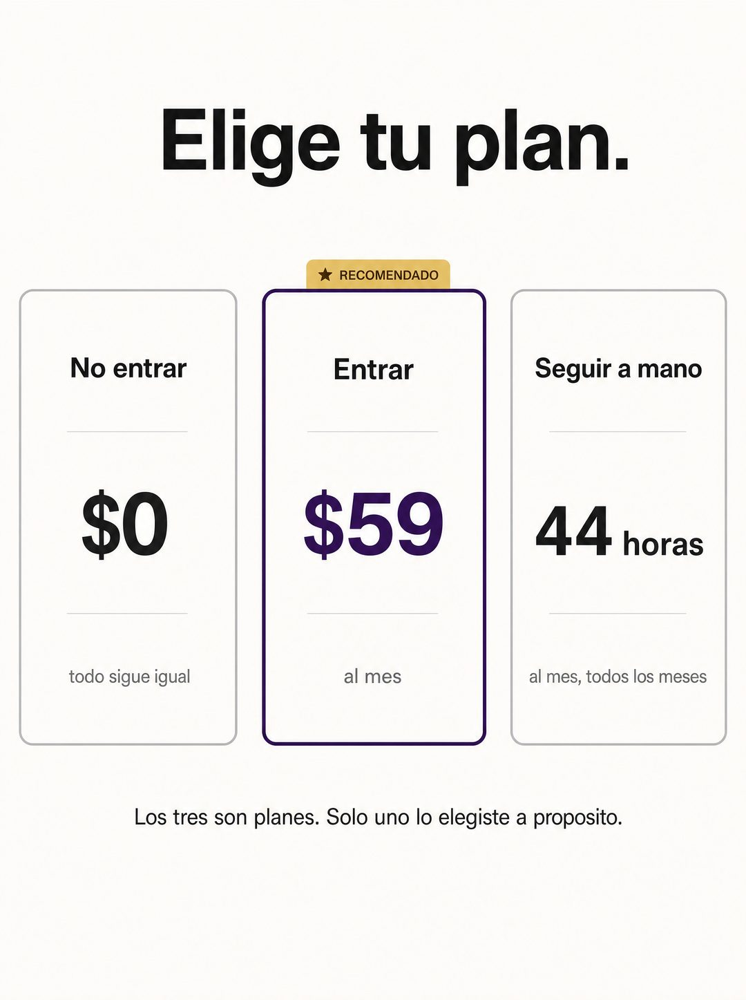

# 047 · Elige tu plan

**Familia:** Oferta y precio · **Necesitas:** Nada · **Resultado en Meta:** $2.088 invertidos, 15 compras, $139,2 por compra (cuenta de Imperio, sep-oct 2026)



## Qué es
Una página de precios con tres tarjetas donde solo una es tu oferta: las otras dos son no comprar y seguir como siempre, presentadas como planes con su propio costo. La tarjeta del medio va destacada como recomendada.

## Por qué funciona
Pone el costo de oportunidad como si fuera un plan más, y de pronto no comprar deja de ser gratis. El lector reconoce la tabla de precios y la lee en segundos, pero el giro incómodo lo obliga a ver que ya está pagando la tercera opción.

## Cuándo usarlo
Público tibio y remarketing, con gente que ya conoce tu oferta y está postergando. Sirve para responder la objeción de precio y empujar la compra en negocios que ahorran tiempo o dinero medible.

## Así lo hicimos para Imperio
- **Texto en la imagen:** Elige tu plan. / No entrar / $0 / todo sigue igual / ★ RECOMENDADO (etiqueta dorada sobre la tarjeta del medio) / Entrar / $59 (morado) / al mes / Seguir a mano / 44 horas / al mes, todos los meses / Los tres son planes. Solo uno lo elegiste a proposito.
- **Texto principal:**
  > Nadie elige el tercero a propósito, pero es el que más gente está pagando.
  >
  > 44 horas al mes repitiendo lo mismo cuesta bastante más que $59.
  >
  > Adentro: +35 cursos, 5 sesiones en vivo por semana y +1.800 logros publicados para copiar ideas 👇
- **Titular:** Imperio Agéntico · $59 al mes

## Receta para tu marca
- **Formato:** fondo blanco roto con la estética limpia de una página de precios.
- **Titular:** arriba, negro y grueso: Elige tu plan.
- **Tarjetas:** tres en fila. Izquierda, borde gris: No [COMPRAR] / $0 / [LO QUE PASA SI NO HACES NADA]. Centro, borde de [COLOR DE TU MARCA] y etiqueta dorada RECOMENDADO: [TU OFERTA] / [TU PRECIO] / [PERIODO]. Derecha, borde gris: Seguir [COMO SIEMPRE] / [EL COSTO REAL DE SEGUIR IGUAL] / [CADA CUÁNTO].
- **Remate:** una línea chica bajo las tarjetas: [FRASE QUE DICE QUE LAS TRES SON DECISIONES].
- **Lo que no se toca:** solo la tarjeta del medio lleva tu color. El costo de la tercera tiene que doler más que tu precio.

## Prompt con que se hizo el de Imperio (GPT Image 2.5)
```
[Nota: el de Imperio se generó con GPT Image 2 en 3:4. En GPT Image 2.5 pídelo en 4:5]
Vertical ad on off-white, laid out like a software pricing page with three cards side by side. Card one, plain grey outline: title 'No entrar', price '$0', and under it small grey text 'todo sigue igual'. Card two, highlighted with a deep purple border and a small gold tag: title 'Entrar', price '$59', small text 'al mes'. Card three, plain grey outline: title 'Seguir a mano', price '44 horas', small text 'al mes, todos los meses'. Above the cards, a bold black headline: 'Elige tu plan.' Below the cards, one small line: 'Los tres son planes. Solo uno lo elegiste a proposito.' Clean SaaS pricing aesthetic with an uncomfortable twist. Spanish accents correct. No inverted punctuation, no em dashes.
```

## Ojo
- El costo de seguir igual tiene que ser una estimación defendible para tu cliente típico, y el precio de la tarjeta, exactamente el de tu oferta.
- Revisa las tildes antes de publicar: en el ejemplo de Imperio salió proposito sin tilde.
- Marca la casilla de contenido generado por IA en el Administrador de anuncios.
