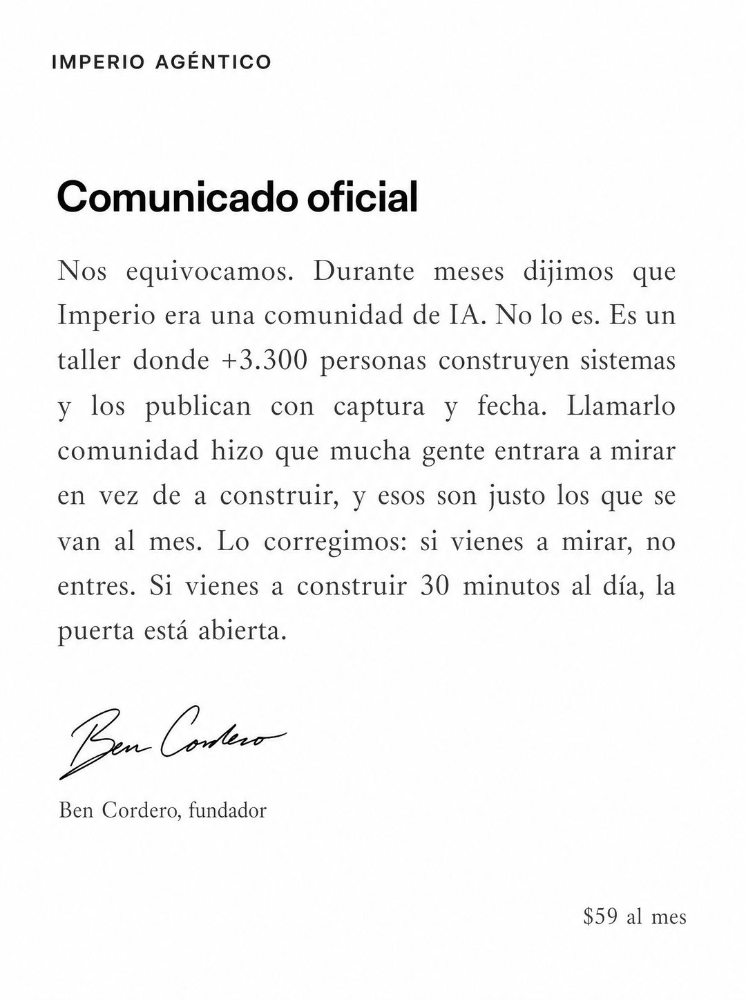

# 048 · Comunicado oficial firmado (Official apology)

**Familia:** Tipografía dura · **Necesitas:** Nada. Si tienes logo, va en el membrete · **Resultado en Meta:** $162 invertidos, 0 compras (cuenta de Imperio, sep 2026)



## Qué es
Una pieza de puro texto armada como un comunicado corporativo: membrete, título, un párrafo largo justificado que admite un error y lo corrige, y la firma del fundador. El error que se admite es en realidad un reposicionamiento: en el ejemplo de Imperio, haberse llamado comunidad cuando es un taller.

## Por qué funciona
No es normal ver a una marca disculpándose en público, y esa curiosidad engancha. El párrafo largo no es un problema, es el formato: se lee como un documento serio, no como publicidad. La firma con nombre y cargo pone autoridad propia en vez de prestada.

## Cuándo usarlo
Público frío y tibio, en negocios que quieren reposicionarse o filtrar al cliente equivocado. Sirve para frenar el scroll y cambiar cómo te perciben; el texto principal en Meta va corto para no competir con el comunicado.

## Así lo hicimos para Imperio
- **Texto en la imagen:** IMPERIO AGÉNTICO (membrete, arriba a la izquierda) / Comunicado oficial / Nos equivocamos. Durante meses dijimos que Imperio era una comunidad de IA. No lo es. Es un taller donde +3.300 personas construyen sistemas y los publican con captura y fecha. Llamarlo comunidad hizo que mucha gente entrara a mirar en vez de a construir, y esos son justo los que se van al mes. Lo corregimos: si vienes a mirar, no entres. Si vienes a construir 30 minutos al día, la puerta está abierta. / [firma manuscrita de Ben Cordero] / Ben Cordero, fundador / $59 al mes (abajo a la derecha)
- **Texto principal:**
  > Nos equivocamos en cómo lo llamábamos, y nos costó gente que entró a mirar en vez de a construir.
  >
  > Está corregido y dicho en público.
  >
  > +3.300 construyendo, +1.800 logros publicados con captura y fecha. $59 al mes 👇
- **Titular:** Imperio Agéntico · $59 al mes

## Receta para tu marca
- **Formato:** fondo blanco, diseño de documento corporativo, sin imágenes ni íconos.
- **Membrete:** arriba a la izquierda, [TU MARCA] en letra chica oscura (o tu logo, si tienes).
- **Título:** negro, tamaño medio: Comunicado oficial.
- **Cuerpo:** un solo párrafo justificado en serif gris oscuro, con interlineado amplio: [EL ERROR QUE ADMITES] / [LO QUE ERES EN REALIDAD, CON UN DATO REAL] / [A QUIÉN LE COSTÓ EL ERROR] / [CÓMO LO CORRIGES Y A QUIÉN INVITAS].
- **Firma:** firma manuscrita en tinta y debajo [TU NOMBRE], [TU CARGO]; abajo a la derecha, [TU PRECIO] en letra chica.
- **Lo que no se toca:** el tono serio de documento. Si le agregas colores, fotos o un botón, deja de parecer un comunicado.

## Prompt con que se hizo el de Imperio (GPT Image 2.5)
```
[Nota: el de Imperio se generó con GPT Image 2 en 3:4. En GPT Image 2.5 pídelo en 4:5]
Vertical ad that is pure text on plain white, laid out exactly like a corporate press statement. At the top left, a small dark wordmark [TU MARCA: logo y nombre]. Then a bold black headline in medium size: 'Comunicado oficial'. Below it, a justified body of small grey serif text in one column, with generous leading, reading: 'Nos equivocamos. Durante meses dijimos que Imperio era una comunidad de IA. No lo es. Es un taller donde +3.300 personas construyen sistemas y los publican con captura y fecha. Llamarlo comunidad hizo que mucha gente entrara a mirar en vez de a construir, y esos son justo los que se van al mes. Lo corregimos: si vienes a mirar, no entres. Si vienes a construir 30 minutos al día, la puerta está abierta.' Below the text, a handwritten ink signature and under it in small type 'Ben Cordero, fundador'. Bottom right, small text '$59 al mes'. Render every Spanish accent exactly. Clean corporate document layout, no images, no icons. No inverted punctuation, no em dashes.
```

## Ojo
- El error que admites tiene que ser real y las cifras del párrafo también: si inventas la falta, el formato se vuelve un truco.
- Si sale texto roto, manos deformes o cifras mal escritas, se rehace.
- Marca la casilla de contenido generado por IA en el Administrador de anuncios.
