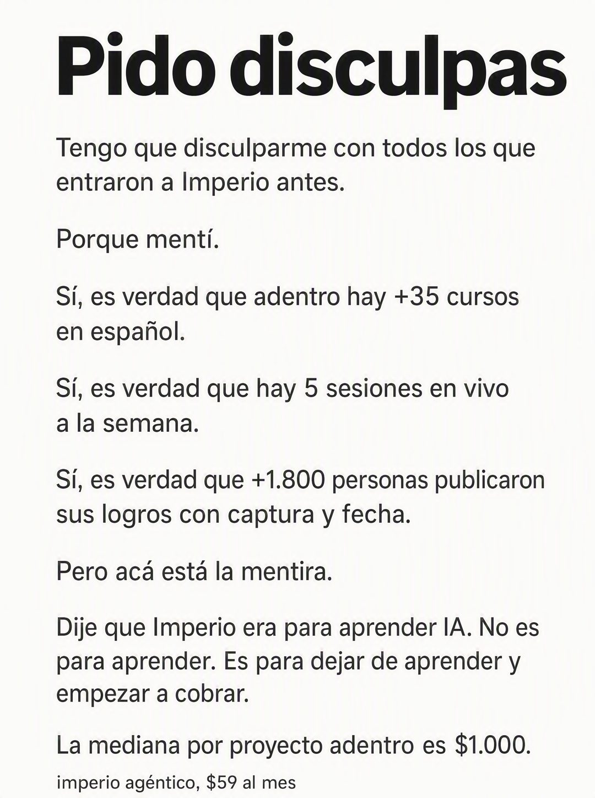

# 049 · Disculpa que es un elogio (I'm sorry)

**Familia:** Tipografía dura · **Necesitas:** Tres o cuatro datos reales de tu oferta con cifra · **Resultado en Meta:** $943 invertidos, 7 compras, $134,7 por compra (cuenta de Imperio, sep 2026)



## Qué es
Una carta de disculpa personal en puro texto, con frases cortas en párrafos separados, que confiesa una mentira y en el camino enumera lo que tu oferta tiene de bueno. La mentira final es que prometiste menos de lo que entregas.

## Por qué funciona
Nadie espera que una marca confiese que mintió, y la curiosidad obliga a leer hasta el final. Cada línea que empieza con "Sí, es verdad que" mete una prueba concreta sin que suene a lista de beneficios, y el giro final reposiciona la oferta. El texto largo es el formato, no un defecto.

## Cuándo usarlo
Público tibio y remarketing, con gente que ya te conoce y necesita una razón nueva para entrar. Sirve para mostrar prueba y reposicionar la oferta; el texto principal en Meta va corto para no competir con la carta.

## Así lo hicimos para Imperio
- **Texto en la imagen:** Pido disculpas / Tengo que disculparme con todos los que entraron a Imperio antes. / Porque mentí. / Sí, es verdad que adentro hay +35 cursos en español. / Sí, es verdad que hay 5 sesiones en vivo a la semana. / Sí, es verdad que +1.800 personas publicaron sus logros con captura y fecha. / Pero acá está la mentira. / Dije que Imperio era para aprender IA. No es para aprender. Es para dejar de aprender y empezar a cobrar. / La mediana por proyecto adentro es $1.000. / imperio agéntico, $59 al mes (letra chica, abajo)
- **Texto principal:**
  > Dije que Imperio era para aprender IA. No es para aprender.
  >
  > Es para dejar de aprender y empezar a cobrar. La mediana por proyecto adentro es $1.000, con mantenciones de $75 a $150 al mes.
  >
  > $59 al mes 👇
- **Titular:** Imperio Agéntico · $59 al mes

## Receta para tu marca
- **Formato:** fondo blanco roto, solo texto, sin imágenes.
- **Titular:** arriba, negro y muy grueso: Pido disculpas.
- **Confesión:** frases cortas, cada una en su propio párrafo, en sans gris oscuro: Tengo que disculparme con [A QUIÉN]. / Porque mentí.
- **Pruebas:** tres líneas que empiezan igual: Sí, es verdad que [DATO REAL 1 CON CIFRA] / [DATO REAL 2] / [DATO REAL 3].
- **Giro:** Pero acá está la mentira. / [LO QUE DIJISTE QUE ERA TU OFERTA]. [LO QUE ES EN REALIDAD]. / [UN RESULTADO REAL CON CIFRA]; al pie, [TU MARCA Y TU PRECIO] en letra chica.
- **Lo que no se toca:** el orden de confesión, pruebas y giro. Si la mentira final no es un elogio a tu oferta, la disculpa se vuelve real y espanta.

## Prompt con que se hizo el de Imperio (GPT Image 2.5)
```
[Nota: el de Imperio se generó con GPT Image 2 en 3:4. En GPT Image 2.5 pídelo en 4:5]
Vertical ad, pure text on a plain off-white background, laid out like a long personal apology letter with short paragraphs and clear line breaks. Bold black headline at top: 'Pido disculpas'. Then body text in dark grey sans, each sentence its own short paragraph: 'Tengo que disculparme con todos los que entraron a Imperio antes.' 'Porque mentí.' 'Sí, es verdad que adentro hay +35 cursos en español.' 'Sí, es verdad que hay 5 sesiones en vivo a la semana.' 'Sí, es verdad que +1.800 personas publicaron sus logros con captura y fecha.' 'Pero acá está la mentira.' 'Dije que Imperio era para aprender IA. No es para aprender. Es para dejar de aprender y empezar a cobrar.' 'La mediana por proyecto adentro es $1.000.' At the bottom, small text: 'imperio agéntico, $59 al mes'. Render every Spanish accent exactly. Text-only ad, no images. No inverted punctuation, no em dashes.
```

## Ojo
- Cada línea que empieza con "Sí, es verdad que" tiene que llevar un dato real y verificable de tu negocio: el formato vive de que esas líneas sean ciertas.
- Si sale texto roto, manos deformes o cifras mal escritas, se rehace.
- Marca la casilla de contenido generado por IA en el Administrador de anuncios.
