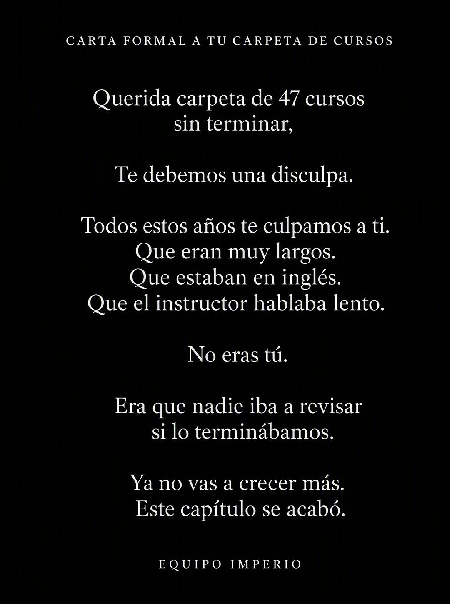

# 050 · Carta formal a un objeto (Formal apology to an object)

**Familia:** Tipografía dura · **Necesitas:** Nada · **Resultado en Meta:** $509 invertidos, 5 compras, $101,7 por compra (cuenta de Imperio, sep 2026)



## Qué es
Una carta formal en puro texto, blanco sobre negro y centrada, dirigida a un objeto que simboliza el problema de tu cliente: la carpeta de cursos sin terminar, el cajón de cremas, la membresía del gimnasio. La marca se disculpa con el objeto y en el camino nombra la verdadera causa del problema.

## Por qué funciona
Hablarle a un objeto es raro y gracioso, y el lector se reconoce en él antes de darse cuenta de que es un anuncio. La disculpa le quita la culpa al cliente y se la pone a la causa real, que es justo lo que tu oferta resuelve. Es puro texto que afirma algo concreto, sin una foto que lo suavice.

## Cuándo usarlo
Público frío y tibio, con clientes que acumulan intentos fallidos: cursos, suplementos, apps, planes. Sirve para frenar el scroll y responder la objeción "ya lo intenté" sin hacer sentir mal al lector; el texto principal en Meta va corto.

## Así lo hicimos para Imperio
- **Texto en la imagen:** CARTA FORMAL A TU CARPETA DE CURSOS (versalitas, arriba) / Querida carpeta de 47 cursos / sin terminar, / Te debemos una disculpa. / Todos estos años te culpamos a ti. / Que eran muy largos. / Que estaban en inglés. / Que el instructor hablaba lento. / No eras tú. / Era que nadie iba a revisar / si lo terminábamos. / Ya no vas a crecer más. / Este capítulo se acabó. / EQUIPO IMPERIO (versalitas, abajo)
- **Texto principal:**
  > 47 cursos guardados y ningún sistema corriendo. No es culpa de los cursos.
  >
  > Es que nadie iba a revisar si los terminabas. Adentro sí: 5 sesiones en vivo a la semana y +3.300 personas construyendo lo mismo.
  >
  > $59 al mes 👇
- **Titular:** Imperio Agéntico · $59 al mes

## Receta para tu marca
- **Formato:** fondo casi negro, texto blanco centrado, mucho espacio vacío y cero imágenes.
- **Encabezado:** versalitas chicas y espaciadas: CARTA FORMAL A [EL OBJETO QUE SIMBOLIZA EL PROBLEMA].
- **Saludo:** en serif blanca: Querida [EL OBJETO, CON UNA CIFRA QUE DUELA],
- **Cuerpo:** líneas cortas en serif: la disculpa / [LAS EXCUSAS DE SIEMPRE, UNA POR LÍNEA] / No eras tú. / [LA CAUSA REAL QUE TU OFERTA RESUELVE] / [EL CIERRE DEL CAPÍTULO].
- **Firma:** versalitas abajo: EQUIPO [TU MARCA].
- **Lo que no se toca:** el tono formal y serio dirigido a un objeto. Si se vuelve chiste explícito o le agregas imagen, se pierde el efecto.

## Prompt con que se hizo el de Imperio (GPT Image 2.5)
```
[Nota: el de Imperio se generó con GPT Image 2 en 3:4. En GPT Image 2.5 pídelo en 4:5]
Vertical ad, pure text in white on a solid near-black background, centered, laid out like a formal letter. Small caps headline at top: 'CARTA FORMAL A TU CARPETA DE CURSOS'. Below, a centered letter in white serif with short lines: 'Querida carpeta de 47 cursos sin terminar,' 'Te debemos una disculpa.' 'Todos estos años te culpamos a ti. Que eran muy largos. Que estaban en inglés. Que el instructor hablaba lento.' 'No eras tú.' 'Era que nadie iba a revisar si lo terminábamos.' 'Ya no vas a crecer más. Este capítulo se acabó.' At the bottom in small caps: 'EQUIPO IMPERIO'. Render every Spanish accent exactly. Elegant typographic layout, no images, generous negative space. No inverted punctuation, no em dashes.
```

## Ojo
- La cifra del objeto (47 cursos en el ejemplo) tiene que ser creíble para tu cliente típico, no exagerada para el chiste.
- Si sale texto roto, manos deformes o cifras mal escritas, se rehace.
- Marca la casilla de contenido generado por IA en el Administrador de anuncios.
