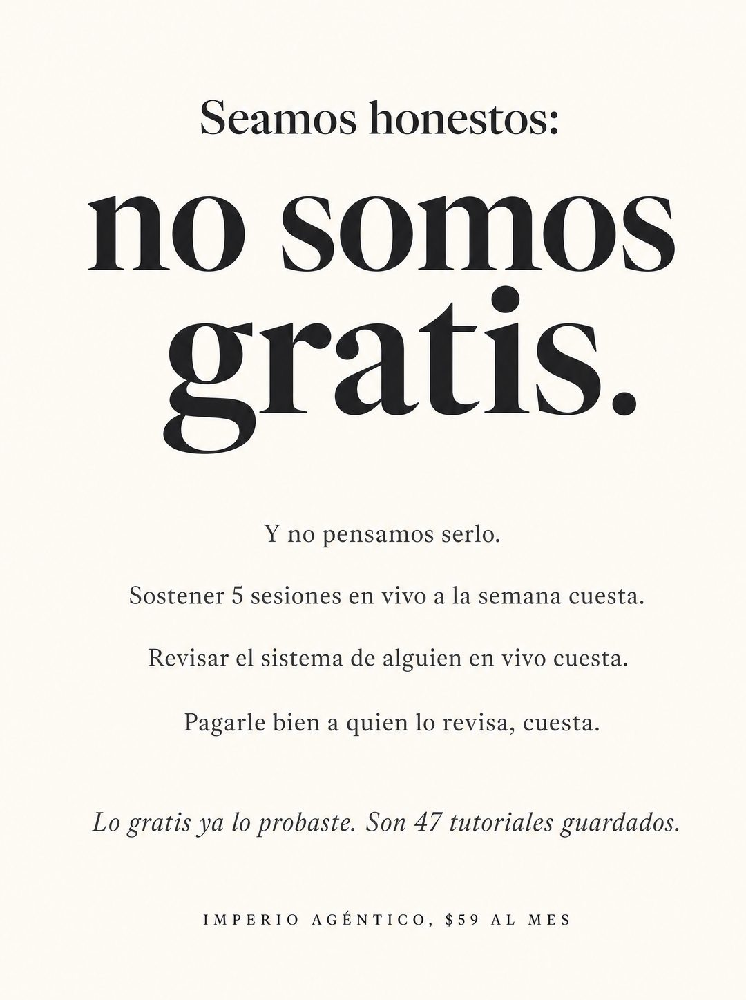

# 051 · Admitir algo incómodo (Admit something)

**Familia:** Tipografía dura · **Necesitas:** Nada · **Resultado en Meta:** $329 invertidos, 0 compras (cuenta de Imperio, sep 2026)



## Qué es
Una pieza de puro texto en tipografía editorial que admite algo incómodo de tu oferta (que no es gratis, que es cara, que tarda) y lo convierte en argumento con razones concretas. Cierra con una línea en itálica que le recuerda al lector lo que ya probó.

## Por qué funciona
Admitir un defecto antes de que el cliente lo saque baja la guardia y da credibilidad: suena a alguien que no se esconde. Cada razón con cifra justifica el precio sin pedir perdón, y la línea final le recuerda que la alternativa gratis ya le falló.

## Cuándo usarlo
Público tibio y remarketing, con gente que compara tu oferta con alternativas gratis o más baratas. Sirve para responder la objeción de precio de frente.

## Así lo hicimos para Imperio
- **Texto en la imagen:** Seamos honestos: / no somos / gratis. / Y no pensamos serlo. / Sostener 5 sesiones en vivo a la semana cuesta. / Revisar el sistema de alguien en vivo cuesta. / Pagarle bien a quien lo revisa, cuesta. / Lo gratis ya lo probaste. Son 47 tutoriales guardados. (itálica) / IMPERIO AGÉNTICO, $59 AL MES (versalitas espaciadas, abajo)
- **Texto principal:**
  > Lo gratis ya lo probaste. Son 47 tutoriales guardados y cero sistemas andando.
  >
  > Sostener 5 sesiones en vivo a la semana cuesta, y por eso esto no es gratis.
  >
  > $59 al mes, con 7 días de garantía si no es para ti 👇
- **Titular:** Imperio Agéntico · $59 al mes

## Receta para tu marca
- **Formato:** fondo blanco cálido, tipografía editorial serif, centrado y con mucho aire, sin imágenes.
- **Arriba:** serif mediana: Seamos honestos:
- **Admisión:** serif negra enorme en dos líneas: [LO INCÓMODO DE TU OFERTA, EN TRES PALABRAS].
- **Razones:** líneas cortas en gris oscuro: Y no pensamos [CAMBIARLO]. / [RAZÓN CONCRETA 1] cuesta. / [RAZÓN 2] cuesta. / [RAZÓN 3], cuesta.
- **Cierre:** una línea en itálica: [LO QUE TU CLIENTE YA PROBÓ Y NO LE FUNCIONÓ]; al pie, versalitas espaciadas con [TU MARCA Y TU PRECIO].
- **Lo que no se toca:** admitir sin disculparse. Si el tono se vuelve defensivo o se llena de descuentos, deja de ser honestidad y pasa a ser excusa.

## Prompt con que se hizo el de Imperio (GPT Image 2.5)
```
[Nota: el de Imperio se generó con GPT Image 2 en 3:4. En GPT Image 2.5 pídelo en 4:5]
Vertical ad, pure text on a warm off-white background, generous white space, centered. At the top in medium dark serif: 'Seamos honestos:'. Directly below in much larger bold black serif across two lines: 'no somos gratis.' Then a gap, then small dark grey lines stacked with space between them: 'Y no pensamos serlo.' 'Sostener 5 sesiones en vivo a la semana cuesta.' 'Revisar el sistema de alguien en vivo cuesta.' 'Pagarle bien a quien lo revisa, cuesta.' Then a gap and one line in italic: 'Lo gratis ya lo probaste. Son 47 tutoriales guardados.' At the bottom, small letterspaced caps: 'IMPERIO AGÉNTICO, $59 AL MES'. Render every Spanish accent exactly. Minimal editorial typography, no images. No inverted punctuation, no em dashes.
```

## Ojo
- Admite algo que de verdad sea cierto de tu oferta y respáldalo con razones reales: la honestidad inventada se nota.
- No acompañes la admisión con un descuento o una garantía que no existe.
- Marca la casilla de contenido generado por IA en el Administrador de anuncios.
