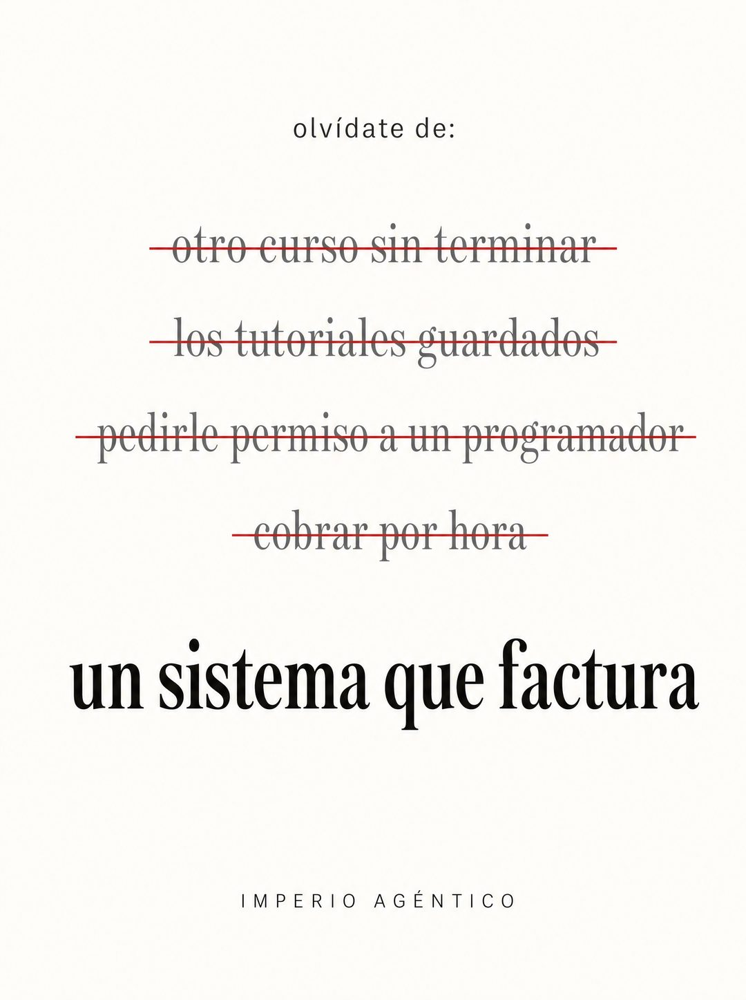

# 052 · Lista de dolores tachados (Crossed-out words)

**Familia:** Tipografía dura · **Necesitas:** Nada · **Resultado en Meta:** $6 invertidos, 0 compras (cuenta de Imperio, sep 2026) (muestra chica)



## Qué es
Una pieza de puro texto sobre blanco con estética de anuncio de cosmética: arriba olvídate de, debajo cuatro dolores de tu cliente tachados con una línea roja fina, y al final una sola frase grande sin tachar con lo que se queda. Sirve para cualquier oferta que reemplace hábitos molestos.

## Por qué funciona
El lector recorre los tachados y reconoce sus propias frustraciones una por una, y la línea limpia del final se lee como el alivio. La tipografía afirma algo concreto sin foto, y la estética de lujo hace que un tema complicado se vea simple.

## Cuándo usarlo
Público frío y tibio, en negocios que eliminan tareas o gastos molestos: servicios, software, limpieza, finanzas, salud. Sirve para frenar el scroll y resumir la promesa en una sola frase.

## Así lo hicimos para Imperio
- **Texto en la imagen:** olvídate de: / otro curso sin terminar (tachado en rojo) / los tutoriales guardados (tachado en rojo) / pedirle permiso a un programador (tachado en rojo) / cobrar por hora (tachado en rojo) / un sistema que factura / IMPERIO AGÉNTICO (versalitas espaciadas, abajo)
- **Texto principal:**
  > Lo que se tacha ahí lo hiciste durante dos años.
  >
  > Lo que queda sin tachar es lo que hacen adentro +3.300 personas: sistemas que facturan. Vilma cobró unos $1.300 por el suyo.
  >
  > $59 al mes 👇
- **Titular:** Imperio Agéntico · $59 al mes

## Receta para tu marca
- **Formato:** fondo blanco roto, composición centrada, mucho aire y cero imágenes.
- **Arriba:** sans chica en minúsculas: olvídate de:
- **Tachados:** cuatro líneas en serif gris mediana, cada una cruzada por una línea roja fina: [DOLOR 1] / [DOLOR 2] / [DOLOR 3] / [DOLOR 4].
- **Promesa:** una línea sin tachar, en serif negra grande: [LO QUE TU CLIENTE SE LLEVA].
- **Pie:** versalitas espaciadas: [TU MARCA].
- **Lo que no se toca:** cuatro dolores en minúsculas y una sola promesa. Si la promesa es larga o va en color, compite con los tachados.

## Prompt con que se hizo el de Imperio (GPT Image 2.5)
```
[Nota: el de Imperio se generó con GPT Image 2 en 3:4. En GPT Image 2.5 pídelo en 4:5]
Vertical ad, pure text on a clean off-white background, centered composition. At the top in small dark grey lowercase: 'olvídate de:'. Below, four lines stacked, each in medium grey serif and each STRUCK THROUGH with a clean thin red horizontal line: 'otro curso sin terminar', 'los tutoriales guardados', 'pedirle permiso a un programador', 'cobrar por hora'. Then a gap, then one line NOT struck through in large bold black serif: 'un sistema que factura'. At the bottom, small letterspaced caps: 'IMPERIO AGÉNTICO'. Render every Spanish accent exactly. Minimal skincare-ad typography applied to tech, lots of white space, no images. No inverted punctuation, no em dashes.
```

## Ojo
- Los dolores tienen que ser los que tu cliente reconoce con sus propias palabras, no los que tú crees que tiene.
- La línea roja tiene que cruzar cada frase completa sin tapar la lectura: si queda corrida o tapa letras, se rehace.
- Marca la casilla de contenido generado por IA en el Administrador de anuncios.
