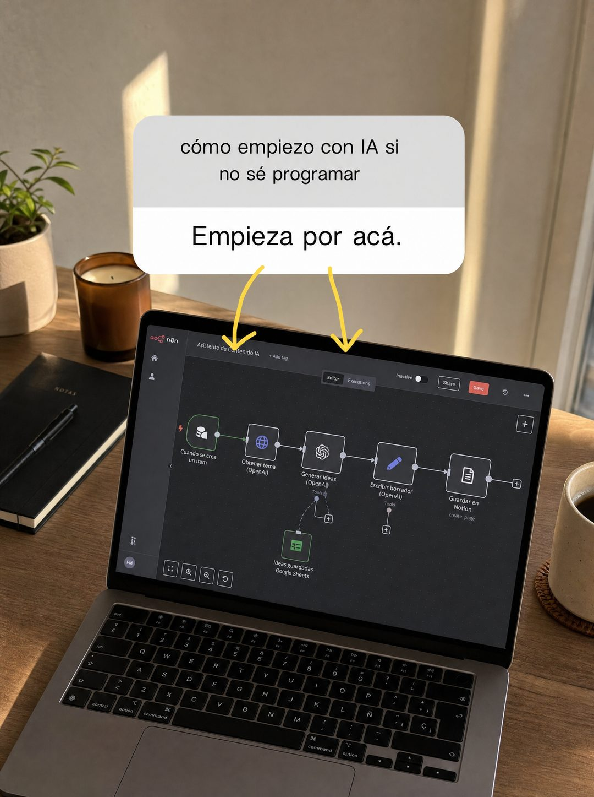

# 053 · Respuesta a pregunta de story (Instagram story response)

**Familia:** Interfaz creíble · **Necesitas:** Nada. Si tienes una foto real de tu producto, mejor · **Resultado en Meta:** $125 invertidos, 0 compras (cuenta de Imperio, sep 2026)



## Qué es
Una captura con la interfaz de respuesta a preguntas de una story: arriba la pregunta que te hace tu audiencia, abajo tu respuesta corta, y flechas dibujadas a mano que apuntan al producto en la foto de fondo. En el ejemplo de Imperio, la pregunta es cómo empezar con IA sin saber programar y la respuesta señala un flujo de automatización en una laptop.

## Por qué funciona
Parece contenido orgánico de una cuenta que sigues, no un anuncio, así que el ojo no lo salta. La pregunta en minúsculas es la duda exacta del cliente, y la respuesta corta con flechas lo lleva directo al producto sin explicar de más.

## Cuándo usarlo
Público frío y tibio, en cualquier negocio que recibe una pregunta frecuente de entrada. Sirve para bajar la fricción (mostrar por dónde empezar) y frenar el scroll con un formato nativo de Instagram.

## Así lo hicimos para Imperio
- **Texto en la imagen:** cómo empiezo con IA si / no sé programar (caja de pregunta gris) / Empieza por acá. (respuesta, en franja blanca) / [dos flechas amarillas dibujadas a mano hacia la pantalla] / [laptop con un flujo de n8n llamado Asistente de Contenido IA, con nodos de OpenAI, Notion y Google Sheets] / NOTAS (tapa del cuaderno, a la izquierda)
- **Texto principal:**
  > Es la pregunta que más me llega y la respondo igual todas las veces: se empieza construyendo algo chico, no estudiando seis meses.
  >
  > Adentro tienes el paso a paso, los archivos listos y gente que te revisa en vivo cuando te trabas.
  >
  > +1.800 logros publicados. $59 al mes 👇
- **Titular:** Imperio Agéntico · $59 al mes

## Receta para tu marca
- **Fondo:** foto real o realista de [TU PRODUCTO O SERVICIO EN USO], con luz natural de día y encuadre desde arriba en ángulo.
- **Pregunta:** caja redondeada gris de story, centrada arriba: [LA PREGUNTA QUE MÁS TE HACEN, EN MINÚSCULAS Y SIN SIGNO DE APERTURA].
- **Respuesta:** pegada debajo, franja blanca con texto oscuro: [TU RESPUESTA EN TRES O CUATRO PALABRAS].
- **Flechas:** dos flechas amarillas a mano alzada desde la respuesta hasta [EL PUNTO EXACTO DEL PRODUCTO QUE RESPONDE].
- **Lo que no se toca:** solo la interfaz nativa de story, sin logo, precio ni botón. Si le agregas diseño, deja de parecer una story.

## Prompt con que se hizo el de Imperio (GPT Image 2.5)
```
[Nota: el de Imperio se generó con GPT Image 2 en 3:4. En GPT Image 2.5 pídelo en 4:5]
Vertical image styled as an Instagram story reply screenshot. Background: a real photograph of a desk with a laptop showing a node-based automation dashboard, warm daylight, shot from above at an angle. Overlaid in the middle, the native story UI: a grey rounded question box containing the text 'cómo empiezo con IA si no sé programar' and directly below it a white rounded answer bubble with dark text reading 'Empieza por acá.' Two hand-drawn yellow arrows point from the answer bubble down toward the laptop screen. Authentic story-reply look, nothing else on screen. Render every Spanish accent exactly. The question has no opening inverted question mark. No em dashes.
```

## Ojo
- La pregunta tiene que ser una que de verdad te hacen, y no muestres el nombre ni la foto de quien la envió.
- Si en la pantalla aparece software de terceros, confirma que puedes mostrar sus logos o pide que salgan desenfocados.
- Marca la casilla de contenido generado por IA en el Administrador de anuncios.
