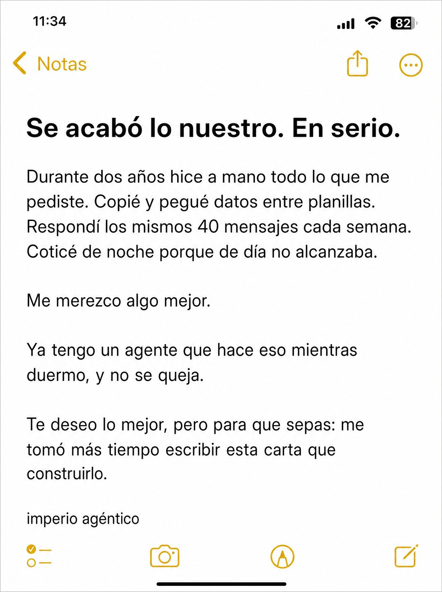

# 054 · Carta de ruptura en notas (iPhone note breakup)

**Familia:** Interfaz creíble · **Necesitas:** Nada · **Resultado en Meta:** $35 invertidos, 1 compra, $34,6 por compra (cuenta de Imperio, sep 2026) (muestra chica)



## Qué es
Una captura de la app de notas del teléfono con una carta de ruptura dirigida a la tarea o el hábito que tu cliente odia. En el ejemplo de Imperio, alguien termina con el trabajo manual porque ya tiene un agente que lo hace.

## Por qué funciona
Se ve tan simple que no parece anuncio: es una nota del teléfono, algo que todos escriben. El tono de ruptura es reconocible y gracioso, y cada línea nombra una tarea concreta que el lector hace hoy. El remate baja la fricción: armar la solución tomó menos que escribir la carta.

## Cuándo usarlo
Público frío, en negocios que reemplazan una tarea repetitiva o un hábito molesto. Sirve para frenar el scroll y bajar la fricción de entrada; si usas otras notas del teléfono, cambia la estructura (checklist, tareas tachadas, plan numerado) para que no se canibalicen.

## Así lo hicimos para Imperio
- **Texto en la imagen:** 11:34 / [barra de estado con señal, wifi y batería en 82] / Notas (botón para volver) / Se acabó lo nuestro. En serio. / Durante dos años hice a mano todo lo que me pediste. Copié y pegué datos entre planillas. Respondí los mismos 40 mensajes cada semana. Coticé de noche porque de día no alcanzaba. / Me merezco algo mejor. / Ya tengo un agente que hace eso mientras duermo, y no se queja. / Te deseo lo mejor, pero para que sepas: me tomó más tiempo escribir esta carta que construirlo. / imperio agéntico / [íconos de la barra inferior de Notas]
- **Texto principal:**
  > Copiar y pegar entre planillas. Responder los mismos 40 mensajes. Cotizar de noche.
  >
  > Eso se termina el día que un agente lo hace por ti mientras duermes, y se construye en una tarde sin escribir código.
  >
  > $59 al mes 👇
- **Titular:** Imperio Agéntico · $59 al mes

## Receta para tu marca
- **Formato:** captura vertical de la app de notas del teléfono en modo claro, con barra de estado, botón Notas para volver y la barra de herramientas abajo.
- **Titular:** en negrita, como primera línea de la nota: [LA RUPTURA EN UNA FRASE]. En serio.
- **Cuerpo:** párrafos cortos: [LO QUE TU CLIENTE HIZO A MANO, CON TRES TAREAS CONCRETAS Y UNA CIFRA] / Me merezco algo mejor. / [LO QUE TIENE AHORA GRACIAS A TU PRODUCTO].
- **Remate:** [UNA FRASE QUE MUESTRA LO FÁCIL QUE FUE EL CAMBIO].
- **Marca:** al final de la nota, [TU MARCA] en minúsculas y texto normal.
- **Lo que no se toca:** la interfaz nativa sin adornos y la estructura de carta de ruptura. Si le agregas colores de marca o un botón, deja de parecer una nota.

## Prompt con que se hizo el de Imperio (GPT Image 2.5)
```
[Nota: el de Imperio se generó con GPT Image 2 en 3:4. En GPT Image 2.5 pídelo en 4:5]
Vertical screenshot of the iPhone Notes app in light mode, filling the frame: status bar, a back chevron labelled 'Notas' at the top left. Bold black headline in the note: 'Se acabó lo nuestro. En serio.' Below it, body text in the note, in short paragraphs: 'Durante dos años hice a mano todo lo que me pediste. Copié y pegué datos entre planillas. Respondí los mismos 40 mensajes cada semana. Coticé de noche porque de día no alcanzaba.' 'Me merezco algo mejor.' 'Ya tengo un agente que hace eso mientras duermo, y no se queja.' 'Te deseo lo mejor, pero para que sepas: me tomó más tiempo escribir esta carta que construirlo.' At the bottom of the note, a small line: 'imperio agéntico'. Render every Spanish accent exactly. Authentic notes app UI. No inverted punctuation, no em dashes.
```

## Ojo
- El remate tiene que ser cierto para tu cliente típico: si tu producto tarda semanas en armarse, no digas que tomó menos que escribir la carta.
- Si sale texto roto, manos deformes o cifras mal escritas, se rehace.
- Marca la casilla de contenido generado por IA en el Administrador de anuncios.
