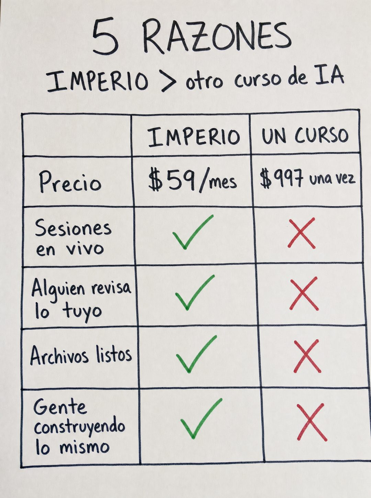

# 055 · Tabla manuscrita de razones (5 reasons why)

**Familia:** Objeto físico con texto · **Necesitas:** Nada · **Resultado en Meta:** $83 invertidos, 0 compras (cuenta de Imperio, sep 2026) (muestra chica)



## Qué es
Una tabla comparativa escrita a mano con plumón en una hoja blanca y fotografiada de frente: tu oferta contra la alternativa típica, con el precio en la primera fila y luego checks verdes contra cruces rojas. El título anuncia cuántas razones hay.

## Por qué funciona
Lo escrito a mano se ve como algo que alguien armó para explicarte, no como diseño de agencia, y un objeto real rinde más que un gráfico de Canva. La tabla se entiende en dos segundos: todo verde de un lado y todo rojo del otro. Poner el precio primero desarma la objeción antes de que aparezca.

## Cuándo usarlo
Público tibio que está comparando opciones. Sirve para negocios con una alternativa conocida más cara o más solitaria (cursos, agencias, consultorías, software) y para responder la objeción de precio.

## Así lo hicimos para Imperio
- **Texto en la imagen:** 5 RAZONES / IMPERIO > otro curso de IA / IMPERIO | UN CURSO / Precio | $59/mes | $997 una vez / Sesiones en vivo | ✓ | ✗ / Alguien revisa lo tuyo | ✓ | ✗ / Archivos listos | ✓ | ✗ / Gente construyendo lo mismo | ✓ | ✗ (checks verdes y cruces rojas a mano)
- **Texto principal:**
  > Un curso de $997 te deja solo con el video. Esto te deja con gente revisando lo que construiste.
  >
  > 5 sesiones en vivo a la semana, archivos listos para adaptar y +3.300 personas construyendo lo mismo.
  >
  > $59 al mes 👇
- **Titular:** Imperio Agéntico · $59 al mes

## Receta para tu marca
- **Escena:** foto de frente de una hoja blanca, todo escrito a mano en plumón negro con letra casual e imperfecta.
- **Título:** arriba, grande: [CANTIDAD] RAZONES; debajo: [TU MARCA] > [LA ALTERNATIVA TÍPICA].
- **Tabla:** líneas trazadas a mano y columnas [TU MARCA] y [LA ALTERNATIVA]; primera fila Precio, con [TU PRECIO] contra [PRECIO TÍPICO REAL DE LA ALTERNATIVA].
- **Filas:** [VENTAJA 1] a [VENTAJA 4], cada una con check verde en tu columna y cruz roja en la otra.
- **Lo que no se toca:** todo a mano, verde y rojo como únicos colores, y la cantidad del título igual al número de filas. Si la tabla sale tipográfica, pierde la gracia.

## Prompt con que se hizo el de Imperio (GPT Image 2.5)
```
[Nota: el de Imperio se generó con GPT Image 2 en 3:4. En GPT Image 2.5 pídelo en 4:5]
Vertical image of a comparison table HANDWRITTEN in black marker on white paper, photographed flat, casual and imperfect handwriting. At the top, handwritten heading: '5 RAZONES' and below it 'IMPERIO > otro curso de IA'. Then a hand-drawn table with two columns headed 'IMPERIO' and 'UN CURSO', and five hand-written rows on the left: 'Precio', 'Sesiones en vivo', 'Alguien revisa lo tuyo', 'Archivos listos', 'Gente construyendo lo mismo'. In the IMPERIO column: '$59/mes' then four green hand-drawn check marks. In the CURSO column: '$997 una vez' then four red hand-drawn crosses. Hand-ruled lines, marker texture. Render every Spanish accent exactly. No inverted punctuation, no em dashes.
```

## Ojo
- El precio de la alternativa tiene que ser un precio típico real de tu rubro y cada cruz, algo que esa alternativa de verdad no da; no nombres a un competidor.
- Si sale texto roto, manos deformes o cifras mal escritas, se rehace.
- Marca la casilla de contenido generado por IA en el Administrador de anuncios.
