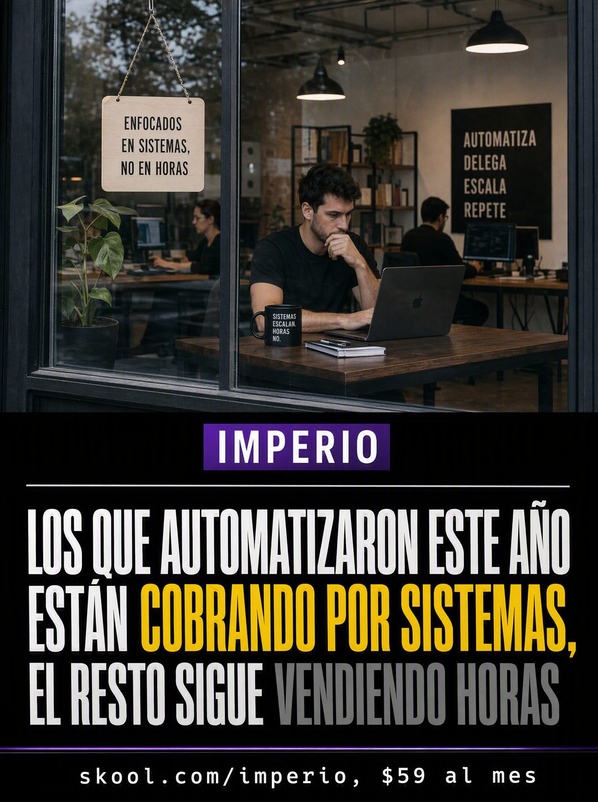

# 057 · Titular de noticiero con marca (News headline)

**Familia:** Tipografía dura · **Necesitas:** Nada. Si tienes una foto real de tu local, mejor · **Resultado en Meta:** $24 invertidos, 0 compras (cuenta de Imperio, sep 2026) (muestra chica)



## Qué es
Un anuncio con forma de pantalla de noticiero: arriba, la foto de un negocio trabajando, vista desde la calle a través de la ventana; abajo, una banda negra con la etiqueta de tu marca, un titular enorme en mayúsculas y una cinta con el link y el precio. La marca va a la vista para no fingir que es prensa.

## Por qué funciona
Se lee como noticia y no como publicidad, y el titular afirma algo concreto que parte al lector en dos: los que ya cambiaron y el resto. El color hace la venta: lo deseable va en amarillo y lo que quieres que deje atrás, en gris. Firma tu marca en vez de un diario prestado, porque la autoridad propia pesa más.

## Cuándo usarlo
Público frío, para frenar el scroll con una tesis sobre tu rubro. Sirve para servicios, consultorías, agencias y cualquier negocio que pueda contar un cambio de época en una frase.

## Así lo hicimos para Imperio
- **Texto en la imagen:** Letrero colgante en la foto: ENFOCADOS EN SISTEMAS, NO EN HORAS / Cuadro en la pared: AUTOMATIZA DELEGA ESCALA REPETE / Taza: SISTEMAS ESCALAN. HORAS NO. / IMPERIO (etiqueta morada) / LOS QUE AUTOMATIZARON ESTE AÑO ESTÁN COBRANDO POR SISTEMAS, EL RESTO SIGUE VENDIENDO HORAS ('COBRANDO POR SISTEMAS' en amarillo, 'VENDIENDO HORAS' en gris) / skool.com/imperio, $59 al mes (cinta al pie)
- **Texto principal:**
  > Los que automatizaron este año dejaron de vender horas y empezaron a cobrar por sistemas.
  >
  > La mediana por proyecto adentro es $1.000. José reemplazó una agencia completa y facturó $2.100.
  >
  > $59 al mes 👇
- **Titular:** Imperio Agéntico · $59 al mes

## Receta para tu marca
- **Formato:** vertical; la mitad de arriba es una foto de [TU NEGOCIO O TU RUBRO EN PLENO TRABAJO] vista a través de una ventana, algo desaturada; la mitad de abajo, una banda negra sólida.
- **Marca:** etiqueta chica con fondo [TU COLOR DE MARCA] y [TU MARCA] en mayúsculas blancas, sobre una línea fina que la separa del titular.
- **Titular:** tres líneas en mayúsculas blancas condensadas: [LOS QUE YA HICIERON EL CAMBIO] [LO QUE GANARON, EN AMARILLO], [EL RESTO] [LO QUE SIGUEN HACIENDO, EN GRIS].
- **Cinta:** franja delgada al pie con letra blanca chica: [TU LINK], [TU PRECIO].
- **Lo que no se toca:** la marca visible, ningún logo de un medio real y el contraste amarillo contra gris dentro del mismo titular.

## Prompt con que se hizo el de Imperio (GPT Image 2.5)
```
[Nota: el de Imperio se generó con GPT Image 2 en 3:4. En GPT Image 2.5 pídelo en 4:5]
Vertical ad styled like a vertical news broadcast frame. Top half: a photograph of a modern small business at work seen through a window, slightly desaturated. Across the middle and lower part, a solid black band containing, in this order: a small purple tag with white caps reading 'IMPERIO', then a thin rule, then a bold white condensed headline across three lines reading 'LOS QUE AUTOMATIZARON ESTE AÑO ESTÁN COBRANDO POR SISTEMAS, EL RESTO SIGUE VENDIENDO HORAS' with the words 'COBRANDO POR SISTEMAS' highlighted in yellow and the words 'VENDIENDO HORAS' in a muted grey. At the very bottom, a thin ticker strip with small white text: 'skool.com/imperio, $59 al mes'. Render every Spanish accent exactly. Broadcast news aesthetic but clearly branded, no fake news outlet logo anywhere. No inverted punctuation, no em dashes.
```

## Ojo
- No uses el nombre ni el logo de un noticiero real: la gracia es parecer noticia sin fingir que lo es.
- Revisa los carteles y objetos de la foto: el modelo puede inventar textos con errores (en el ejemplo de Imperio, un cuadro dice 'REPETE').
- Marca la casilla de contenido generado por IA en el Administrador de anuncios.
