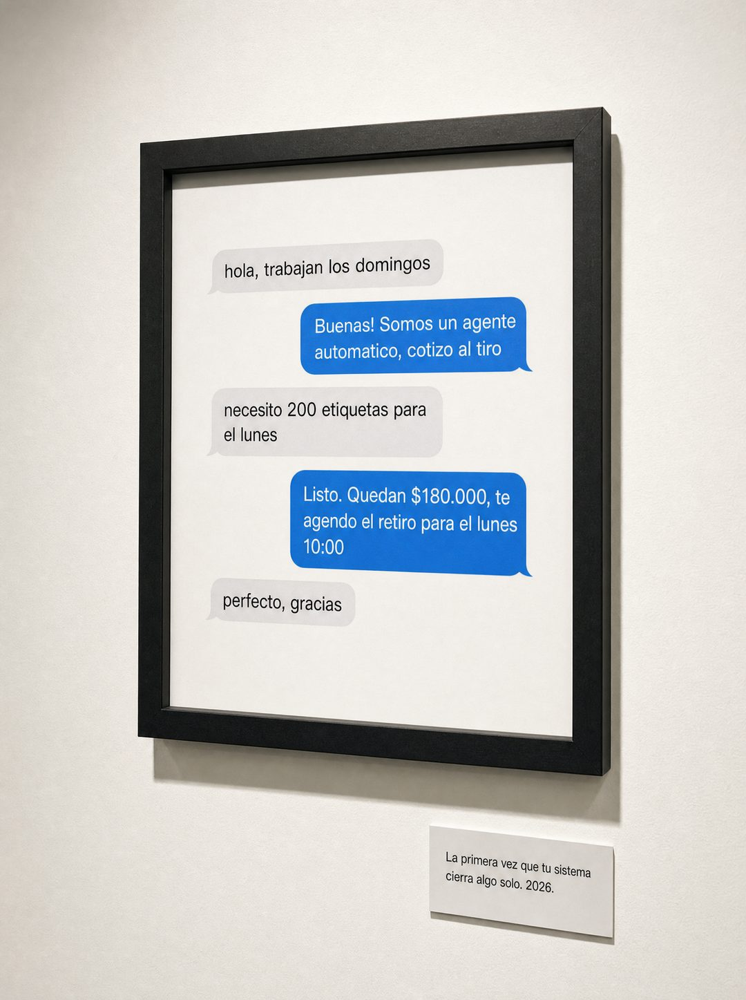

# 058 · Chat enmarcado como obra (Text thread)

**Familia:** Objeto físico con texto · **Necesitas:** Nada · **Resultado en Meta:** $29 invertidos, 0 compras (cuenta de Imperio, sep 2026) (muestra chica)



## Qué es
Una foto de galería: un cuadro de marco negro en una pared blanca que, en vez de una obra, enmarca la captura de un chat donde tu producto atiende, cotiza y cierra una venta solo. Debajo, una placa de museo con una frase y un año.

## Por qué funciona
Nadie espera ver un chat colgado como obra de arte, y esa rareza detiene el scroll: arriesgarse con el concepto funciona. El chat muestra el producto con un caso concreto (pregunta, pedido con cantidad, precio y fecha) y la placa convierte ese momento en un hito que el lector quiere vivir.

## Cuándo usarlo
Público frío o tibio que entiende qué vendes pero no se imagina usándolo. Sirve para software, automatizaciones y cualquier negocio que venda o atienda por chat; el objetivo es frenar el scroll y mostrar el producto funcionando.

## Así lo hicimos para Imperio
- **Texto en la imagen:** Chat impreso dentro del cuadro: hola, trabajan los domingos / Buenas! Somos un agente automatico, cotizo al tiro / necesito 200 etiquetas para el lunes / Listo. Quedan $180.000, te agendo el retiro para el lunes 10:00 / perfecto, gracias / Placa de museo bajo el cuadro: La primera vez que tu sistema cierra algo solo. 2026.
- **Texto principal:**
  > La primera vez que tu sistema cierra algo solo se siente raro. Después se vuelve normal.
  >
  > Un agente conectado a WhatsApp cotiza, agenda y confirma sin ti. Se construye en una tarde y sin código.
  >
  > Vincent cobró $750 por el suyo. $59 al mes 👇
- **Titular:** Imperio Agéntico · $59 al mes

## Receta para tu marca
- **Escena:** foto de galería, cuadro de marco negro en una pared blanca limpia, luz suave de museo, tomado apenas en ángulo.
- **Dentro del cuadro:** captura impresa de un chat con burbujas grises (cliente) y azules (tu negocio): [PREGUNTA DEL CLIENTE] / [RESPUESTA DE TU PRODUCTO] / [PEDIDO CONCRETO CON CANTIDAD] / [CIERRE CON PRECIO Y FECHA] / [GRACIAS DEL CLIENTE].
- **Placa:** tarjeta blanca chica bajo el cuadro: [EL MOMENTO QUE TU PRODUCTO HACE POSIBLE]. [AÑO].
- **Colores:** los del chat y la galería; no metas los colores de tu marca.
- **Lo que no se toca:** nada más en la pared, ni logo ni botón; la placa es el único texto fuera del chat.

## Prompt con que se hizo el de Imperio (GPT Image 2.5)
```
[Nota: el de Imperio se generó con GPT Image 2 en 3:4. En GPT Image 2.5 pídelo en 4:5]
Vertical photograph of a black picture frame hanging on a clean white gallery wall, lit like a small artwork, shot slightly angled. Inside the frame, instead of a picture, there is a printed screenshot of a phone messaging conversation in light grey and blue bubbles. The conversation reads, alternating: incoming grey 'hola, trabajan los domingos', outgoing blue 'Buenas! Somos un agente automatico, cotizo al tiro', incoming grey 'necesito 200 etiquetas para el lunes', outgoing blue 'Listo. Quedan $180.000, te agendo el retiro para el lunes 10:00', incoming grey 'perfecto, gracias'. Below the frame on the wall, a small museum-style placard with the text 'La primera vez que tu sistema cierra algo solo. 2026.' Render every Spanish accent exactly. Gallery photography, clean and quiet. No inverted punctuation, no em dashes.
```

## Ojo
- El chat es una demostración de tu producto: nunca lo presentes como la conversación real de un cliente.
- Revisa las tildes dentro del chat: en el ejemplo de Imperio salió 'automatico' sin tilde porque así venía escrito en el prompt.
- Marca la casilla de contenido generado por IA en el Administrador de anuncios.
