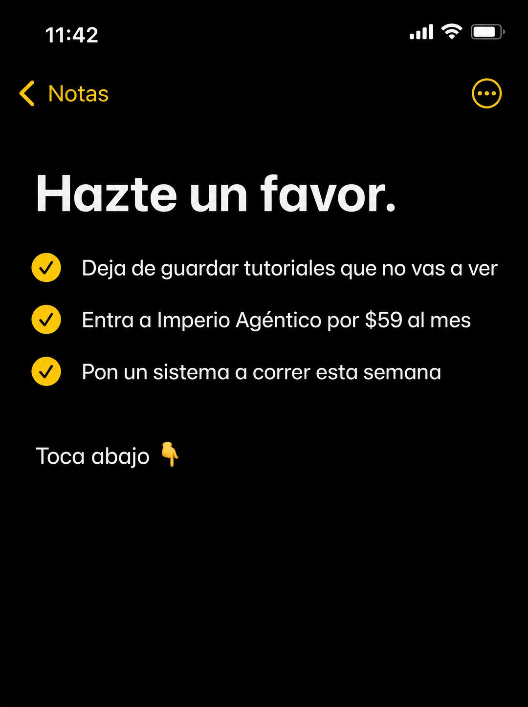

# 059 · Nota del teléfono con checklist (Apple Notes)

**Familia:** Interfaz creíble · **Necesitas:** Nada · **Resultado en Meta:** $21 invertidos, 0 compras (cuenta de Imperio, sep 2026) (muestra chica)



## Qué es
La captura de una nota del iPhone en modo oscuro con un título corto y tres acciones marcadas con check amarillo. La compra es la acción del medio, dicha como un paso más de la lista.

## Por qué funciona
Se ve tan simple que no parece anuncio: parece una nota que alguien se dejó a sí mismo. El checklist mete la compra entre un hábito que el lector reconoce y un resultado cercano, y el 'Toca abajo' lo manda directo al botón.

## Cuándo usarlo
Público frío o tibio, para empujar la compra sin presión. Sirve para cualquier negocio con una oferta que se explica en una línea.

## Así lo hicimos para Imperio
- **Texto en la imagen:** 11:42 / Notas / Hazte un favor. / Deja de guardar tutoriales que no vas a ver / Entra a Imperio Agéntico por $59 al mes / Pon un sistema a correr esta semana (cada línea con check amarillo) / Toca abajo 👇
- **Texto principal:**
  > Tres cosas, y la primera es dejar de guardar tutoriales que no vas a ver.
  >
  > Adentro: +35 cursos en español, 5 sesiones en vivo a la semana y +1.800 logros publicados para copiar ideas.
  >
  > $59 al mes 👇
- **Titular:** Imperio Agéntico · $59 al mes

## Receta para tu marca
- **Formato:** captura vertical de Notas del iPhone en modo oscuro: hora en la barra de estado, 'Notas' con flecha amarilla arriba a la izquierda y botón de opciones a la derecha.
- **Título:** [UNA ORDEN CORTA DE 3 PALABRAS], en negrita blanca grande.
- **Checklist:** tres líneas con check amarillo: [DEJAR UN HÁBITO QUE TU CLIENTE RECONOCE] / [COMPRAR O ENTRAR A TU OFERTA, CON PRECIO] / [EL PRIMER RESULTADO, CON UN PLAZO CORTO].
- **Cierre:** una línea blanca suelta: 'Toca abajo' con el emoji de mano apuntando hacia abajo.
- **Lo que no se toca:** la interfaz nativa sin adornos, sin logo y sin colores de marca; la compra va en medio de la lista, nunca como título.

## Prompt con que se hizo el de Imperio (GPT Image 2.5)
```
[Nota: el de Imperio se generó con GPT Image 2 en 3:4. En GPT Image 2.5 pídelo en 4:5]
Vertical screenshot of the iPhone Notes app in DARK mode, filling the frame: status bar showing '11:42', a yellow back chevron labelled 'Notas' at the top left and a circular options button at the top right. Inside the note, a large bold white headline: 'Hazte un favor.' Below it, three lines each preceded by a yellow circular checkmark icon: 'Deja de guardar tutoriales que no vas a ver', 'Entra a Imperio Agéntico por $59 al mes', 'Pon un sistema a correr esta semana'. Below those, a gap and then one line in white: 'Toca abajo' followed by a pointing down emoji. Render every Spanish accent exactly. Authentic dark mode notes app UI, nothing else in frame. No inverted punctuation, no em dashes.
```

## Ojo
- Si vas a hacer más de una nota, cambia la estructura (checklist, tareas tachadas, plan numerado) para que no compitan entre sí.
- Marca la casilla de contenido generado por IA en el Administrador de anuncios.
