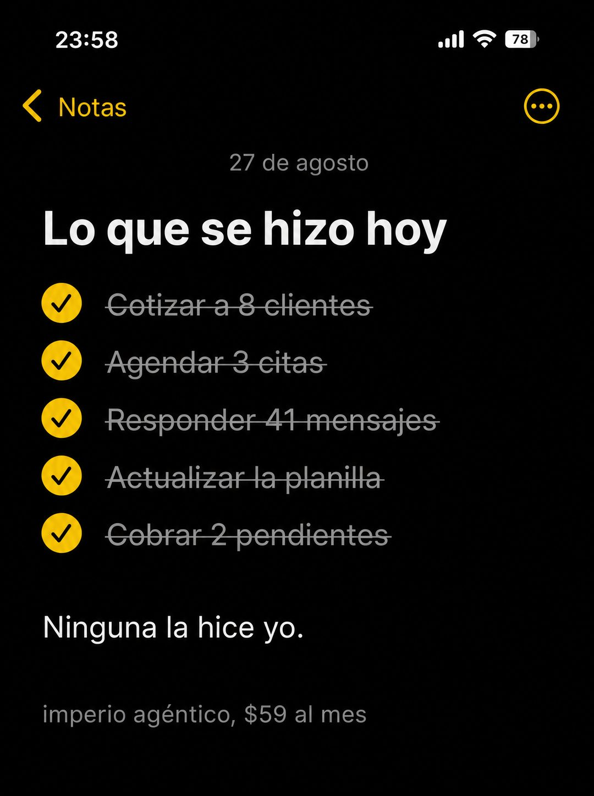

# 060 · Nota de tareas ya hechas (Apple Notes)

**Familia:** Interfaz creíble · **Necesitas:** Nada · **Resultado en Meta:** $64 invertidos, 0 compras (cuenta de Imperio, sep 2026) (muestra chica)



## Qué es
Una nota del iPhone en modo oscuro, escrita casi a medianoche, con las tareas del día completas y tachadas. La última línea, sin tachar, revela que ninguna la hizo la persona.

## Por qué funciona
El lector reconoce su propia lista de pendientes y la ve resuelta sin haber movido un dedo. El giro final hace la venta sin nombrar el producto, y las tareas con cantidades concretas pesan más que cualquier adjetivo.

## Cuándo usarlo
Público frío o tibio ahogado en tareas repetitivas. Sirve para software, automatización, asistentes y servicios que le quitan trabajo operativo al cliente; el objetivo es frenar el scroll con una escena reconocible.

## Así lo hicimos para Imperio
- **Texto en la imagen:** 23:58 / Notas / 27 de agosto / Lo que se hizo hoy / Cotizar a 8 clientes / Agendar 3 citas / Responder 41 mensajes / Actualizar la planilla / Cobrar 2 pendientes (las cinco con check amarillo y tachadas en gris) / Ninguna la hice yo. / imperio agéntico, $59 al mes (gris, abajo)
- **Texto principal:**
  > Cotizar a 8 clientes. Agendar 3 citas. Responder 41 mensajes. Cobrar 2 pendientes.
  >
  > Ninguna la hice yo, y ese es el punto. Se construye en una tarde y sin escribir código.
  >
  > $59 al mes 👇
- **Titular:** Imperio Agéntico · $59 al mes

## Receta para tu marca
- **Formato:** captura vertical de Notas del iPhone en modo oscuro, hora cercana a la medianoche en la barra de estado y la fecha chica en gris arriba.
- **Título:** 'Lo que se hizo hoy' o [TU VERSIÓN EN 5 PALABRAS], en negrita blanca.
- **Lista:** cinco tareas que tu cliente odia hacer, con check amarillo y tachadas en gris: [TAREA 1] / [TAREA 2] / [TAREA 3] / [TAREA 4] / [TAREA 5].
- **Giro:** una línea blanca, sin tachar y sin check: [QUIÉN LAS HIZO EN REALIDAD, EN 4 PALABRAS].
- **Marca:** [TU MARCA], [TU PRECIO] en gris chico al final.
- **Lo que no se toca:** todo tachado menos el giro; nada de logo, botón ni colores de marca.

## Prompt con que se hizo el de Imperio (GPT Image 2.5)
```
[Nota: el de Imperio se generó con GPT Image 2 en 3:4. En GPT Image 2.5 pídelo en 4:5]
Vertical screenshot of the iPhone Notes app in DARK mode filling the frame: status bar showing '23:58', a yellow back chevron labelled 'Notas' at the top left, a circular options button at the top right. Inside the note, a small grey date line reading '27 de agosto', then a bold white headline: 'Lo que se hizo hoy'. Below, five checklist rows, each with a filled yellow circular checkmark and the text struck through with a thin line, in grey: 'Cotizar a 8 clientes', 'Agendar 3 citas', 'Responder 41 mensajes', 'Actualizar la planilla', 'Cobrar 2 pendientes'. Then a gap and one line in plain white, not struck through and with no checkmark: 'Ninguna la hice yo.' At the bottom, a small grey line: 'imperio agéntico, $59 al mes'. Render every Spanish accent exactly. Authentic dark mode notes app UI. No inverted punctuation, no em dashes.
```

## Ojo
- Si la lista lleva cantidades (mensajes, citas, cobros), que salgan de un día real de tu negocio; si no las tienes, escribe las tareas sin números.
- Si vas a hacer más de una nota, cambia la estructura (checklist, tareas tachadas, plan numerado) para que no compitan entre sí.
- Marca la casilla de contenido generado por IA en el Administrador de anuncios.
